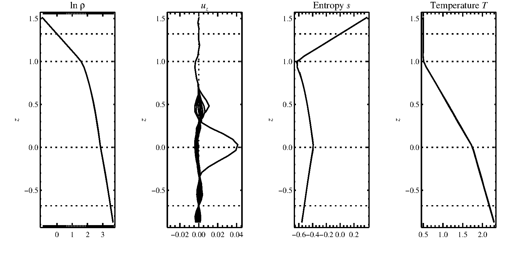
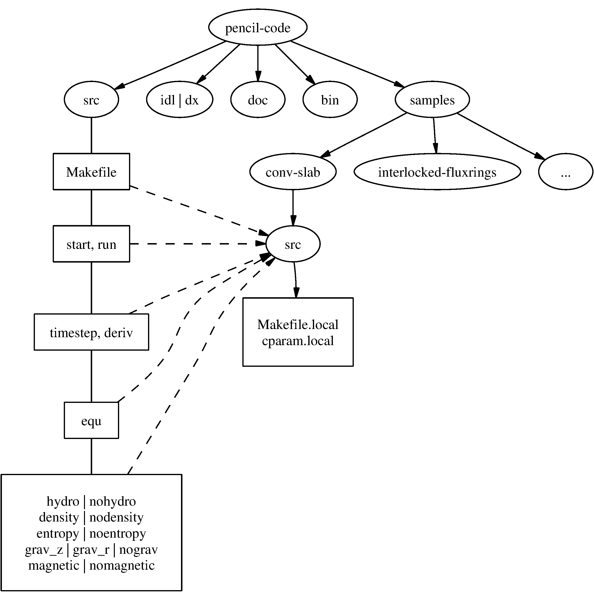
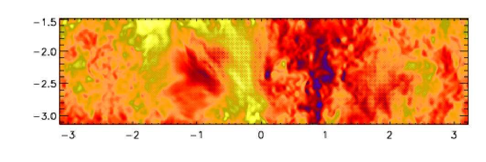
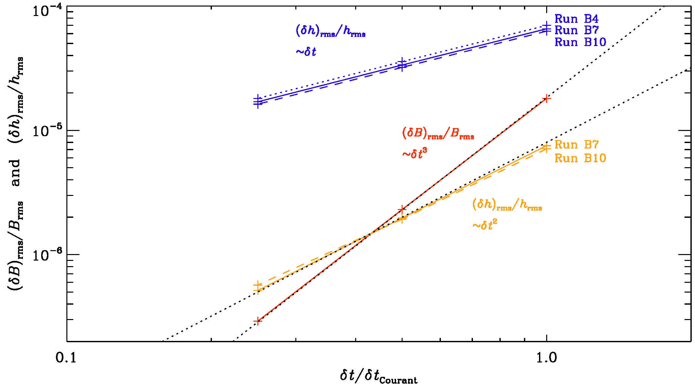

.. _manualpart1:

**********************************************************
Part 1: Using the |PC|
**********************************************************

System requirements
===================

To use the code, you will need the following:

1. Absolutely needed:

   - F95 compiler
   - C compiler

2. Used heavily (if you don't have one of these, you will need to
   adjust many things manually):

   - a Unix/Linux-type system with make and csh
   - Perl (remember: if it doesn't run Perl, it's not a computer)

3. The following are dispensable, but enhance functionality in one
   way or the other:

   - an MPI implementation (for parallelization on
     multiprocessor systems)
   - DX alias OpenDX or data explorer (for
     3-D visualization of results)
   - IDL (for visualization of results; the 7-minute demo
     license will do for many applications)


Otaining the code
=================


The code is now distributed via |repo|,
where you can either download a tarball, or, preferably,
download it via svn or git.
In Iran and some other countries, GitHub is not currently available.
To alleviate this problem, we have made a recent copy available on
`http://www.nordita.org/software/pencil-code/`.
If you want us to update this tarball, please contact us.

To ensure at least some level of stability of the svn/git
versions, a set of test problems (listed in
:file:`$PENCIL_HOME/bin/auto-test`)
are routinely tested.
This includes all problems in
:file:`$PENCIL_HOME/samples`.
See :ref:`S-Testing` for details.

Obtaining the code via git or svn
---------------------------------

1. Many machines have svn installed (try ``svn -v`` or ``which svn``).
   On Ubuntu, for example, svn comes under the package name ``subversion``.

2. The code is now saved under GitHub; git can be obtained in Linux by typing:

   .. code-block:: console

       sudo apt-get install git

3. Unless you are a privileged user with write access, you can
   download the code with the command:

   .. code-block:: console

       git clone https://github.com/pencil-code/pencil-code.git

   or:

   .. code-block:: console

       svn checkout https://github.com/pencil-code/pencil-code/trunk/ \
       pencil-code --username MY_GITHUB_USERNAME

   In order to push your changes to the repository, you have to ask the maintainer
   of the Pencil Code for push access (to become a contributor), or submit a pull request
   to the maintainer of the code.

   Be sure to run ``auto-test`` before you check anything back in.
   It can be very annoying for someone else to figure out what's wrong,
   especially if you are just testing something else.
   At the very least, you should do:

   .. code-block:: console

       pc_auto-test --level=0 --no-pencil-check -C

   This allows you to run just the 2 most essential tests, starting
   with no-modules and then most-modules.

See also :ref:`download` for general information on obtaining the code.


Updating via svn or git
-----------------------

Independent of how you installed the code in the first place (from tarball
or via svn/git), you can update your version using svn/git.
If you have done nontrivial alterations to your version of the code, you
ought to be careful about upgrading: although svn/git is an excellent
tool for distributed programming, conflicts are quite possible, since many
developers may touch many parts of the code while developing it further.
Thus, despite the fact that the code is under svn/git, you should probably
back up your important changes before upgrading.

Here is the upgrading procedure for git:

1. Perform a ``git`` update of the tree:

   .. code-block:: console

       unix> git pull \

2. Fix any conflicts you encounter and make sure the examples in the
   directory :file:`samples/` are still working.

Here is the upgrading procedure for svn:

1. Perform a ``svn`` update of the tree:

   .. code-block:: console

       unix> pc_svnup \

2. Fix any conflicts you encounter and make sure the examples in the
   directory :file:`samples/` are still working.

If you have made useful changes, please contact one of the (currently) 10
"Contributors" (listed under `GitHub <https://github.com/pencil-code/pencil-code>`_) 
who can give you push or check-in permission.
Be sure to have sufficient comments in the code and please follow our
standard coding conventions explained in :ref:`programming-style`.
There is also a script to check and fix the most common style breaks,
``pc_codingstyle``.

Getting the last validated version
----------------------------------

The script ``pc_svnup`` accepts arguments ``-val`` or ``-validated``, which
means that the current changes on a user's machine will be merged
into the last working version. This way every user can be sure that
any problems with the code must be due to the current changes done
by this user since the last check-in.

Examples:

.. code:: bash

    $ pc_svnup -src -s -validated

brings all files in :file:`src/` under ``$PENCIL_HOME`` to the last validated
status, and merges all your changes into this version. This allows you
to work with this, but in order to check in your changes you have to
update everything to the most recent status first, i.e.

.. code:: bash

    $ pc_svnup -src

Your own changes will be merged into this latest version as before.

.. note::

    The functionality of the head of the trunk should be preserved  at all times. However, accidents do happen. For the benefit of all
    other developers, any errors should be corrected within 1-2 hours. 
    This is the reason why the code comes with a file
    :file:`pencil-code/license/developers.txt`,
    which should contain contact details of all developers.
    The ``pc_svnup -val`` option allows all other people to stay away
    from any trouble.

Getting older versions
----------------------

You may find that the latest svn version of the code produces errors.
If you have reasons to believe that this is due to changes introduced on
27 November 2008 (to give an example), you can check out the version prior to
this by specifying a revision number with ``svn update -r #####``.
One reason why one cannot always reproduce exactly the same situation too far
back in time is connected with the fact that processor architecture and the
compiler were different, resulting, e.g., in different rounding errors.


Getting started
===============

To get yourself started, you should run one or several examples which are
provided in one of the :file:`samples/` subdirectories.
Note that you will only be able to fully assess the numerical solutions if you
visualize them with IDL, DX, or other tools (see :ref:`visualization`).


Setup
----------

Environment settings
^^^^^^^^^^^^^^^^^^^^^

The functionality of helper scripts and IDL routines relies on a few
environment variables being set correctly.
The simplest way to achieve this is to go to the top directory of the code
and source one of the two scripts :file:`sourceme.csh` or :file:`sourceme.sh`
(depending on the type of shell you are using):

.. code-block:: console

  csh> cd pencil-code
  csh> source ./sourceme.csh

for tcsh or csh users; or

.. code-block:: console

  sh> cd pencil-code
  sh> . ./sourceme.sh

for users of bash, Bourne shell, or similar shells.
You should get output similar to:

.. code-block:: console

  PENCIL_HOME = </home/dobler/f90/pencil-code>
  Adding /home/dobler/f90/pencil-code/bin to PATH

Apart from the PATH variable, the environment variable IDL_PATH is set to
something like ``./idl:../idl:+$PENCIL_HOME/idl:./data:<IDL_DEFAULT>``.


.. note::
   The ``<IDL_DEFAULT>`` mechanism does not work for IDL versions 5.2 or
   older. In this case, you will have to edit the path manually, or adapt
   the :file:`sourceme` scripts.

.. note::
   If you don't want to rely on the :file:`sourceme` scripts' (quite
   heuristic) ability to correctly identify the code's main directory, you
   can set the environment variable ``PENCIL_HOME`` explicitly before you
   run the source command.

.. note::
   Do not just source the :file:`sourceme` script from your shell startup
   file (:file:`~/.cshrc` or :file:`~/.bashrc`), because it outputs a few
   lines of diagnostics for each sub-shell, which will break many applications.
   To suppress all output, follow the instructions given in the header
   documentation of :file:`sourceme.csh` and :file:`sourceme.sh`.
   Likewise, output from other files invoked by ``source`` should also be suppressed.

.. note::
   The second time you source :file:`sourceme`, it will not add
   anything to your ``PATH`` variable.
   This is on purpose to avoid cluttering of your environment: you can
   source the file as often as you like (in your shell startup script, then
   manually and in addition in some script you have written), without
   thinking twice.
   If, however, at the first sourcing, the setting of ``PENCIL_HOME`` was
   wrong, this mechanism would keep you from ever adding the right directory
   to the ``PATH``.
   In this case, you need to first undefine the environment variable
   ``PENCIL_HOME``:

   .. code-block:: console

      csh> unsetenv PENCIL_HOME
      csh> source ./sourceme.csh
      or
      sh> unset PENCIL_HOME
      sh> . ./sourceme.sh

.. note::
   If you want to be able to easily handle multiple versions/branches of
   Pencil, you can use the `modulefile` mechanism that is used on most
   clusters to load libraries and programs.
   Create a file at, say, :file:`$HOME/.modulefiles/pencil-local` with the
   following contents:

   .. code-block:: tcl

      #%Module4.6#####################################################################

      proc ModulesHelp {} {
        global version prefix

        puts stderr "\tmodules - loads the modules software"
        puts stderr "& application environment"
        puts stderr "\n\tThis adds $prefix/* to several of the"
        puts stderr "\tenvironment variables."
        puts stderr "\n\tVersion $version\n"
      }

      module-whatis   "Environment setup for the Pencil code"

      #change the following line according to the location of your local copy of Pencil
      setenv          PENCIL_HOME     $env(HOME)/.software/pencil-code

      setenv          _sourceme_quiet 1
      source-sh       bash            $env(PENCIL_HOME)/sourceme.sh
      unsetenv        _sourceme_quiet

   To your :file:`~/.bashrc`, add:

   .. code-block:: console

      MODULEPATH=$HOME/.modulefiles:$MODULEPATH

   If you now open a new shell and run ``module avail``, you will find the
   ``pencil-local`` module created above listed as an option.
   This requires version 4.6 of the ``modules`` program.


Linking scripts and source files
^^^^^^^^^^^^^^^^^^^^^^^^^^^^^^^^^

With your environment set up correctly, you can now go to the directory
you want to work in and set up subdirectories and links.
This is accomplished by the script :file:`pc_setupsrc`, which is located in
:file:`$PENCIL_HOME/bin` and is thus now in your executable path.

For concreteness, let us assume you want to use
:file:`samples/conv-slab`
as your **run directory**, i.e., you want to run a three-layer slab model
of solar convection.
You then do the following::

   unix> cd samples/conv-slab
   unix> pc_setupsrc
   src already exists
   2 files already exist in src

The script has linked a number of scripts from :file:`$PENCIL_HOME/bin`,
generated a directory :file:`src` for the source code and linked the
Fortran source files (plus a few more files) from :file:`$PENCIL_HOME/src`
to that directory:

.. code:: bash

   unix> ls -F
   reference.out  src/
   start.csh@     run.csh@  getconf.csh@
   start.in       run.in    print.in


Adapting ``Makefile.src``
^^^^^^^^^^^^^^^^^^^^^^^^^

This step requires some input from you, but you only have to do this once
for each machine you want to run the code on.
See :ref:`adapt-mkfile` for a description of the steps you need to
take here.

.. note::
   If you are lucky and use compilers similar to the ones
   we have, you may be able to skip this step; but blame yourself if things
   don't compile, then.
   If not, you can run ``make`` with explicit flags, see
   :ref:`S-make-flags` and in particular Table :ref:`Tab-compiler-options`.

Running ``make``
^^^^^^^^^^^^^^^^

Next, you run ``make`` in the :file:`src` subdirectory of your run
directory.
Since you are using one of the predefined test problems, the settings in
:file:`src/Makefile.local` and
:file:`src/cparam.local` are all reasonable, and you just do:

.. code:: bash

   unix> make

If you have set up the compiler flags correctly, compilation should
complete successfully.

Choosing a data directory
^^^^^^^^^^^^^^^^^^^^^^^^^

The code will by default write data like snapshot files to the subdirectory
:file:`data` of the run directory.
Since this will involve a large volume of IO operations (at least for
large grid sizes), one will normally try to avoid writing the data via
NFS.

The recommended way to set up a :file:`data` directory is to generate
a corresponding directory on the local disk of the computer you are
running on and (soft-)link it to :file:`./data`.
Even if the link is part of an NFS directory, all the IO operations will
be local.

For example, if you have a local disk :file:`/scratch`, you can do the following:

.. code:: bash

   unix> mkdir -p /scratch/$USER/pencil-data/samples/conv-slab
   unix> ln -s /scratch/$USER/pencil-data/samples/conv-slab ./data

This is done automatically by the ``pc_mkdatadir``
command which, in turn, is invoked when making a new run directory with
the ``pc_newrun`` command, for example.

Even if you don't have an NFS-mounted directory (say, on your notebook
computer), it is probably still a good idea to have code and data well
separated by a scheme like the one described above.

An alternative to symbolic links is to provide a file called
:file:`datadir.in` in the root of the run directory. This file
should contain one line of text specifying the absolute or relative data
directory path to use. This facility is useful if one wishes to switch
one run directory between different data directories. It is suggested
that in such cases symbolic links are again made in the run directory;
then the :file:`datadir.in` need contain only a short relative path.

Running the code
^^^^^^^^^^^^^^^^

You are now ready to start the code:

.. code:: bash

   unix> start.csh
   Linux cincinnatus 2.4.18-4GB #1 Wed Mar 27 13:57:05 UTC 2002 i686 unknown
   Non-MPI version
   datadir = data
   Fri Aug  8 21:36:43 CEST 2003
      src/start.x
   CVS: io_dist.f90        v. 1.61         (brandenb  ) 2003/08/03 09:26:55
   [...]
   CVS: start.in           v. 1.4          (dobler    ) 2002/10/02 20:11:14
    nxgrid,nygrid,nzgrid=          32          32          32
    thermodynamics: assume cp=1

    uu: up-down
    piecewise polytropic vertical stratification (lnrho)
    init_lnrho: cs2bot,cs2top=   1.450000      0.3333330
    e.g., for ionization runs: cs2bot,cs2top not yet set
    piecewise polytropic vertical stratification (ss)

    start.x has completed successfully

    0.070u 0.020s 0:00.14 64.2%     0+0k 0+0io 180pf+0w

    Fri Aug  8 21:36:43 CEST 2003


This runs :file:`src/start.x` to construct an initial condition based on
the parameters set in :file:`start.in`.
This initial condition is stored in :file:`data/proc0/var.dat` (and
:data/proc1/var.dat, etc., if you run the multiprocessor version).
It is fair to say that this is now a rather primitive routine; see
:file:`pencil-code/idl/read` for various reading routines.
You can then visualize the data using standard IDL language.

If you visualize the profiles using ``IDL`` (see below),
the result should bear some resemblance to :numref:`Fig-pvert1`, but with
different values in the ghost zones (the correct values are set at
run-time only) and a simpler velocity profile.

Now we run the code:

.. code:: 

   unix> run.csh

This executes :file:`src/run.x` and carries out ``nt`` time steps,
where ``nt`` and other run-time parameters are specified in :file:`run.in`.
On a decent PC (1.7 GHz), 50 time steps take about 10 seconds.

The relevant part of the code's output looks like:

.. code::

    --it----t-------dt-------urms----umax----rhom------ssm-----dtc----dtu---dtnu---dtchi-
       0   0.34  6.792E-03  0.0060  0.0452  14.4708  -0.4478  0.978  0.013  0.207  0.346
      10   0.41  6.787E-03  0.0062  0.0440  14.4707  -0.4480  0.978  0.013  0.207  0.345
      20   0.48  6.781E-03  0.0064  0.0429  14.4705  -0.4481  0.977  0.012  0.207  0.345
      30   0.54  6.777E-03  0.0067  0.0408  14.4703  -0.4482  0.977  0.012  0.207  0.345
      40   0.61  6.776E-03  0.0069  0.0381  14.4702  -0.4482  0.977  0.011  0.207  0.346


The columns list:

- ``it``: the number of the current time step
- ``t``: the time
- ``dt``: the time step
- ``urms``: the rms velocity, ``urms = sqrt(<u^2>)``
- ``umax``: the maximum velocity, ``umax = max |u|``
- ``rhom``: the mean density, ``rhom = <rho>``
- ``ssm``: the mean entropy, ``ssm = <s>/cp``
- ``dtc``: the time step in units of the acoustic Courant step, ``dtc = dt * cs0 / dx_min``
- ``dtu``: the time step in units of the advective time step, ``dtu = dt / (c_delta_t * dx / max|u|)``
- ``dtnu``: the time step in units of the viscous time step, ``dtnu = dt / (c_delta_t_v * dx^2 / nu_max)``
- ``dtchi``: the time step in units of the conductive time step, ``dtchi = dt / (c_delta_t_v * dx^2 / chi_max)``

The entries in this list can be added, removed or reformatted in the file
:file:`print.in` (see Sects. :ref:`diagnostic-IO` and :ref:`S-print.in-params`).
The output is also saved in :file:`data/time_series.dat`
and should be identical to the content of :file:`reference.out`.

.. _Fig-pvert1:



   Stratification of the three-layer convection model in
   :file:`samples/conv-slab` after 50 timesteps (t=0.428).
   Shown are (from left to right) density rho, vertical velocity u_z,
   entropy s/cp and temperature T as functions of the
   vertical coordinate z for about ten different vertical lines in the
   computational box.
   The dashed lines denote domain boundaries:
   z < -0.68 is the lower ghost zone (points have no physical significance);
   -0.68 < z < 0 is a stably stratified layer (ds/dz > 0);
   0 < z < 1 is the unstable layer (ds/dz < 0);
   1 < z < 1.32 is the isothermal top layer;
   z > 1.32 is the upper ghost zone (points have no physical significance).


If you have ``IDL``, you can visualize the stratification with (see
Sect. :ref:`S-IDL-routines` for details):

.. code:: 

   unix > idl
   IDL >  pc_read_var,obj=var,/trimall
   IDL >  tvscl,var,uu(*,*,0,0)

which shows ``u_x`` in the xy plane through the first
meshpoint in the z direction.

The same can be achieved using ``Python``
(see Sect. :ref:`Python` for details) with:

.. code:: python

   unix > ipython3  # (or 'ipython', or just 'python')
   python > import pencil as pc
   python > from matplotlib import pylab as plt
   python > var = pc.read.var(trimall=True)
   python > plt.imshow(var.uu[0, 0, :, : ].T, origin='lower')

.. note::

   If you want to run the code with ``MPI``, you will probably need to
   adapt :file:`getconf.csh`, which defines the commands and flags used to
   run MPI jobs (and which is sourced by the scripts :file:`start.csh` and
   :file:`run.csh`).

   Try:

   .. code:: bash

      csh -v getconf.csh
      or
      csh -x getconf.csh

   to see how :file:`getconf.csh` makes its decisions. You would add a
   section for the host name of your machine with the particular settings.
   Since :file:`getconf.csh` is linked from the central directory
   :file:`pencil-code/bin`, your changes will be
   useful for all your other runs too.


Further tests
--------------

There are a number of other tests in the :file:`samples/` directory.
You can use the script :file:`bin/auto-test` to automatically run
these tests and have the output compared to reference results.


Code structure
==============

Directory tree
--------------

.. _Fig-Structure: 



   The basic structure of the code

The overall directory structure of the code is shown in :numref:`Fig-Structure`.
Under :file:`pencil-code/`, there are currently the following files and directories:

.. code-block:: text

   bin/   config/  doc/  idl/  license/  perl/   samples/      sourceme.sh  utils/
   bugs/  dx/   lib/  misc/     README  sourceme.csh  src/         www/

Almost all of the source code is contained in the directory :file:`src/`,
but in order to encapsulate individual applications, the code is compiled
separately for each run in a local directory :file:`src/` below the
individual run directory, like
e.\,g.~:file:`samples/conv-slab/src/`.

It may be a good idea to keep your own runs also under SVN or CVS
(which is older than but similar to SVN), but this would normally be a
different repository. On the machine where you are running the code, you
may want to check them out into a subdirectory of :file:`pencil-code/`.
For example, we have our own runs in a repository called :file:`pencil-runs`, so we do:

.. code-block:: console

   unix> cd $PENCIL_HOME
   unix> svn co runs pencil-runs

In this case, :file:`runs/` contains individual run directories,
grouped in classes (like :file:`spher/` for spherical calculations, or
:file:`kinematic/` for kinematic dynamo simulations).
The current list of classes in our own :file:`pencil-runs/` repository is

.. code-block:: text

   1d-tests/   disc/          kinematic/  rings/
   2d-tests/   discont/       Misc/       slab_conv/
   3d-tests/   discussion/    OLD/        test/
   buoy_tube/  forced/        pass_only/
   convstar/   interstellar/  radiation/

The directory :file:`forced/` contains some forced turbulence runs (both
magnetic and nonmagnetic);
:file:`gravz/` contains runs with vertical gravity;
:file:`rings/` contains decaying MHD problems (interlocked flux rings as
initial condition, for example);
and :file:`kinematic/` contains kinematic dynamo problems where the
hydrodynamics is turned off entirely.
The file :file:`samples/README` should contain an up-to-date list and
short description of the individual classes.\footnote{Our
:file:`pencil-runs/` directory also contains runs that were
done some time ago. Occasionally, we try to update these, especially if we
have changed names or other input conventions.}

The subdirectory :file:`src/` of each run directory contains a few local
configuration files (currently these are :file:`Makefile.local` and
:file:`cparam.local`) and possibly :file:`ctimeavg.local`.
To compile the samples, links the files :file:`*.f90`,
:file:`*.c` and :file:`Makefile.src` need to be linked from the top
:file:`src/` directory to the local directory :file:`./src`.
These links are set up by the script
:file:`pc_setupsrc` when used in the root of a run directory.

General-purpose visualization routines for IDL or DX are in the
directories :file:`idl/` and :file:`dx/`, respectively.
There are additional and more specialized IDL directories in the
different branches under :file:`pencil-runs/`.

The directory :file:`doc/` contains this manual;
:file:`bin/` contains a number of utility scripts (mostly written in
C-shell and Perl), and in particular the :file:`start.csh`,
:file:`run.csh`, and :file:`getconf.csh` scripts.
The :file:`.svn/` directory is used (you guessed it) by SVN, and is
not normally directly accessed by the user;
:file:`bugs/`, finally, is used by us for internal purposes.

The files :file:`sourceme.csh` and :file:`sourceme.sh` will set up some
environment variables --- in particular :envvar:`PATH` --- and aliases/shell
functions for your convenience.
If you do not want to source one of these files, you need to make sure
your IDL path is set appropriately (provided you want to use
IDL) and you will need to address the scripts from :file:`bin/` with their explicit path name, or adjust your :envvar:`PATH`
manually.

Basic concepts
---------------

.. _Pencil_design: 

Data access in pencils
^^^^^^^^^^^^^^^^^^^^^^

Unlike the CRAY computers that dominated supercomputing in the 80s and
early 90s, all modern computers have a cache that constitutes a significant
bottleneck for many codes.
This is the case if large three-dimensional arrays are constantly used
within each time step, which has the obvious advantage of working on
long arrays and allows vectorization of elementary machine operations.
This approach also implies conceptual simplicity of the code and allows
extensive use of the intuitive F90 array syntax.
However, a more cache-efficient way of coding is to calculate an entire
time step (or substep of a multi-stage time-stepping scheme) only
along a one-dimensional pencil of data within the numerical grid.
This technique is more efficient for modern RISC processors:
on Linux PCs and SGI workstations, for example, we have found a speed-up
by about 60% in some cases.
An additional advantage is a drastic reduction in temporary storage for
auxiliary variables within each time step.

.. _S-modularity:

Modularity
^^^^^^^^^^

Each run directory has a file :file:`src/Makefile.local` in
which you choose certain ``modules``\footnote{%
  We stress once more that we are not talking about F90 modules here,
  although there is some connection, as most of our modules define F90
  modules:
  For example each of the modules ``gravity_simple``, ``grav_r`` and
  ``nogravity`` defines a Fortran module ``Gravity``.
}, which tell the code whether or not entropy, magnetic fields,
hydrodynamics, forcing, etc.\ should be invoked.
For example, the settings for forced turbulent MHD simulations are

.. code-block:: text

  HYDRO     =   hydro
  DENSITY   =   density
  ENTROPY   = noentropy
  MAGNETIC  =   magnetic
  GRAVITY   = nogravity
  FORCING   =   forcing

  MPICOMM   = nompicomm
  GLOBAL    = noglobal
  IO        =   io_dist
  FOURIER   = nofourier

This file will be processed by ``make`` and the settings are thus
assignments of ``make`` variables.
Apart from the physics modules (equation of motion: yes, density
[pressure]: yes, entropy equation: no, magnetic fields: yes, gravity: no,
forcing: yes), a few technical modules can also be used or deactivated; in
the example above, these are MPI (switched off), additional global
variables (none), input/output (distributed), and FFT (not used).
The table in Sect.~:ref:`Tab-modules` in the Appendix lists all currently available modules.

Note that most of these ``make`` variables *must* be set, but they
will normally obtain reasonable default values in :file:`Makefile` (so you
only need to set the non-standard ones in :file:`Makefile.local`).
It is by using this switching mechanism through ``make`` that we achieve
high flexibility without resorting to excessive amounts of cryptic
preprocessor directives or other switches within the code.

Many possible combinations of modules have already been tested
and examples are part of the distribution, but you may be interested in a
combination which was never tried before and which may not work yet, since the
modules are not fully orthogonal.
In such cases, we depend on user feedback for fixing problems
and documenting the changes for others.

Files in the run directories
----------------------------

:file:`start.in`, :file:`run.in`, :file:`print.in`
^^^^^^^^^^^^^^^^^^^^^^^^^^^^^^^^^^^^^^^^^^^^^^^^^^^^

These files specify the startup and runtime parameters (see
Sects. :ref:`S-start-params` and :ref:`S-all-run-params`), and the list of
diagnostic variables to print (see :ref:`diagnostic-IO`).
They specify the setup of a given simulation and are kept under
svn :index:`svn` in the individual :file:`samples/` directories.

You may want to check for the correctness of these configuration files by
issuing the command ``pc_configtest``.

.. _Ss-datadir-in:

:file:`datadir.in`
^^^^^^^^^^^^^^^^^^


If this file exists, it must contain the name of an existing directory,
which will be used as ``data directory``,
i.e., the directory where all results are written.
If :file:`datadir.in` does not exist, the data directory is :file:`data/`.

:file:`sn_series.in``
^^^^^^^^^^^^^^^^^^^^^^

Formatted file containing the times and locations at which future supernova
events will occur, using same format as :file:`sn_series.dat` when lSN_list.
(Only needed by the ``interstellar`` module.)

:file:`reference.out`
^^^^^^^^^^^^^^^^^^^^^^

If present, :file:`reference.out` contains the output you should obtain in
the given run directory, provided you have not changed any parameters.
To see whether the results of your run are OK, compare :file:`time_series.dat` to
:file:`reference.out`:

.. code:: bash

  unix> diff data/time_series.dat reference.out


.. _start-run-getconf:

:file:`start.csh`, :file:`run.csh`, :file:`getconf.csh`` [obsolete; see Sect. :ref:`S-configuration`]
^^^^^^^^^^^^^^^^^^^^^^^^^^^^^^^^^^^^^^^^^^^^^^^^^^^^^^^^^^^^^^^^^^^^^^^^^^^^^^^^^^^^^^^^^^^^^^^^^^^^^^^


These are links to :file:`$PENCIL_HOME/bin`.
You will be constantly using the scripts :file:`start.csh` and
:file:`run.csh` to initialize the code.
Things that are needed by both (like the name of the ``mpirun``
executable, MPI options, or the number of processors) are located in
:file:`getconf.csh`, which is never directly invoked.


:file:`src/`
^^^^^^^^^^^^


The :file:`src/` directory contains two local files,
:file:`src/Makefile.local` and
:file:`src/cparam.local`, which allow the user to choose
individual modules (see :ref:`S-modularity`) and to set parameters like the
grid size and the number of processors for each direction.
These two files are part of the setup of a given simulation and are kept
under svn in the individual :file:`samples/` directories.

The file :file:`src/cparam.inc` is automatically generated by
the script :file:`mkcparam` and contains the number of fundamental
variables for a given setup.

All other files in :file:`src/` are either links to source files (and
:file:`Makefile.src`) in the :file:`$PENCIL_HOME/src` directory,
or object and module files generated by the compiler.

:file:`data/`
^^^^^^^^^^^^^

This directory (the name of which will actually be overwritten by the first
line of :file:`datadir.in`, if that file is present; see :ref:`Ss-datadir-in`)
contains the output from the code:

:file:`data/dim.dat`
""""""""""""""""""""""""

The global array dimensions.

:file:`data/legend.dat` 
""""""""""""""""""""""""""

The header line specifying the names of the diagnostic variables in
:file:`time_series.dat`.

:file:`data/time_series.dat` 
""""""""""""""""""""""""""""""""

Time series of diagnostic variables (also printed to stdout).
You can use this file directly for plotting with Gnuplot,
IDL, Xmgrace or similar tools (see also :ref:`S-Visualization`).

:file:`data/tsnap.dat`, :file:`data/tvid.dat`
""""""""""""""""""""""""""""""""""""""""""""""""

Time when the next snapshot :file:`VAR$N$` or animation slice should be
taken.

:file:`data/params.log`
""""""""""""""""""""""""""""

Keeps a log of all your parameters: :file:`start.x` writes the startup
parameters to this file, :file:`run.x` appends the runtime parameters and
appends them anew, each time you use the RELOAD mechanism (see :ref:`S-RELOAD`).

:file:`data/param.nml`
""""""""""""""""""""""""""""

Complete set of startup parameters, printed as Fortran namelist.
This file is read in by :file:`run.x` (this is how values of startup
parameters are propagated to :file:`run.x`) and by IDL (if you use it).

:file:`data/param2.nml`
""""""""""""""""""""""""""""""""

Complete set of runtime parameters, printed as Fortran namelist.
This file is read by IDL (if you use it).

:file:`data/index.pro`
""""""""""""""""""""""""""""

Can be used as include file in IDL and contains the column in which
certain variables appear in the diagnostics file (:file:`time_series.dat`).
It also contains the positions of variables in the :file:`VAR$N$` files.
These positions depend on whether ``entropy`` or ``noentropy``, etc,
are invoked.
This is a temporary solution and the file may disappear in future
releases.

:file:`data/sn_series.dat`
""""""""""""""""""""""""""""""""

Time series of SN explosions locations and diagnostics. Can be plotted
using same machinery as for :file:`time_series.dat` and stored as
:file:`sn_series.in` to replicate series in subsequent experiments.
(Only needed by the ``interstellar`` module.)

:file:`[proc$N]data/proc0`, :file:`data/proc1`, ...
""""""""""""""""""""""""""""""""""""""""""""""""""""

These are the directories containing data from the individual processors.
So after running an MPI job on two processors, you will have the
two directories :file:`proc0` and :file:`proc1`.
Each of the directories can contain the following files:


* :file:`var.dat`
  - binary file containing the latest snapshot;
* :file:`VAR$N$`
  - binary file containing individual snapshot number $N$;
* :file:`dim.dat`
  - ASCII file containing the array dimensions as seen by the given processor;
* :file:`time.dat`
  - ASCII file containing the time corresponding to :file:`var.dat` (not actually *used* by the code, unless you use the ``io_mpiodist.f90`` module);
* :file:`grid.dat`
  - binary file containing the part of the grid seen by the given processor;
* :file:`seed.dat`
  - the random seed for the next time step (saved for reasons of reproducibility). For multi-processor runs with velocity forcing, the files :file:`proc$N$/seed.dat` must all contain the same numbers, because globally coherent waves of given wavenumber are used;
* :file:`X.xy`, :file:`X.xz`, :file:`X.yz`
  - two-dimensional sections of variable X, where X stands for the corresponding variable. The current list includes:
        
        .. code:: text

            bx.xy  bx.xz  by.xy  by.xz  bz.xy  bz.xz  divu.xy  lnrho.xz
            ss.xz  ux.xy  ux.xz  uz.xy  uz.xz

     Each processor writes its own slice, so these need t
     be reassembled if one wants to plot a full slice.


Using the code
==============

.. _S-configuration:

Configuring the code to compile and run on your computer
--------------------------------------------------------

.. note::

   We recommend to use the procedure described here, rather than
   the old method described in Sects. :ref:`adapt-mkfile` and :ref:`start-run-getconf`.

Quick instructions
^^^^^^^^^^^^^^^^^^

You may compile with a default compiler-specific configuration:

1. Single-processor using the GNU compiler collection:

   .. code-block:: console

      unix> pc_build -f GNU-GCC

2. Multi-processor using GNU with MPI support:

   .. code-block:: console

      unix> pc_build -f GNU-GCC_MPI

Many compilers are supported already; please refer to the available config
files in :file:`$PENCIL_HOME/config/compilers/*.conf`, e.g.,
:file:`Intel.conf` and :file:`Intel_MPI.conf`.

If you have to set up some compiler options specific to a certain host system you work on,
or if you like to create a host-specific configuration file so that you can
simply execute ``pc_build`` without any options,
you can clone an existing host-file, just include an existing
compiler configuration, and simply only add the options you need.
A good example of a host-file is
:file:`$PENCIL_HOME/config/hosts/IWF/host-andromeda-GNU_Linux-Linux.conf`.
You may save a clone under :file:`$PENCIL_HOME/config/hosts/<ID>.conf`,
where :file:`<ID>` is to be replaced by the output of ``pc_build -i``.
This will be the new default for ``pc_build``.
Another way to specify the default is setting the environment variable ``PENCIL_CONFIG_FILES``
appropriately.

If you don't know what this was all about, read on.

In essence, configuration, compiling and running the code work like this:

1. Create a configuration file for your computer's *host ID*.
2. Compile the code using ``pc_build``.
3. Run the code using ``pc_run``.

In the following, we will discuss the essentials of this scheme.
Exhaustive documentation is available with the commands
``perldoc Pencil::ConfigFinder`` and ``perldoc PENCIL::ConfigParser``.


Locating the configuration file
^^^^^^^^^^^^^^^^^^^^^^^^^^^^^^^^

Commands like ``pc_build`` and ``pc_run`` use the Perl module
:file:``Pencil::ConfigFinder`` to locate an appropriate configuration file
and :file:``Pencil::ConfigParser`` to read and interpret it.
When you use ``ConfigFinder`` on a given computer, it constructs a
*host ID* for the system it is running on, and looks for a file
:file:``host_ID.conf`` in any subdirectory of :file:``$PENCIL_HOME/config/hosts``.

For example, if the host ID is ``workhorse.pencil.org``, ``ConfigFinder`` would
consider the file
:file:``$PENCIL_HOME/config/hosts/pencil.org/workhorse.pencil.org.conf``.

.. note::

   The location in the tree under :file:``hosts/`` is irrelevant, which allows
   you to group related hosts by institution, owner, hardware, etc.

.. note::

   ``ConfigFinder`` actually uses the following search path:

   1. :file:``./config``
   2. :file:``$PENCIL_HOME/config-local``
   3. :file:``$HOME/.pencil/config``
   4. :file:``$PENCIL_HOME/config``

   This allows you to override part of the :file:``config/`` tree globally on
   the given file system, or locally for a particular run directory, or for
   one given copy of the Pencil Code.
   This search path is used both for locating the configuration file for
   your host ID and for locating included files (see below).

The host ID is constructed based on information that is easily available
for your system. The algorithm is as follows:

1. Most commands using :file:``ConfigFinder`` have a ``--host-id``
   (sometimes abbreviated as ``-H``) option to explicitly set the host ID.
2. If the environment variable ``PENCIL_HOST_ID`` is set, its value is used.
3. If any of the files

   - :file:``./host-ID``
   - :file:``$PENCIL_HOME/host-ID``
   - :file:``$HOME/.pencil/host-ID``

   exists, its first line is used.
4. If :file:``ConfigFinder`` can get hold of a fully qualified host name, that is used as host ID.
5. Else, a combination of host name, operating system name and possibly
   some other information characterizing the system is used.
6. If no config file for the host ID is found, the current operating
   system name is tried as fallback host ID.

To see which host IDs are tried (up to the first one for which a
configuration file is found), run:

.. code-block:: console

   unix> pc_build --debug-config

This command will tell you the *host-ID* of the system that you are using:

.. code-block:: console

   unix> pc_build -i


Structure of configuration files
^^^^^^^^^^^^^^^^^^^^^^^^^^^^^^^^^

It is strongly recommended to include in a user's configuration file one of
the preset compiler suite configuration files. Then, only minor options
need to be set by a user, e.g., the optimization flags.
One of those user configuration files looks rather simple:

.. code:: 

   # Simple config file. Most files don't need more.
   %include compilers/GNU-GCC

or if you prefer a different compiler:

.. code:: 

   # Simple Intel compiler suite config file.
   %include compilers/Intel

A more complex file (using MPI with additional options) would look like this:

.. code:: 

   # More complex config file.
   %include compilers/GNU-GCC_MPI

   %section Makefile
     MAKE_VAR1 = -j4   # joined compilation with four threads
     FFLAGS += -O3 -Wall -fbacktrace   # don't redefine, but append with '+='
   %endsection Makefile

   %section runtime
     mpiexec = mpirun   # some MPI backends need a redefinition of mpiexec
   %endsection runtime

   %section environment
     SCRATCH_DIR=/var/tmp/$USER
   %endsection environment

Adding "_MPI" to a compiler suite's name is usually sufficient to use MPI.

.. note::

   We strongly advise *not* to mix Fortran- and C-compilers from different
   manufacturers or versions by manually including multiple separate compiler
   configurations.

.. note::

   We strongly advise to use *at maximum* the optimization levels '-O2' for
   the Intel compiler and '-O3' for all other compilers. Higher optimization
   levels implicate an inadequate loss of precision.

The :file:``.conf`` files consist of the following elements:

- **Comments:**  
  A ``#`` sign and any text following it on the same line are ignored.

- **Sections:**  
  There are three sections:

  - **Makefile** for setting ``make`` parameters
  - **runtime** for adding compiler flags used by ``pc_run``
  - **environment** shell environment variables for compilation and running

- **Include statements:**  
  An ``%include ...`` statement is recursively replaced by the
  contents of the files it points to. [#]_

  The included path gets a ``.conf`` suffix appended.
  Included paths are typically "absolute", e.g.,:

  .. code:: 

    %include os/Unix

  will include the file :file:``os/Unix.conf`` in the search path listed
  above (typically from :file:``$PENCIL_HOME/config``).  
  However, if the included path starts with a dot, it is a relative path, so:

  .. code:: 

    %include ./Unix

  will only search in the directory where the including file is located.

- **Assignments:**  
  Statements like ``FFLAGS += -O3`` or ``mpiexec=mpirun`` are
  assignments and will set parameters that are used by
  ``pc_build``/``make`` or ``pc_run``.

  Lines ending with a backslash ``\`` are continuation lines.

  If possible, one should always use *incremental assignments*,
  indicated by using a ``+=`` sign instead of ``=``, instead of
  redefining certain flags.

  Thus:

  .. code:: 

     CFLAGS += -O3
     CFLAGS += -I../include -Wall

  is the same as:

  .. code:: 

     CFLAGS = $(CFLAGS) -O3 -I../include -Wall

.. [#] However, if the include statement is inside a section, only the file's
       contents inside that section are inserted.


Compiling the code
^^^^^^^^^^^^^^^^^^

Use the ``pc_build`` command to compile the code::

   unix> pc_build                               # use default compiler suite
   unix> pc_build -f Intel_MPI                  # specify a compiler suite
   unix> pc_build -f os/GNU_Linux,mpi/open-mpi  # explicitly specify config files
   unix> pc_build -l                            # use same config files as in last call of pc_build
   unix> pc_build VAR=something                 # set variables for the makefile
   unix> pc_build --cleanall                    # remove generated files

The third example circumvents the whole host ID mechanism by explicitly
instructing ``pc_build`` which configuration files to use.  
In the fourth example, ``pc_build`` will apply the same configuration files as in its last invocation.
They are stored in :file:``src/.config-files``, which is automatically written, but can also be manually modified.  
The fifth example shows how to define extra variables (``VAR=something``) for the execution of the ``Makefile``.

See ``pc_build --help`` for a complete list of options.

Running the code
^^^^^^^^^^^^^^^^

Use the ``pc_run`` command to run the code::

   unix> pc_run                    # start if necessary, then run
   unix> pc_run start
   unix> pc_run run

   unix> pc_run start run^3        # start, then run 3 times
   unix> pc_run start run run run  # start, then run 3 times
   unix> pc_run ^3                 # start if necessary, then run 3 times

See ``pc_run --help`` for a complete list of options.

Testing the code
^^^^^^^^^^^^^^^^

The ``pc_auto-test`` command uses ``pc_build`` for compiling and
``pc_run`` for running the tests.  
Here are a few useful options:

.. code:: bash

   unix> pc_auto-test
   unix> pc_auto-test --no-pencil-check   # suppress pencil consistency check
   unix> pc_auto-test --max-level=1       # run only tests in level 0 and 1
   unix> pc_auto-test --time-limit=2m     # kill each test after 2 minutes

See ``pc_auto-test --help`` for a complete list of options.

The ``pencil-test`` script will use ``pc_auto-test`` if given the
``--use-pc_auto-test`` or ``-b`` option:

.. code:: bash

   unix> pencil-test --use-pc_auto-test
   unix> pencil-test -b                   # ditto
   unix> pencil-test -b \
              -Wa,--max-level=1,--no-pencil-check  # quick pencil test

See ``pencil-test --help`` for a complete list of options, and section :numref:`S-Testing` for more details.


.. _adapt-mkfile:

Adapting :file:``Makefile.src`` [obsolete; see Sect.:numref:`S-configuration`]
^^^^^^^^^^^^^^^^^^^^^^^^^^^^^^^^^^^^^^^^^^^^^^^^^^^^^^^^^^^^^^^^^^^^^^^^^^^^^^

By default, one should use the above described configuration mechanism for
compilation. If for whatever reason one needs to work with a modified
:file:``Makefile``, there is a mechanism for picking the right set of compiler
flags based on the hostname.

To give you an idea of how to add your own machines, let us assume you have
several Linux boxes running a compiler ``f95`` that needs the options
``-O2 -u``, while one of them, *Janus*, runs a compiler ``f90``
which needs the flags ``-O3`` and requires the additional
options ``-lmpi -llam`` for *MPI*.

The :file:``Makefile.src`` you need will have the following section:

.. code:: 

   ### Begin machine dependent

   ## IRIX64:
   [...]   (leave as it is in the original Makefile)
   ## OSF1:
   [...]   (leave as it is in the original Makefile)

   ## Linux:
   [...]   (leave everything from original Makefile and add:)
   #FC=f95
   #FFLAGS=-O2 -u
   #FC=f90             #(Janus)
   #FFLAGS=-O3         #(Janus)
   #LDMPI=-lmpi -llam  #(Janus)

   ## SunOS:
   [...]   (leave as it is in the original Makefile)
   ## UNICOS/mk:
   [...]   (leave as it is in the original Makefile)
   ## HI-UX/MPP:
   [...]   (leave as it is in the original Makefile)
   ## AIX:
   [...]   (leave as it is in the original Makefile)

   ### End machine dependent

.. note:: 

    There is a script for adapting the Makefile: :file:``adapt-mkfile``.  
    In the example above, ``#(Janus)`` is *not* a comment, but marks
    this line to be activated (uncommented) by ``adapt-mkfile`` if your
    hostname (``uname -n``) matches `Janus` or `janus` (capitalization is irrelevant).  
    You can combine machine names with a vertical bar: a line containing 
    ``#(onsager|Janus)`` will be activated on both *Janus* and *Onsager*.

.. note:: 

    If you want to experiment with compiler flags, or if you
    want to get things running without setting up the machine-dependent
    section of the :file:``Makefile``, you can set *make* variables at the
    command line in the usual manner:

    .. code:: 

        src> make FC=f90 FFLAGS='-fast -u'

    This will use the compiler ``f90`` and the flags ``-fast -u`` for both compilation and linking.  
    Table :numref:`Tab-compiler-options` summarizes flags we use for common compilers.

.. _Tab-compiler-options:

.. list-table:: Compiler flags for common compilers
   :widths: 20 15 20 15 20
   :header-rows: 1

   * - Compiler
     - FC
     - FFLAGS
     - CC
     - CFLAGS
   * - Unix/POSIX:
     - 
     - 
     - 
     - 
   * - GNU
     - gfortran
     - -O3
     - gcc
     - -O3 -DFUNDERSC=1
   * - Intel
     - ifort
     - -O2
     - icc
     - -O3 -DFUNDERSC=1
   * - PGI
     - pgf95
     - -O3
     - pgcc
     - -O3 -DFUNDERSC=1
   * - G95
     - g95
     - -O3 -fno-second-underscore
     - gcc
     - -O3 -DFUNDERSC=1
   * - Absoft
     - f95
     - -O3 -N15
     - gcc
     - -O3 -DFUNDERSC=1
   * - IBM XL
     - xlf95
     - -qsuffix=f=f90 -O3
     - xlc
     - -O3 -DFUNDERSC=1
   * - outdated:
     - 
     - 
     - 
     - 
   * - IRIX Mips
     - f90
     - -64 -O3 -mips4
     - cc
     - -O3 -64 -DFUNDERSC=1
   * - Compaq
     - f90
     - -fast -O3
     - cc
     - -O3 -DFUNDERSC=1


Changing the resolution
""""""""""""""""""""""""""

It is advisable to produce a new run directory each time you run a new case.  
(This does not include restarts from an old run, of course.)  
If you have a 32^3 run in some directory :file:``runA_32a``, then go to
its parent directory, i.e.:

.. code:: 

   runA_32a> cd ..
   forced> pc_newrun runA_32a runA_64a
   forced> cd runA_64a/src
   forced> vi cparam.local

and edit the :file:``cparam.local`` for the new resolution.

If you have ever wondered why we don't do dynamic allocation of the
main variable (f) array, the main reason it that with static allocation
the compiler can check whether we are out of bounds.


Using a non-equidistant grid
^^^^^^^^^^^^^^^^^^^^^^^^^^^^^

We introduce a non-equidistant grid :math:`z_i` (by now, this is also implemented
for the other directions) as a function :math:`z(\zeta)` of an equidistant grid
:math:`\zeta_i` with grid spacing :math:`\Delta \zeta = 1`.

The way the parameters are handled, the box size and position are
*not* changed when you switch to a non-equidistant grid, i.e.,
they are still determined by ``xyz0`` and ``Lxyz``.

The first and second derivatives can be calculated by:

.. math::

   \frac{df}{dz} = \frac{df}{d\zeta} \frac{d\zeta}{dz} = \frac{1}{z'} f'(\zeta), 
   \qquad
   \frac{d^2 f}{dz^2} = \frac{1}{z'^2} f''(\zeta) - \frac{z''}{z'^3} f'(\zeta)

which can be written somewhat more compactly using the inverse function :math:`\zeta(z)`:

.. math::

   \frac{df}{dz} = \zeta'(z) f'(\zeta), \qquad
   \frac{d^2 f}{dz^2} = \zeta'^2(z) f''(\zeta) + \zeta''(z) \zeta'(z) f'(\zeta)

Internally, the code uses the quantities:

.. math::

   \text{dz_1} \equiv \frac{1}{z'} = \zeta'(z), \qquad
   \tilde{\text{dz}} \equiv -\frac{z''}{z'^2} = \frac{\zeta''}{\zeta'}

and stores them in :file:``data/proc$N$/grid.dat``.

The parameters ``lequidist`` (a 3-element logical array), ``grid_func``,
``coeff_grid`` (a ≥ 2-element real array) are used to choose a
non-equidistant grid and define the function :math:`z(\zeta)`.  
So far, one can choose between ``grid_function='sinh'``, 
``grid_function='linear'`` (equidistant grid for testing), and 
``grid_function='step-linear'``.

The sinh profile:
""""""""""""""""""

For ``grid_function='sinh'``, the function :math:`z(\zeta)` is given by:

.. math::

   z(\zeta)
   = z_0 + L_z \frac{\sinh a (\zeta - \zeta_*) + \sinh a (\zeta_* - \zeta_1)}
                   {\sinh a (\zeta_2 - \zeta_*) + \sinh a (\zeta_* - \zeta_1)}

where :math:`z_0` and :math:`z_0+L_z` are the lowest and uppermost levels,  
:math:`\zeta_1, \zeta_2` are the :math:`\zeta` values representing those levels  
(normally :math:`\zeta_1=0, \zeta_2=N_z-1` for a grid of :math:`N_z` vertical layers [excluding ghost layers]),  
and :math:`\zeta_*` is the :math:`\zeta` value of the inflection point of the sinh function.  

The :math:`z` coordinate and :math:`\zeta` value of the inflection point are related via:

.. math::

   z_* = z_0 + L_z \frac{\sinh a (\zeta_* - \zeta_1)}{\sinh a (\zeta_2 - \zeta_*) + \sinh a (\zeta_* - \zeta_1)}

which can be inverted to:

.. math::

   \zeta_* = \frac{\zeta_1 + \zeta_2}{2} + \frac{1}{a} 
              \artanh \Biggl[ \left(2 \frac{z_* - z_0}{L_z} - 1 \right) 
              \tanh \frac{a (\zeta_2 - \zeta_1)}{2} \Biggr]

General profile:
""""""""""""""""

For a general monotonic function :math:`\psi()` instead of sinh:

.. math::

   z(\zeta) = z_0 + L_z \frac{\psi[a(\zeta - \zeta_*)] + \psi[a(\zeta_* - \zeta_1)]}
                           {\psi[a(\zeta_2 - \zeta_*)] + \psi[a(\zeta_* - \zeta_1)]}

and the reference point :math:`\zeta_*` is found by inverting:

.. math::

   z_* = z_0 + L_z \frac{\psi[a(\zeta_* - \zeta_1)]}{\psi[a(\zeta_2 - \zeta_*)] + \psi[a(\zeta_* - \zeta_1)]}

numerically.

Duct flow:
""""""""""""

The profile function ``grid_function='duct'`` generates a grid profile
for turbulent flow in ducts.  
For a duct flow, most gradients are steepest close to the walls, requiring
very fine resolution near the walls.  

We follow the method of Kim (1987) and use a Chebyshev-type grid with a cosine
distribution of the grid points such that in the y direction:

.. math::

   y_j = h \cos \theta_j

where

.. math::

   \theta_j = \frac{(N_y - j)\pi}{N_y - 1}, \quad j=1,2,\dots,N_y

and :math:`h = L_y/2` is the duct half-width.  

Currently this method is adapted for ducts where x is the stream-wise direction,
z is the span-wise direction, and the walls are at :math:`y=y_0` and :math:`y=y_0+L_y`.

In order to have fine enough resolution, the first grid point should be a
distance :math:`\delta = 0.05 \, l_w` from the wall, where:

.. math::

   l_w = \frac{\nu}{u_\tau}, \qquad u_\tau = \sqrt{\frac{\tau_w}{\rho}}

and :math:`\tau_w` is the shear wall stress.  
This is accomplished by using at least:

.. math::

   N_y \ge N_y^* = \frac{\pi}{\arccos(1 - \delta/h)} + 1
                   = \pi \sqrt{\frac{h}{2\delta}} + 1 - \frac{\pi}{24} \sqrt{\frac{2\delta}{h}} + O\left[\left(\frac{\delta}{h}\right)^{3/2}\right]

grid points in the y-direction.  

After rounding up to the next integer value, the truncated condition:

.. math::

   N_y \ge \left\lceil \pi \sqrt{\frac{h}{2\delta}} \right\rceil + 1

(where ceil(x) is the ceiling function) gives practically identical results.

Example:
"""""""""

To apply the ``sinh`` profile, you can set the following in :file:``start.in`` 
(this example is from :file:``samples/sound-spherical-noequi/``):

.. code:: 

   &init_pars
     [...]
     xyz0  = -2., -2., -2.       ! first corner of box
     Lxyz  =  4.,  4.,  4.       ! box size
     lperi =  F ,  F ,  F        ! periodic direction?
     lequidist = F, F, T         ! non-equidistant grid in z
     xyz_star   = , , -2.        ! position of inflection point
     grid_func  = , , 'sinh'     ! sinh function: linear for small, but
                                 ! exponential for large z
     coeff_grid = , , 0.5
   /

The parameter array ``coeff_grid`` represents :math:`z_*` and :math:`a`; the bottom
height :math:`z_0` and the total box height :math:`L_z` are taken from ``xyz0`` and ``Lxyz`` 
as in the equidistant case.  
The inflection point of the sinh profile (the part where it is linear) is 
not in the middle of the box, because we have set ``xyz_star(3)`` (i.e. :math:`z_*`) 
to -2.


.. _diagnostic-IO:


Diagnostic output
------------------

Every ``it1`` time steps (``it1`` is a runtime parameter, see
Sect. :ref:`S-all-run-params`), the code writes monitoring output to
:ref:`stdout` and, parallel to this, to the file :file:`data/time_series.dat`.  

The variables that appear in this listing and the output format are
defined in the file :file:``print.in`` and can be changed without touching
the code (even while it is running).  

A simple example of :file:`print.in` may look like this:

.. code:: text

   t(F10.3)
   urms(E13.4)
   rhom(F10.5)
   oum

This means that the output table will contain:

- Time ``t`` in the first column, formatted as ``F10.3``  
- The mean squared velocity ``urms``` (i.e. :math:`\langle \mathbf{u}^2 \rangle^{1/2}`) 
  in the second column with format ``E13.4``  
- The average density ``rhom`` (i.e. :math:`\langle \rho \rangle`, which allows monitoring mass conservation) formatted ``F10.5``  
- The kinetic helicity ``oum`` (i.e. :math:`\langle \vec{\omega} \cdot \mathbf{u} \rangle`) in the last column with the default format ``E10.2`` [#]_


The corresponding diagnostic output will look like this:

.. code:: text

   ----t---------urms--------rhom------oum----
       0.000   4.9643E-03  14.42457 -8.62E-06
       0.032   3.9423E-03  14.42446 -5.25E-06
       0.063   6.8399E-03  14.42449 -3.50E-06
       0.095   1.1437E-02  14.42455 -2.58E-06
       0.126   1.6980E-02  14.42457 -1.93E-06


.. [#] The format specifiers are like in Fortran, apart from the fact that the ``E`` format will use standard scientific notation, corresponding to the Fortran ``1pE`` syntax.   Seasoned Fortran IV programmers may use formats like ``(0pE13.4)``for nostalgic reasons, or ``(1pF10.5)`` if they rely on getting "wrong" numbers.

Data files
----------

.. _snapshots:

Snapshot files
^^^^^^^^^^^^^^

Snapshot files contain the values of all evolving variables and are
sufficient to restart a run. In the case of an MHD simulation with entropy
equation, for example, the snapshot files will contain the values of
velocity, logarithmic density, entropy and the magnetic vector potential.

There are two kinds of snapshot files: the current snapshot and permanent
snapshots, both of which reside in the directory :file:`data/proc$N$/`.

The parameter isav determines the frequency at which the *current snapshot*
:file:`data/proc$N$/var.dat` is written. If you keep this frequency too high,
the code will spend a lot of time on I/O, in particular for large jobs; too low
a frequency makes it difficult to follow the evolution interactively during
test runs.

There is also the ialive parameter. Setting this to 1 or 10 gives an updated
timestep in the files :file:`data/proc*/alive.info`. You can put
``ialive=0`` to turn this off to limit the I/O on your machine.

The *permanent snapshots* :file:`data/proc*/VAR$N$` are written every
dsnap time units. These files are numbered consecutively from N=1 upward and
for long runs they can occupy quite some disk space. On the other hand, if
after a run you realize that some additional quantity q would have been
important to print out, these files are the only way to reconstruct the time
evolution of q without re-running the code.

File structure
""""""""""""""

Snapshot files consist of the following Fortran records [#]_ :

1. variable vector :math:`f [mx × my × mz × nvar]`

2. time :math:`t` [1], coordinate vectors :math:`x` [:file:`mx`], :math:`y` [:file:`my`], :math:`z` [:file:`mz`], grid spacings :math:`\delta x` [1], :math:`\delta y` [1], :math:`\delta z` [1], shearing-box shift :math:`\Delta y` [1]


All numbers (apart from the record markers) are single precision (4-byte) floating point numbers, unless you use double precision (see :ref:`double-precision`), in which case all numbers are 8-byte floating point numbers, while the record markers remain 4-byte integers.

The script :command:`pc_tsnap` allows you to determine the time :math:`t` of a snapshot file:

.. code:: bash

    unix> pc_tsnap data/proc0/var.dat
    data/proc0/var.dat:        t = 8.32456
    unix> pc_tsnap data/proc0/VAR2
    data/proc0/VAR2:           t = 2.00603


.. [#] A Fortran record is marked by the 4-byte integer byte count of the data in the record at the beginning and the end, i.e. has the form :math:`\left< N_{\rm bytes}, \mathtt{raw\_data}, N_{\rm bytes} \right>`


.. _S-slices:

Video files and slices
----------------------


We use the terms *video files* and *slice files* interchangeably. These
files contain a time series of values of one variable in a given plane.
The output frequency of these video snapshots is set by the parameter
:var:`dvid` (in code time units).

When output to video files is activated by some settings in
:file:`run.in` (see example below) and the existence of :file:`video.in`,
slices are written for four planes:

#. :math:`x`-:math:`z` plane (:math:`y` index :file:`iy`; file suffix ``.xz``)
#. :math:`y`-:math:`z` plane (:math:`y` index :file:`ix`; suffix ``.yz``)
#. :math:`x`-:math:`y` plane (:math:`y` index :file:`iz`; suffix ``.xy``)
#. another slice parallel to the :math:`x`-:math:`y` plane (:math:`y` index :file:`iz2`; suffix ``.xy2``)


You can specify the position of the slice planes by setting the parameters
:file:`ix`, :file:`iy`, :file:`iz`, and :file:`iz2` in the namelist *run_pars*
in :file:`run.in`. Alternatively, you can set the input parameter
:file:`slice_position` to one of ``'p'`` (periphery of box) or ``'m'`` 
(middle of box). Or you can also specify the :math:`z`-position using the
tags :file:`zbot_slice` and :file:`ztop_slice`. In this case, the
:file:`zbot_slice` slice will have suffix ``.xy`` and :file:`ztop_slice` the
suffix ``.xy2``.

In the file :file:`video.in` of your run directory, you can choose
for which variables you want to get video files; valid choices are listed
in :ref:`S-video.in-params`.

The *slice files* are written in each processor directory
:file:`data/proc*/` and have a file name indicating the individual
variable (e.g., :file:`slice_uu1.yz` for a slice of :math:`u_x` in
the :math:`y`-:math:`z` plane). Before visualizing slices one normally
wants to combine the sub-slices written by each processor into one global
slice (for each plane and variable). This is done by running
:file:`src/read_videofiles.x`, which will prompt for the variable
name, read the individual sub-slices and write global slices to
:file:`data/`. Once all global slices have been assembled you may
want to remove the local slices :file:`data/proc*/slice*`.

To read all sub-slices demanded in :file:`video.in` at once, use
:file:`src/read_all_videofiles.x`. This program doesn't expect any
user input and can thus be submitted in computing queues.

For visualization of slices, you can use the *IDL* routines
:file:`rvid_box.pro`, :file:`rvid_plane.pro`, or :file:`rvid_line.pro`,
which allow the flag ``/png`` for writing *PNG* images that can then be
combined into an *MPEG* movie using *mpeg_encode*. Based on
:file:`rvid_box`, you can write your own video routines in *IDL*.

An example
^^^^^^^^^^

Suppose you have set up a run using :file:`entropy.f90` and :file:`magnetic.f90`
(most probably together with :file:`hydro.f90` and other modules). In order
to animate slices of entropy :math:`s` and the :math:`z`-component
:math:`B_z` of the magnetic field, in planes passing through the center
of the box, do the following:

#. Write the following lines to :file:`video.in` in your run directory:

    .. code:: text

        ss
        bb
        divu

#. Edit the namelist *run_pars* in the file :file:`run.in`.
   Request slices by setting :file:`write_slices` and set :file:`dvid` and
   :file:`slice_position` to reasonable values, e.g.:

   .. code:: text 

        !lwrite_slices=T !(no longer works; write requested slices into video.in)
        dvid=0.05
        slice_position='m'

#. Run the *Pencil Code*:

   .. code:: bash

      $ start.csh
      $ run.csh

#. Say ``make read_videofiles`` to compile the routine and then run
   :file:`src/read_videofiles.x` to assemble global slice files from
   those scattered across :file:`data/proc*/`:

    .. code:: bash

        $ src/read_videofiles.x
        enter name of variable (lnrho, uu1, ..., bb3):  ss
        $ src/read_videofiles.x
        enter name of variable (lnrho, uu1, ..., bb3):  bb3

#. Start *IDL* and run :file:`rvid_box`:

   .. code:: bash

        $ idl
        IDL> rvid_box,'bb3'
        IDL> rvid_box,'ss',min=-0.3,max=2.

        etc.
    
Another example
"""""""""""""""""""""""

Suppose you have set up a run using :file:`magnetic.f90` and some other modules. 
This run studies some process in a ``surface`` layer inside the box. This
``surface`` can represent a sharp change in density or turbulence. So you defined
your box setting the :math:`z=0` point at the surface.
Therefore, your :file:`start.in` file will look something similar to:

.. code:: bash

    &init_pars
        lperi=T,T,F
        bcz = 's','s','a','hs','s','s','a'
        xyz0 = -3.14159, -3.14159, -3.14159
        Lxyz = 6.28319, 6.28319, 9.42478

A smarter way of specifying the box size in units of :math:`\pi` is to write

.. code:: bash

    &init_pars
        xyz_units = 'pi', 'pi', 'pi'
        xyz0 = -1., -1., -1.
        Lxyz =  2.,  2.,  2.

Now you can analyze quickly the surface of interest and some other :math:`xy` slice
setting :file:`zbot_slice` and :file:`ztop_slice` in the :file:`run.in` file:

.. code:: bash

    &run_pars
        slice_position='c'
        zbot_slice=0.
        ztop_slice=0.2

In this case, the slices with the suffix ``.xy`` will be at the ``surface``
and the ones with the suffix ``.xy2`` will be at the position :math:`z=0.2` above
the surface. And you can visualize this slices by:


#. Write the following lines to :file:`video.in` in your run directory:

   .. code:: bash

        bb

#. Edit the namelist ``run_pars`` in the file :file:`run.in` to include 
   :file:`zbot_slice` and :file:`ztop_slice`.

#. Run the Pencil Code:

   .. code:: bash

        unix> start.csh
        unix> run.csh

#. Run :command:`src/read_videofiles.x` to assemble global slice files from 
   those scattered across :file:`data/proc*/`:

   .. code:: bash

        unix> src/read_videofiles.x
            enter name of variable (lnrho, uu1, ..., bb3):  bb3

#. Start :name:`IDL`, load the slices with :file:`pc_read_video` and plot 
   them at some time:

   .. code:: bash

      unix> idl
      IDL> pc_read_video, field='bb3',ob=bb3,nt=ntv
      IDL> tvscl,bb3.xy(*,*,100)
      IDL> tvscl,bb3.xy2(*,*,100)
      etc.

File structure
"""""""""""""""

:file:`Slice files` consist of one Fortran record [#]_ for each slice, 
which contains the data of the variable (without ghost zones), the time 
:math:`t` of the snapshot and the position of the sliced variable 
(e.g., the :math:`x` position for a :math:`y`-:math:`z` slice):

#. data :math:`_1` [:math:`nx \times ny \times nz`], time :math:`t_1` [1], position :math:`_1` [1]
#. data :math:`_2` [:math:`nx \times ny \times nz`], time :math:`t_2` [1], position :math:`_2` [1]
#. data :math:`_3` [:math:`nx \times ny \times nz`], time :math:`t_3` [1], position :math:`_3` [1]
#. etc.

.. [#] A Fortran record is marked by the 4-byte integer byte count of the data in the record at the beginning and the end, i.e., has the form :math:`\left< N_{\rm bytes}, \mathtt{raw\_data}, N_{\rm bytes} \right>`.


.. _S-averages:

Averages  
---------

.. _S-1d-averages:

One-dimensional output averaged in two dimensions
^^^^^^^^^^^^^^^^^^^^^^^^^^^^^^^^^^^^^^^^^^^^^^^^^^

In the file :file:`xyaver.in`, :math:`z`-dependent (horizontal) averages 
are listed. They are written to the file :file:`data/xyaverages.dat`. A 
new line of averages is written every :file:`it1`th time steps.

There is the possibility to output two-dimensional averages. The result 
then depends on the remaining dimension. The averages are listed in the 
files :file:`xyaver.in`, :file:`xzaver.in`, and :file:`yzaver.in` where 
the first letters indicate the averaging directions. The output is then 
stored to the files :file:`data/xyaverages.dat`, :file:`data/xzaverages.dat`,
and :file:`data/yzaverages.dat`. The output is written every :file:`it1d`
time steps.

The rms values of the so defined mean magnetic fields are referred to as
:file:`bmz`, :file:`bmy` and :file:`bmx`, respectively, and the rms values
of the so defined mean velocity fields are referred to as :file:`umz`, 
:file:`umy`, and :file:`umx`. (The last letter indicates the direction on 
which the averaged quantity still depends.)

See :ref:`S-new-output-diagnostics` on how to add new averages.

In :code:`idl` such :math:`xy`-averages can be read using the procedure
:file:`pc_read_xyaver`.

.. _S-2d-averages:

Two-dimensional output averaged in one dimension
^^^^^^^^^^^^^^^^^^^^^^^^^^^^^^^^^^^^^^^^^^^^^^^^^

There is the possibility to output one-dimensional averages. The result 
then depends on the remaining two dimensions. The averages are listed in 
the files :file:`yaver.in`, :file:`zaver.in`, and :file:`phiaver.in` where 
the first letter indicates the averaging direction. The output is then 
stored to the files :file:`data/yaverages.dat`, :file:`data/zaverages.dat`, 
and :file:`data/phiaverages.dat`.

See :ref:`S-new-output-diagnostics` on how to add new averages.

.. admonition:: Disadvantage
    The output files, e.g., :file:`data/zaverages.dat`, can be rather big because each average is just appended to the file.


.. _S-phi-averages:

Azimuthal averages
^^^^^^^^^^^^^^^^^^

Azimuthal averages are controlled by the file :file:`phiaver.in`, which 
currently supports the quantities listed in :ref:`S-phiaver.in-params`. 
In addition, one needs to set :file:`lwrite_phiaverages`, :file:`lwrite_yaverages`,
or :file:`lwrite_zaverages` to :math:`.true.`. For example, if 
:file:`phiaver.in` contains the single line:

.. code::

   b2mphi

then you will get azimuthal averages of the squared magnetic field 
:math:`\Bv^2`.

Azimuthal averages are written every :file:`d2davg` time units to the 
files :file:`data/averages/PHIAVG$N$`. The file format of azimuthal-average 
files consists of the following Fortran records [#]_:

#. number of radial points :math:`N_{r,\rm \phi-avg}` [1], number of vertical 
   points :math:`N_{z,\rm \phi-avg}` [1], number of variables 
   :math:`N_{\rm var,\phi-avg}` [1], number of processors in :math:`z` direction [1]
#. time :math:`t` [1], positions of cylindrical radius :math:`r_{\rm cyl}`
   [:math:`N_{r,\rm \phi-avg}`] and :math:`z` [:math:`N_{z,\rm \phi-avg}`] 
   for the grid, radial spacing :math:`\delta r_{\rm cyl}` [1], vertical spacing :math:`\delta z` [1]
#. averaged data [:math:`N_{r,\rm \phi-avg} {\times} N_{z,\rm \phi-avg}`]
#. label length [1], labels of averaged variables [:math:`N_{\rm var,\phi-avg}`]

All numbers are 4-byte numbers (floating-point numbers or integers), unless 
you use double precision (see :ref:`double-precision`).

To read and visualize azimuthal averages in :command:`IDL`, use 
:file:`$PENCIL_HOME/idl/files/pc_read_phiavg.pro`:

.. code:: 

   IDL> avg = pc_read_phiavg('data/averages/PHIAVG1')
   IDL> contour, avg.b2mphi, avg.rcyl, avg.z, TITLE='!17B!U2!N!X'

or have a look at :file:`$PENCIL_HOME/idl/phiavg.pro` for a more sophisticated example.

.. [#] A Fortran record is marked by the 4-byte integer byte count of the data in the record at the  beginning and the end, i.e., has the form :math:`\left< N_{\rm bytes}, \mathtt{raw\_data}, N_{\rm bytes} \right>`.

.. _S-time-averages:

Time averages
^^^^^^^^^^^^^^

Time averages need to be prepared in the file :file:`src/ctimeavg.local`, 
since they use extra memory. They are controlled by the averaging time 
:math:`\tau_{\rm avg}` (set by the parameter :file:`tavg` in :file:`run.in`), 
and by the indices :file:`idx_tavg` of variables to average.

Currently, averaging is implemented as exponential (memory-less) average [#]_ :

.. math::

   \left<f\right>_{t+\delta t} = \left<f\right>_t
    + \frac{\delta t}{\tau_{\rm avg}} [f(t+\delta t)-\left<f\right>_t] \; ,

which is equivalent to

.. math::

   \left<f\right>_t = \int\limits_{t_0}^t e^{-(t-t')/\tau_{\rm avg}} f(t') dt' \; .

Here :math:`t_0` is the time of the snapshot the calculation started with, 
i.e., the snapshot read by the last :command:`run.x` command. Note that 
the implementation will approximate the integral only to first-order 
accuracy in :math:`\delta t`. In practice, however, :math:`\delta t` is 
small enough to make this accuracy suffice.

In :file:`src/ctimeavg.local`, you need to set the number of slots used for 
time averages. Each of these slots uses :math:`\mathtt{mx}\times\mathtt{my}\times\mathtt{mz}` 
floating-point numbers, i.e., half as much memory as each fundamental variable.

For example, if you want to get time averages of all variables, set:

.. code::

   integer, parameter :: mtavg=mvar

in :file:`src/ctimeavg.local`, and don't set :file:`idx_tavg` in :file:`run.in`.

If you are only interested in averages of variables 1--3 and 6--8 (say, 
the velocity vector and the magnetic vector potential in a run with 
:file:`hydro.f90`, :file:`density.f90`, :file:`entropy.f90` and 
:file:`magnetic.f90`), then set:

.. code::

   integer, parameter :: mtavg=6

in :file:`src/ctimeavg.local`, and set:

.. code::

   idx_tavg = 1,2,3,6,7,8      ! time-average velocity and vector potential 

in :file:`run.in`.

Permanent snapshots of time averages are written every :file:`tavg` time 
units to the files :file:`data/proc*/TAV$N$`. The current time averages 
are saved periodically in :file:`data/proc*/timeavg.dat` whenever 
:file:`data/proc*/var.dat` is written. The file format for time averages 
is equivalent to that of the snapshots; see :ref:`snapshots` above.

.. [#] A Fortran record is marked by the 4-byte integer byte count of the data in the record at the  beginning and the end, i.e., has the form :math:`\left< N_{\rm bytes}, \mathtt{raw\_data}, N_{\rm bytes} \right>`.

Helper scripts
--------------

The :file:`bin` directory contains a collection of utility scripts,
some of which are discussed elsewhere. Here is a list of the more important ones.

``adapt-mkfile``
  Activate the settings in a :file:`Makefile` that apply to the given computer,
  see :ref:`adapt-mkfile`.

``auto-test``
  Verify that the code compiles and runs in a set of run directories and compare
  the results to the reference output. These tests are carried out routinely to
  ensure that the :command:`svn` version of the code is in a usable state.

``cleanf95``
  Can be use to clean up the output from the Intel x86 Fortran 95 compiler (ifc).

``copy-proc-to-proc``
  Used for restarting in a different directory. Example:
  ``copy-proc-to-proc seed.dat ../hydro256e``

``copy-snapshots``
  Copy snapshots from a processor-local directory to the global directory.
  To be started in the background before :file:`run.x` is invoked.
  Used by :file:`start.csh` and :file:`run.csh` on network connected processors.

``pc_copyvar var1 var2 source dest``
  Copies snapshot files from one directory (source) to another (dest). See documentation in file.

``pc_copyvar v v dir``
  Copies all :file:`var.dat` files from current directory to :file:`var.dat` in ``dir`` run directory.
  Used for restarting in a different directory.

``pc_copyvar N v``
  Used to restart a run from a particular snapshot :file:`VAR$N$`. Copies a specified
  snapshot :file:`VAR$N$` to :file:`var.dat` where ``N`` and (optionally) the
  target run directory are given on the command line.

``cvs-add-rundir``
  Add the current run directory to the :command:`svn` repository.

``cvsci_run``
  Similar to ``cvs-add-rundir``, but it also checks in the :file:`*.in` and
  :file:`src/*.local` files. It also checks in the files :file:`data/time_series.dat`,
  :file:`data/dim.dat` and :file:`data/index.pro` for subsequent processing in
  :command:`IDL` on another machine. This is particularly useful if collaborators want
  to check each others' runs.

``dx_*``
  These script perform several data collection or reformatting exercises required
  to read particular files into :command:`DX`. They are called internally by some of
  the :command:`DX` macros in the :file:`dx/macros` directory.

``getconf.csh``
  See :ref:`start-run-getconf`

``gpgrowth``
  Plot simple time evolution with Gnuplot's ASCII graphics for fast orientation via a slow modem line.

``local``
  Materialize a symbolic link.

``mkcparam``
  Based on :file:`Makefile` and :file:`Makefile.local`, generate :file:`src/cparam.inc`,
  which specifies the number :file:`mvar` of fundamental variables, and :file:`maux`
  of auxiliary variables. Called by the :file:`Makefile`.

``pc_mkdatadir``
  Creates a link to a data directory in a suitable workspace. By default this is on
  ``/var/tmp/``, but different locations are specified for different machines.

``mkdotin``
  Generate minimal :file:`start.in`, :file:`run.in` files based on :file:`Makefile`
  and :file:`Makefile.local`.

``mkinpars``
  Wrapper around ``mkdotin`` — needs proper documentation.

``mkproc-tree``
  Generates a multi-processor (:file:`proc$N$`/) directory structure. Useful when copying
  data files in a processor tree, such as slice files.

``mkwww``
  Generates a template HTML file for describing a run of the code, showing input
  parameters and results.

``move-slice``
  Moves all the slice files from a processor tree structure, :file:`proc$N$`/, to a new
  target tree creating directories where necessary.

``nl2idl``
  Transform a Fortran :command:`namelist` (normally the files :file:`param.nml`,
  :file:`param2.nml` written by the code) into an :command:`IDL` structure. Generates an
  :command:`IDL` file that can be sourced from :file:`start.pro` or :file:`run.pro`.

``pacx-adapt-makefile``
  Version of adapt-makefile for highly distributed runs using PACX MPI.

``pc_newrun``
  Generates a new run directory from an old one. The new one contains a copy of the old
  :file:`*.local` files, runs ``pc_setupsrc``, and makes also a copy of the old
  :file:`*.in` and :file:`k.dat` files.

``pc_newscan``
  Generates a new scan directory from an old one. The new one contains a copy of the old,
  e.g., the one given under :file:`samples/parameter_scan`. Look in the :file:`README`
  file for details.

``pc_inspectrun``
  Check the execution of the current run: prints legend and the last few lines of the
  :file:`time_series.dat` file. It also appends this result to a file called :file:`SPEED`,
  which contains also the current wall clock time, so you can work out the speed of the
  code (without being affected by i/o time).

``read_videofiles.csh``
  The script for running read_videofiles.x.

``remote-top``
  Create a file :file:`top.log` in the relevant :file:`proc$N$` directory containing
  the output of ``top`` for the appropriate processor. Used in batch scripts for
  multi-processor runs.

``run.csh``
  The script for producing restart files with the initial condition; see :ref:`start-run-getconf`

``scpdatadir``
  Make a tarball of data directory, :file:`data/` and use ``scp`` to secure copy to copy
  it to the specified destination.

``pc_setupsrc``
  Link :file:`start.csh`, :file:`run.csh` and :file:`getconf.csh` from :file:`$PENCIL_HOME/bin`.
  Generate :file:`src/` if necessary and link the source code files from
  :file:`$PENCIL_HOME/src` to that directory.

``start.csh``
  The script for initializing the code; see :ref:`start-run-getconf`

``summarize-history``
  Evaluate :file:`params.log` and print a history of changes.

``timestr``
  Generate a unique time string that can be appended to file names from shell scripts
  through the backtick mechanism.

``pc_tsnap``
  Extract time information from a snapshot file, :file:`VAR$N$`.

There are several additional scripts on :file:`pencil-code/utils`. Some are located
in separate folders according to users. There could be redundancies, but it is often
just as easy to write your own new script than figuring out how something else works.


.. _S-RELOAD:

RELOAD, STOP and SAVE files
---------------------------

The code periodically (every :file:`it` time steps) checks
for the existence of two files, :file:`RELOAD`
and :file:`STOP`, which can be used to trigger certain behavior.

Reloading run parameters
^^^^^^^^^^^^^^^^^^^^^^^^^^

In the directory where you started the code, create the file
:file:`RELOAD` with

.. code:: bash

   touch RELOAD

to force the code to re-read the runtime parameters from :file:`run.in`.
This will happen the next time the code is writing monitoring output (the
frequency of this happening is controlled by the input parameter :file:`it`,
see :numref:`S-start-params`).

Each time the parameters are reloaded, the new set of parameters is
appended (in the form of namelists) to the file
:file:`data/params.log` together with the time :math:`t`, so you have
a full record of your changes.
If :file:`RELOAD` contains any text, its first line will be written to
:file:`data/params.log` as well, which allows you to annotate
changes:

.. code:: bash

   echo "Reduced eta to get fields growing" > RELOAD

Use the command :command:`summarize-history` to print a history of changes.

Stopping the code
^^^^^^^^^^^^^^^^^^^

In the directory where you started the code, create the file
:file:`STOP` with

.. code:: bash

   touch STOP

to stop the code in a controlled manner (it will write the latest
snapshot).
Again, the action will happen the next time the code is writing monitoring
output.

Saving a snapshot
^^^^^^^^^^^^^^^^^^^^^

In the directory where you started the code, create the file
:file:`SAVE` with

.. code:: bash

   touch SAVE

to save the current state of the simulation in the file ``var.dat``.
See `Stopping the code`_ for when this action is taken.


.. _RERUN:

RERUN and NEWDIR files
----------------------


After the code finishes (e.g., when the final timestep number is reached
or when a :file:`STOP` file is found), the :file:`run.csh` script checks
whether there is a :file:`RERUN` file.
If so, the code will simply run again, perhaps even after you have
recompiled the code.
This is useful in the development phase when you changed something in
the code, so you don't need to wait for a new slot in the queue!

Even more naughty, as Tony says, is the :file:`NEWDIR` file, where
you can enter a new directory path (relative path is ok, e.g.,
``../conv-slab``).
If nothing is written in this file (e.g., via :command:`touch NEWDIR`)
it stays in the same directory.
On distributed machines, the :file:`NEWDIR` method will copy all the
:file:`VAR#` and :file:`var.dat` files back to and from the sever.
This can be useful if you want to run with new data files, but you
better do it in a separate directory, because with :file:`NEWDIR`
the latest data from the code are written back to the server before
running again.

Oh, by the way, if you want to be sure that you haven't messed up the
content of the pair of :file:`NEWDIR` files, you may want to try out
the :command:`pc_jobtransfer` command.
It writes the decisive :file:`STOP` file only after the script has
checked that the content of the two  :file:`NEWDIR` files points to
existing run directory paths, so if the new run crashes, the code
returns safely to the old run directory.


.. _S-start-params:

Start and run parameters
------------------------

All input parameters in :file:`start.in` and :file:`run.in` are grouped in
Fortran :command:`namelists`.
This allows arbitrary order of the parameters (*within* the given
namelist; the namelists need no longer be in the correct order), as well as
enhanced readability through inserted Fortran comments and whitespace.
One namelist (:command:`init_pars` / :command:`run_pars`) contains general
parameters for initialization/running and is always read in.
All other namelists are specific to individual modules and will only
be read if the corresponding module is used.

The syntax of a namelist (in an input file like :file:`start.in`) is

.. code::

  &init_pars
    ip=5, Lxyz=2,4,2
  /

--- in this example, the name of the namelist is :command:`init_pars`, and we
read just two variables (all other variables in
the namelist retain their previous value): :file:`ip`, which is set to :math:`5`,
and :file:`Lxyz`, which is a vector of length three and is set to :math:`(2,4,2)`.

While all parameters from the namelists can be set, in most cases
reasonable default values are preset.
Thus, the typical file :file:`start.in` will only contain a minimum set of
variables or (if you are *very* minimalistic) none at all.
If you want to run a particular problem, it is best to start by
modifying an existing example that is close to your application.

Before starting a simulation run, you may want to execute the command ``pc_configtest``
in order to test the correctness of your changes to these configuration files.

As an example, we give here the start parameters for
:file:`samples/helical-MHDturb/`

.. code::

  &init_pars
    cvsid='${}Id:$',                 ! identify version of start.in
    xyz0  = -3.1416, -3.1416, -3.1416, ! first corner of box
    Lxyz  =  6.2832,  6.2832,  6.2832, ! box size
    lperi =  T     ,  T     ,  T     , ! periodic in x, y, z
    random_gen='nr_f90'
  /
  &hydro_init_pars
  /
  &density_init_pars
    gamma=1.
  /
  &magnetic_init_pars
    initaa='gaussian-noise', amplaa=1e-4
  /

The three entries specifying the location, size and periodicity of the box
are just given for demonstration purposes here --- in fact a periodic box
from :math:`-\pi` to :math:`-\pi` in all three directions is the default.
In this run, for reproducibility, we use a random number generator from
the Numerical Recipes :cite:`NR`, rather than the compiler's built-in
generator.
The adiabatic index :math:`\gamma` is set explicitly to :math:`1` (the default would have
been 5/3) to achieve an isothermal equation of state.
The magnetic vector potential is initialized with uncorrelated, normally
distributed random noise of amplitude :math:`10^{-4}`.

The run parameters for :file:`samples/helical-MHDturb/` are

.. code::

  &run_pars
    cvsid='${}Id:$',                 ! identify version of start.in
    nt=10, it1=2, cdt=0.4, cdtv=0.80, isave=10, itorder=3
    dsnap=50, dvid=0.5
    random_gen='nr_f90'
  /
  &hydro_run_pars
  /
  &density_run_pars
  /
  &forcing_run_pars
    iforce='helical', force=0.07, relhel=1.
  /
  &magnetic_run_pars
    eta=5e-3
  /
  &viscosity_run_pars
    nu=5e-3
  /

Here we run for :file:`nt` :math:`=10` timesteps, every second step, we write a
line of diagnostic output; we require the time step to keep the advective
:command:`Courant number` :math:`\le 0.4` and the diffusive :command:`Courant number`
:math:`\le 0.8`, save :file:`var.dat` every 20 time steps, and
use the 3-step time-stepping scheme described in Appendix :ref:`S-2N-scheme`
(the Euler scheme :file:`itorder` :math:`=1` is only useful for tests).
We write permanent snapshot file :file:`VAR N` every :file:`dsnap` :math:`=50` time
units and 2d slices for animation every :file:`dvid` :math:`=0.5` time units.
Again, we use a deterministic random number generator.
Viscosity :math:`\nu` and magnetic diffusivity :math:`\eta`
are set to :math:`5\times10^{-3}` (so the mesh Reynolds number
*based on the rms velocity* :index:`Mesh Reynolds number` is about
:math:`u_{\rm rms}\delta x/\nu=0.3\times(2\pi/32)/5\times10^{-3}\approx12`,
which is in fact rather a bit to high).
The parameters in :command:`forcing_run_pars` specify fully helical forcing of
a certain amplitude.

A full list of input parameters is given in Appendix :ref:`S-all-parameters`.

.. _physdim:

Physical units
--------------


Many calculations are unit-agnostic, in the sense that all results remain
the same independent of the unit system in which you interpret the numbers.
E.g. if you simulate a simple hydrodynamical flow in a box of length :math:`L=1.`
and get a maximum velocity of :math:`u_{\rm max}=0.5` after :math:`t=3` time units,
then you may interpret this as
:math:`L=1 {\rm m}`, :math:`u_{\rm max}= 0.5 {\rm m/s}`, :math:`t= 3 {\rm s}`,
or as :math:`L=1 {\rm pc}`, :math:`u_{\rm max}= 0.5 {\rm pc/Myr}`, :math:`t= 3 {\rm Myr}`,
depending on the physical system you have in mind.
The units you are using must of course be consistent, thus in the second
example above, the units for diffusivities would be :math:`{\rm  pc^2/Myr}`,
etc.

The units of magnetic field and temperature are determined by the values
:math:`\mu_0=1` and :math:`c_p=1` used internally by the code [#]_  .
This means that if your units for density and velocity are
:math:`[\rho]` and :math:`[v]`, then magnetic fields will be in

.. math:: 
    :label: unit-B

    [B] = \sqrt{\mu_0\,[\rho]\,[v]^2} \; ,

and temperatures are in

.. math:: 
    :label: unit-T
    
    [T] = \frac{[v]^2}{c_p}
                = \frac{\gamma{-}1}{\gamma}\,\frac{[v]^2}{\mathcal{R}/\mu} \; .


.. _Tab-units-B-T: 

.. table:: Units of magnetic field and temperature for some choices of :math:`[\rho]` and :math:`[v]` according to Eqs.~(:math:numref:`unit-B`) and (:math:numref:`unit-T`). Values are for a monatomic gas (:math:`\gamma=5/3`) of mean atomic weight :math:`\bar{\mu}_{\rm g} = \bar{\mu}/1{ \rm g}` in grams.

   +-------------------+--------------+---------------------------------+-----------------------------------------------------------------------------------+
   | :math:`[\rho]`    | :math:`[v]`  | :math:`[B]`                     | :math:`[T]`                                                                       |
   +===================+==============+=================================+===================================================================================+
   | 1 kg/m :math:`^3` | 1 m/s        | 1.12 mT =  11.2 G               | :math:`\left(\dfrac{\bar{\mu}_{\rm g}}{0.6}\right) \times  2.89\EE{-5}\, {\rm K}` |
   +-------------------+--------------+---------------------------------+-----------------------------------------------------------------------------------+
   | 1 g/cm :math:`^3` | 1 cm/s       | 3.54 :math:`\EE{-4}` T = 3.54 G | :math:`\left(\dfrac{\bar{\mu}_{\rm g}}{0.6}\right) \times  2.89\, {\rm nK}`       |
   +-------------------+--------------+---------------------------------+-----------------------------------------------------------------------------------+
   | 1 g/cm :math:`^3` | 1 km/s       | 35.4 T = 354 kG                 | :math:`\left(\dfrac{\bar{\mu}_{\rm g}}{0.6}\right) \times 28.9\, {\rm K}`         |
   +-------------------+--------------+---------------------------------+-----------------------------------------------------------------------------------+
   | 1 g/cm :math:`^3` | 10 km/s      | 354 T = 3.54 MG                 | :math:`\left(\dfrac{\bar{\mu}_{\rm g}}{0.6}\right) \times  2\,890\, {\rm K}`      |
   +-------------------+--------------+---------------------------------+-----------------------------------------------------------------------------------+

For some choices of density and velocity units,  :numref:`Tab-units-B-T`
shows the resulting units of magnetic field and temperature.

On the other hand, as soon as material equations are used (e.g., one of
the popular parameterizations for radiative losses, Kramers opacity,
Spitzer conductivities or ionization, which implies well-defined
ionization energies), the corresponding routines in the code need to know
the units you are using.
This information is specified in :file:`start.in` or :file:`run.in` through
the parameters :file:`unit_system`,
:file:`unit_length`,  :file:`unit_velocity`, :file:`unit_density` and
:file:`unit_temperature` [#]_  like e.g.

.. code::

  unit_system='SI',
  unit_length=3.09e16, unit_velocity=978.  ! [l]=1pc, [v]=1pc/Myr

.. note::

    The default unit system is ``unit_system='cgs'`` which is a synonym for ``unit_system='Babylonian cubits'``.


.. [#] Note that :math:`c_p=1` is only assumed if you use the module :file:`noionization.f90`.
  If you work with :file:`ionization.f90`, temperature units are specified by :file:`unit_temperature` as described below.


.. [#] Note: the parameter :file:`unit_temperature` is currently only used in  connection with :file:`ionization.f90`. If you are working with :file:`noionization.f90`, the temperature unit is completely determined by Eq.~(:ref:`unit-T`) above.


.. _viscosity:

Minimum amount of viscosity
---------------------------


We emphasize that, by default,
the code works with constant diffusion coefficients
(viscosity :math:`\nu`, thermal diffusivity :math:`\chi`, magnetic diffusivity :math:`\eta`,
or passive scalar diffusivity :math:`\mathcal{D}`).
If any of these numbers is too small, you would need to have more
meshpoints to get consistent numerical solutions; otherwise the code
develops wiggles (`ringing') and will eventually crash.
A useful criterion is given by the
mesh Reynolds number *based on the maximum velocity* :index:`Mesh Reynolds number`,

.. math::

  \mbox{Re}_{\rm mesh}=\max(|\uv|)\max(\delta x,\delta y,\delta z)/\nu,

which should not exceed a certain value which can be problem-dependent.
Often the largest possible value of :math:`\mbox{Re}_{\rm mesh}` is around 5.
Similarly there exist mesh Péclet and mesh magnetic Reynolds numbers that
should not be too large.

Note that in some cases, `wiggles' in :math:`\ln\rho` will develop despite
sufficiently large diffusion coefficients, essentially because the
continuity equation contains no dissipative term.
For convection runs (but not only for these), we have found that this can
often be prevented by :command:`Upwinding`, see Sect.~\ref{S-upwind}.

If the Mach number of the code approaches unity, i.e. if the rms velocity
becomes comparable with the speed of sound, shocks may form.
In such a case the mesh Reynolds number should be smaller.
In order to avoid excessive viscosity in the unshocked regions,
one can use the so-called shock viscosity (Sect.~\ref{ShockViscosity})
to concentrate the effects of a low mesh Reynolds number to only those
areas where it is necessary.


.. _time-step:

The time step
-------------

The usual RK-2N time step
^^^^^^^^^^^^^^^^^^^^^^^^^

RK-2N refers to the third order Runge-Kutta scheme by Williamson (1980)
with a memory consumption of two chunks.
Therefore the 2N in the name.

The time step is normally specified as Courant time step through the
coefficients :var:`cdt` (:math:`c_{\delta t}`), :var:`cdtv` (:math:`c_{\delta t,{\rm v}}`)
and :var:`cdts` (:math:`c_{\delta t,{\rm s}}`).
The resulting Courant step is given by

.. math::

  \delta t
  = \min\left( c_{\delta t}\frac{\delta x_{\rm min}}
                    {U_{\rm max}} ,
               c_{\delta t,{\rm v}}
               \frac{\delta x_{\rm min}^2}
                    {D_{\rm max}},
               c_{\delta t,{\rm s}}
               \frac{1}
                    {H_{\rm max}}
         \right) \; ,

where

.. math::

  \delta x_{\rm min} \equiv \min(\delta x, \delta y, \delta z) \; ;

.. math::

  U_{\rm max} \equiv \max\left(|\uv|
                      + \sqrt{\cs^2{+}\vA^2}\right) \; ,

.. _sound speed:

:math:`\cs` and :math:`\vA` denoting sound speed and Alfvén speed, respectively;

.. math:: 
    :label: Dmax

    D_{\rm max} = \max(\nu,\gamma\chi,\eta,D) ,

where
:math:`\nu` denotes kinematic viscosity,
:math:`\chi = K/(c_p\rho)` thermal
diffusivity and :math:`\eta` the magnetic diffusivity;

.. math:: 
    :label: Hmax

    H_{\rm max} = \max\left(\frac{2\nu\Strain^2 +\zeta_{\rm shock}(\Div\uv)^2+...}{c_vT}\right),

where dots indicate the presence of other terms on the rhs of the
entropy equation.

To fix the time step :math:`\delta t` to a value independent of velocities and
diffusivities, explicitly set the run parameter ``dt``, rather than
``cdt`` or ``cdtv`` (see p.~:ref:`dt-run`).

If the time step exceeds the viscous time step the simulation  may
actually run ok for quite some time. Inspection of images usually
helps to recognize the problem. An example is shown in :numref:`Ftimestepoverviscous`.



  Example of a velocity slice from a run where the time step is too long. Note the spurious checkerboard modulation in places, for example near :math:`x=-0.5` and :math:`-2.5<y<-1.5`. This is an example of a hyperviscous turbulence simulations with :math:`512^3` meshpoints and a third order hyperviscosity of
  :math:`\nu_3=5\times10^{-12}`. Hyperviscosity is explained in the Appendix~:ref:`high-freq-filters`.

Timestepping is accomplished using the Runge-Kutta 2N scheme.
Regarding details of this scheme see Sect.~:ref:`S-2N-scheme`.

.. _Runge-Kutta-Fehlberg-time-step

The Runge-Kutta-Fehlberg time step
^^^^^^^^^^^^^^^^^^^^^^^^^^^^^^^^^^


A fifth order Runge-Kutta-Fehlberg time stepping procedure is available.
It is used mostly for chemistry application, often together with the
double precision option.
In order to make this work, you need to compile with

.. code::

  TIMESTEP  =   timestep_rkf

in :file:`src/Makefile.local`.
In addition, you must put ``itorder=5`` in :file:`run.in`.
An example application is
:file:`samples/1d-tests/H2_flamespeed` (in :file:`H2_flamespeed/`).


.. attention::

    This procedure is still experimental.


.. _boundconds:

Boundary conditions
-------------------

.. _S-boundconds-where:

Where to specify boundary conditions
^^^^^^^^^^^^^^^^^^^^^^^^^^^^^^^^^^^^

In most tests that come with the |PC|, boundary conditions are set
in :file:`run.in`, which is a natural choice.
However, this may lead to unexpected initial data written by
:file:`start.x`, since when you start the code (via :file:`start.csh`), the
boundary conditions are unknown and :file:`start.x` will then fill the ghost
zones assuming periodicity (the default boundary condition) in all three
directions.
These ghost data will never be used in a calculation, as :file:`run.x` will
apply the boundary conditions before using any ghost-zone values.

To avoid these periodic conditions in the initial snapshot, you
can set the boundary conditions in :file:`start.in` already.
In this case, they will be inherited by :file:`run.x`, unless you also
explicitly set boundary conditions in :file:`run.in`.


How to specify boundary conditions
^^^^^^^^^^^^^^^^^^^^^^^^^^^^^^^^^^

Boundary conditions are implemented through three layers of
*ghost points* on either boundary, which is quite a natural choice
for an MPI code that uses ghost zones for representing values located on
the neighboring processors anyway.
The desired type of boundary condition is set through the parameters
:command:`bc{x,y,z}`
in :file:`run.in`; the nomenclature used is as follows.
Set :command:`bc{x,y,z}` to a sequence of letters like

.. code::

  bcx = 'p','p','p', 'p',  'p'

for periodic boundaries, or

.. code::

  bcz = 's','s','a','a2','c1:c2'

for non-periodic ones.
Each element corresponds to one of the
variables, which are those of the variables
:math:`u_x`, :math:`u_y`, :math:`u_z`, :math:`\ln\rho`, :math:`s/c_p`, :math:`A_x`, :math:`A_y`, :math:`A_z`, :math:`\ln c`
that are actually used *in this order*.
The following conditions are available:

* :command:`p` – periodic boundary condition
* :command:`a` – antisymmetric condition w.r.t. the boundary (vanishing value)
* :command:`s` – symmetric condition w.r.t. the boundary (vanishing first derivative)
* :command:`a2` – antisymmetry w.r.t. the arbitrary value on the boundary (vanishing second derivative)
* :command:`c1` – constant heat flux through the boundary (for :math:`\ln\rho` and :math:`s`)
* :command:`c2` – constant temperature at the boundary (for :math:`s`; requires :code:`a2` for :math:`\ln\rho`)
* :command:`cT` – constant temperature at the boundary (for arbitrarily set :math:`\ln\rho`)
* :command:`ce` – set ghost-point temperature equal to boundary value (for arbitrarily set :math:`\ln\rho`)
* :command:`db` – low-order one-sided derivatives ("no boundary condition") for density
* :command:`she` – shearing-sheet boundary condition (default when :command:`Shear` is used)
* :command:`g` – force boundary field values (requires :command:`force_lower_bound` and :command:`force_upper_bound` in :file:`init_pars`)
* :command:`hs` – enforce hydrostatic equilibrium at vertical boundaries (for :math:`\ln\rho` and :math:`s`)

The extended syntax ``a:b`` (e.g. ``c1:c2``) means: use boundary condition ``a`` at the lower boundary, but ``b`` at the upper one.

If you build a new :file:`run.in` from another one with a different number
of variables (:command:`noentropy` vs. :command:`entropy`, for example), you must
adjust the *length* of the arrays :command:`bcx` to :command:`bcz`.
The advantage of this approach is that it is easy to replace *all* boundary conditions
in one direction at once (e.g. make everything periodic, or switch off shearing-sheet
conditions and use stress-free boundaries instead).


.. _restart:

Restarting a simulation
-----------------------


When a run stops at the end of a simulation, you can just resubmit
the job again, and it will start from the latest snapshot saved in
:file:`data/proc*/var.dat`. The value of the latest time is saved in a
separate file, :file:`data/proc*/time.dat`.
On parallel machines it is possible that some (or just one) of the
:file:`var.dat` are corrupt; for example after a system crash.
Check for file size and date, and restart from a good :file:`VARN`
file instead.

If you want to run on a different machine, you just need to copy the
:file:`data/proc*/var.dat` (and, just to be sure)
:file:`data/proc*/time.dat`) files into a new directory tree.
You may also need the :file:`data/proc*/seed.dat`
files for the random number generator. The easiest way to get all these
other files is to run :command:`start.csh` again on the new machine (or in
a new directory) and then to overwrite the
:file:`data/proc*/var.dat` files with the correct ones.

For restarting from runs that didn't have magnetic fields, passive scalar
fields, or test fields, see Sect. :numref:`RestartingFromLessPhysics`.

One- and two-dimensional runs
-----------------------------

If you want to run two-dimensional problems, set the number
of mesh points in one direction to unity, e.g., :file:`nygrid`=1
or :file:`nzgrid`=1 in :file:`cparam.local`.
Remember that the number of mesh points is still divisible by
the number of processors.
For 2D-runs, it is also possible to write only 2D-snapshots (i.e. VAR
files written only in the considered (:math:`x`,:math:`y`) or (:math:`x`,:math:`z`) plane, with a size
seven times smaller as we do not write the third unused direction). To
do that, please add the logical flag ``lwrite_2d=T`` in the namelist ``init_pars`` in :file:`start.in`.

Similarly, for one-dimensional problems, set, for example,
:command:`nygrid=1` and :command:`nzgrid=1` in :file:`cparam.local`.
You can even do a zero-dimensional run, but then you better
set :command:`dt` (rather than :file:`cdt`), because there is no
Courant condition for the time step.

See *0d, 1d, 2d, and 3d tests* with examples.

.. _S-Visualization: 

Visualization
-------------

.. _S-gnuplot:

Gnuplot
^^^^^^^^

Simple visualization can easily be done using `Gnuplot <http://www.gnuplot.info>`_, an open-source plotting program suitable
for two-dimensional plots.


For example, suppose you have the variables

.. code:: text

    ---it-----t-------dt-------urms-----umax-----rhom-----ssm------dtc---

in :file:`time_series.dat` and want to plot :math:`u_{\rm rms}(t)`.
Just start gnuplot and type

.. code::

  gnuplot> plot "data/time_series.dat" using 2:4 with lines

If you work over a slow line and want to see both :math:`u_{\rm rms}(t)` and :math:`u_{\rm max}(t)`, use ASCII graphics:

.. code::

  gnuplot> set term dump
  gnuplot> set logscale y
  gnuplot> plot "data/time_series.dat" using 2:4 title "urms", \
  gnuplot>      "data/time_series.dat" using 2:5 title "umax"


.. _S-openDX: 

Data explorer
^^^^^^^^^^^^^

:command:`DX` (:command:`data explorer`; `<http://www.opendx.org>`_) is an open-source tool for visualization of three-dimensional data.

|PC| provides a few networks for :command:`DX`. It is quite easy to read in a snapshot file from :command:`DX` (the only tricky thing is the four extra bytes at the beginning of the file, representing a Fortran record marker), and whenever you run :file:`start.x`, the code writes a file :file:`var.general` that tells :command:`DX` all it needs to know about the data structure.

As a starting point for developing your own :command:`DX` programs or networks, you can use a few generic :command:`DX` scripts provided in the directory :file:`dx/basic/`.  
From the run directory, start :command:`DX` with

.. code::

  unix> dx -edit $PENCIL_HOME/dx/basic/lnrho

to load the file :file:`dx/basic/lnrho.net`, and execute it with :key:`Ctl-o` or `Execute -> Execute Once`.  
You will see a set of iso-surfaces of logarithmic density.  
If the viewport does not fit to your data, you can reset it with :key:`Ctl-f`.  
To rotate the object, drag the mouse over the Image window with the left or right mouse button pressed.  
Similar networks are provided for entropy (:file:`ss.net`), velocity (:file:`uu.net`) and magnetic field (:file:`bb.net`).

When you expand these simple networks to much more elaborate ones, it is probably a good idea to separate the different tasks (like Importing and Selecting, visualizing velocity, visualizing entropy, and Rendering) onto separate pages through `Edit -> Page`.

.. note::

  Currently, :command:`DX` can only read in data files written by one single processor, so from a multi-processor run, you can only visualize one subregion at a time.


.. _S-GDL:

GDL
^^^

:command:`GDL`, also known as :command:`Gnu Data Language` is a free visualization package that can be found at `<http://gnudatalanguage.sourceforge.net/>`_.  
It aims at replacing the very expensive :command:`IDL` package (see :ref:`S-IDL-routines`).  
For the way we use :command:`IDL` for |PC|, compatibility is currently not completely sufficient, but you can use :command:`GDL` for many of the visualization tasks.  
If you get spurious "Error opening file" messages, you can normally simply ignore them.

Setup
"""""""

As of GDL 0.9 -- at least the version packed with Ubuntu Jaunty (9.10) -- you will need to add GDL's :file:`examples/pro/` directory to your :command:`!PATH` variable.  
So the first call after starting :command:`GDL` should be

.. code::

  GDL> .run setup_gdl

Starting visualization
""""""""""""""""""""""

There are mainly two possibilities for visualization: using a simple GUI or loading the data with :command:`pc_read` and work with it interactively.  
Please note that the GUI was written and tested only with :command:`IDL` (see :ref:`S-IDL-visualization`).

Here, the :command:`pc_read` family of :command:`IDL` routines to read the data is described.  
Try

.. code::

  GDL> pc_read

to get an overview.

To plot a time series, use

.. code::

  GDL> pc_read_ts, OBJECT=ts
  GDL> help, ts, /STRUCT  ;; (to see which slots are available)
  GDL> plot, ts.t, ts.umax
  GDL> oplot, ts.t, ts.urms

Alternatively, you could simply use the :file:`ts.pro` script:

.. code::

  GDL> .run ts

To work with data from :file:`var.dat` and similar snapshot files, you can e.g., use the following routines:

.. code::

  GDL> pc_read_dim, OBJECT=dim
  GDL> $$PENCIL_HOME/bin/nl2idl -d ./data/param.nml> ./param.pro
  GDL> pc_read_param, OBJECT=par
  GDL> pc_read_grid, OBJECT=grid
  GDL> pc_read_var, OBJECT=var

Having thus read the data structures, we can have a look at them to see what information is available:

.. code::

  GDL> help, dim, /STRUCT
  GDL> help, par, /STRUCT
  GDL> help, grid, /STRUCT
  GDL> help, var, /STRUCT

To visualize data, we can e.g., do [#]_ :

.. code::

  GDL> plot, grid.x, var.ss[*, dim.ny/2, dim.nz/2]
  GDL> contourfill, var.ss[*, *, dim.nz/2], grid.x, grid.y

  GDL> ux_slice = var.uu[*, *, dim.nz/2, 0]
  GDL> uy_slice = var.uu[*, *, dim.nz/2, 1]
  GDL> wdvelovect, ux_slice, uy_slice, grid.x, grid.y

  GDL> surface, var.lnrho[*, *, dim.nz/2, 0]


.. [#] If `contourfill` produces just contour lines instead of a color-coded plot, your version of GDL is too old. E.g. the version shipped with Ubuntu 9.10 is based on GDL 0.9rc1 and has this problem.


See also Sect. :ref:`S-IDL-routines`. 


.. _S-IDL-routines:

IDL
^^^

:command:`IDL` is a commercial visualization program for two-dimensional and simple three-dimensional graphics.  
It allows to access and manipulate numerical data in a fashion quite similar to how Fortran handles them.

In :file:`$PENCIL_HOME/idl` we provide a number of general-purpose :command:`IDL` scripts that we are using all the time in connection with |PC|.  
While :command:`IDL` is quite an expensive software package, it is quite useful for visualizing results from numerical simulations.  
In fact, for many applications, the 7-minute demo version of :command:`IDL` is sufficient.

.. _S-IDL-visualization:

Visualization in IDL
"""""""""""""""""""""""

The Pencil Code GUI is a data post-processing tool for the usage on a day-to-day basis.  
It allows fast inspection of many physical quantities, as well as advanced features like horizontal averages, streamline tracing, freely orientable 2D-slices, and extraction of cut images and movies.  
To use the Pencil Code GUI, it is sufficient to run:

.. code::

  unix> idl
  IDL>  .r pc_gui

If you like to load only some subvolume of the data, like any 2D-slices from the given data snapshots, or 3D-subvolumes, it is possible to choose the corresponding options in the file selector dialog.  
The Pencil Code GUI offers also some options to be set on the command-line, please refer to their description in the source code.

There are also other small GUIs available, e.g., the file :file:`time-series.dat` can easily be analyzed with the command:

.. code::

  unix> idl
  IDL>  pc_show_ts

The easiest way to derive physical quantities at the command-line is to use one of the many :command:`pc_read_var`-variants (:command:`pc_read_var_raw` is recommended for large datasets because of its high efficiency regarding computation and memory usage) for reading the data.  
With that, one can make use of :command:`pc_get_quantity` to derive any implemented physical quantity.  
Packed in a script, this is the recommended way to get reproducible results, without any chance for accidental errors on the interactive :command:`IDL` command-line.

Alternatively, by using the command-line to see the time evolution of e.g., velocity and magnetic field (if they are present in your run), start :command:`IDL` and run :file:`ts.pro`:


.. code::

  unix> idl
  IDL>  .run ts

The :command:`IDL` script :file:`ts.pro` script reads the time series data from :file:`data/time_series.dat` and sorts the column into the structure :var:`ts`, with the slot names corresponding to the name of the variables (taken from the header line of :file:`time_series.dat`).  
Thus, you can refer to time as :code:`ts.t`, to the rms velocity as :code:`ts.urms`, and in order to plot the mean density as a function of time, you would simply type:

.. code::

  IDL> plot, ts.t, ts.rhom

The basic command sequence for working with a snapshot is:

.. code::

  unix> idl
  IDL>  .run start
  IDL>  .run r
  IDL>  [specific commands] \

You run :file:`start.pro` once to initialize (or reinitialize, if the mesh size has changed, for example) the fields and read in the startup parameters from the code.  
To read in a new snapshot, run :file:`r.pro` (or :file:`rall.pro`, see below).

If you are running in parallel on several processors, the data are scattered over different directories.  
To reassemble everything in :command:`IDL`, use:

.. code::

  IDL> .r rall

instead of :code:`.r r` (here, :code:`.r` is a shorthand for :command:`.run`).  
The procedure :file:`rall.pro` reads (and assembles) the data from all processors and correspondingly requires large amounts of memory for very large runs.  
If you want to look at just the data from one processor, use :file:`r.pro` instead.

If you need the magnetic field or the current density, you can calculate them in :command:`IDL` by:

.. code::

  IDL> bb=curl(aa)
  IDL> jj=curl2(aa)

By default one is reading always the current snapshot :file:`data/proc$N$/var.dat`; if you want to read one of the permanent snapshots, use (for example):

.. code::

  IDL> varfile='VAR2'
  IDL> .r r  (or .r rall)

With :file:`r.pro`, you can switch the part of the domain by changing the variable :var:`datadir`:

.. code::

  IDL> datadir='data/proc3'
  IDL> .r r

will read the data written by processor 3.


.. note::
    
    If you run IDL from the command line, you will highly appreciate the following tip: IDL's command line editing is broken beyond hope. But you can fix it, by running IDL under :file:`rlwrap`, a wrapper for the excellent GNU :command:`readline` library. 
    Download and install :file:`rlwrap` from `<http://utopia.knoware.nl/~hlub/uck/rlwrap/>`_ (on some systems you just need to run :command:`emerge rlwrap`, or :command:`apt-get install rlwrap`), and alias your :command:`idl` command: 
    
    .. code:: 
    
        alias idl 'rlwrap -a -c idl'`` (csh)
        alias idl='rlwrap -a -c idl'`` (bash)
        
    From now on, you can 
    
    * use long command lines that correctly wrap around; 
    * type the first letters of a command and then :kbd:`PageUp` to recall commands starting with these letters;
    * capitalize, uppercase or lowercase a word with :kbd:`Esc-C`, :kbd:`Esc-U`, :kbd:`Esc-L`; 
    * use command history across IDL sessions; 
    * complete file names with :kbd:`Tab`; 
    * and use all other :command:`readline` features that you are using in :command:`bash`, :command:`octave`, :command:`bc`, :command:`gnuplot`, :command:`ftp`, etc.


Reading data into IDL arrays or structures
"""""""""""""""""""""""""""""""""""""""""""

As an alternative to the method described above, there is also the possibility
to read the data into structures. This makes some more operations possible,
e.g., reading data from an :command:`IDL` program where the command :command:`.r` is not allowed.

.. code::

  IDL> pc_read_var_raw, obj=var, tags=tags
  IDL> bb = pc_get_quantity ('B', var, tags)
  IDL> jj = pc_get_quantity ('j', var, tags)

To read a snapshot :file:`VAR10` into the IDL structure :var:`ff`, type:

.. code::

  IDL> pc_read_var, obj=ff, varfile='VAR10', /trimall

The option :command:`/trimall` removes ghost zones from the data.  
You can see what data the structure contains by using the command :command:`tag_names`:

.. code::

  IDL> print, tag_names(ff)
  T X Y Z DX DY DZ UU LNRHO AA

One can access the individual variables by typing :code:`ff.varname`, e.g.,

.. code::

  IDL> help, ff.aa
  <Expression>    FLOAT     = Array[32, 32, 32, 3]

There are a number of files that read different data into structures. They are
placed in the directory :file:`$PENCIL_HOME/idl/files` contains files to read different data into structures, e.g.,

* :command:`pc_read_var_raw, obj=var, tags=tags`  
   Efficiently read a snapshot into an array.

* :command:`pc_read_var, obj=ff, /trimall`  
   Read a snapshot into a structure.

* :command:`pc_read_ts, obj=ts`  
   Read the time series into a structure.

* :command:`pc_read_xyaver, obj=xya`  ;    :command:`pc_read_xzaver, obj=xza`  ;   :command:`pc_read_yzaver, obj=yza`  
   Read 1-D time series into a structure.

* :command:`pc_read_const, obj=cst`  
   Read code constants into a structure.

* :command:`pc_read_pvar, obj=fp`  
   Read particle data into a structure.

* :command:`pc_read_param, obj=par`  
   Read startup parameters into a structure.

* :command:`pc_read_param, obj=par2, /param2`  
   Read runtime parameters into a structure.

Other options are documented in the source code of the files.  

For examples on how to use these routines, see :ref:`S-GDL`.


.. _S-Python:

Python
^^^^^^

The |PC| supports reading, processing and the visualization of data using :command:`python`. A number of scripts are placed in the subfolder :file:`$PENCIL_HOME/python`. A :file:`README` file placed under that subfolder contains the information needed to read Pencil output data into python.

Installation
"""""""""""""""

For modern operating systems, Python is generally installed together with the system. If not, it can be installed via your preferred package manager or downloaded from the website `https://www.python.org/ <https://www.python.org/>`_. For convenience, it is strongly recommend to also install IPython, which is a more convenient console for Python. You will also need the Python packages NumPy, matplotlib, h5py, Tk and often Dill.

Perhaps the easiest way to obtain all the required software mentioned above is to install either Continuum's :command:`Anaconda` or Enthought's :command:`Canopy`. These Python distributions also provide (or indeed are) integrated graphical development environments.

Another way of installing libraries, particularly on a cluster without root privileges, is to use pip or pip3: :code:`pip install h5py` or :code:`pip3 install h5py`.

In order for Python to find the Pencil Code commands, you will have to set the environment variable :command:`PYTHONPATH`:

.. code:: bash 

  export PYTHONPATH=${PENCIL_HOME}/python
  # or
  export PYTHONPATH=${PENCIL_HOME}/python:${PYTHONPATH}

Normally, you will add one of these lines to your :file:`.bashrc` file.

In addition, you have to import the :command:`pencil` module each time you start a Python shell:

.. code:: python 

  import pencil as pc

The next two paragraphs show how you can include this and some other imports into your Python interpreter setup, so they are automatically run when you start IPython or the Python REPL.

ipythonrc
"""""""""""

When using IPython, some Pencil Code users add the following line to their :file:`.ipython/ipythonrc` (create the file if it doesn't exist):

.. code:: python

  import_all pencil

and in addition add to their :file:`.ipython/profile_default/startup/init.py` the lines:

.. code:: python

  import pencil as pc

  import numpy as np
  import pylab as plt
  import matplotlib
  from matplotlib import rc

  plt.ion()
  matplotlib.rcParams['savefig.directory'] = ''

.pythonrc
""""""""""""

If you don't have IPython and cannot install it (e.g., on some cluster), you can instead edit your :file:`.pythonrc`:

.. code:: python

  #!/usr/bin/python
  import numpy as np
  import pylab as plt
  import pencil as pc
  import atexit
  #import readline
  import rlcompleter

  # enables search with Ctrl+r in the history
  try:
      import readline
  except ImportError:
      print "Module readline not available."
  else:
      import rlcompleter
      readline.parse_and_bind("tab: complete")
  # enables command history
  historyPath = os.path.expanduser("~/.pyhistory")
  def save_history(historyPath=historyPath):
      import readline
      readline.write_history_file(historyPath)
  if os.path.exists(historyPath):
      readline.read_history_file(historyPath)
  atexit.register(save_history)
  del os, atexit, readline, rlcompleter, save_history, historyPath

  plt.ion()

and create the file :file:`.pythonhistory` and add to your :file:`.bashrc`:

.. code:: bash

  export PYTHONSTARTUP=~/.pythonrc

However, none of this is required to use the Pencil Code Python modules.

Pencil Code Commands in General
"""""""""""""""""""""""""""""""

For a list of all Pencil Code commands start IPython and type :kbd:`pc. <TAB>` (as with auto completion). To access the help of any command just type the command followed by a '?' (no spaces), e.g.,

.. code:: python

  In [1]: pc.math.dot?
  Signature: pc.math.dot(a, b)
  Docstring:
  Take dot product of two pencil-code vectors a and b.

  call signature:

  dot(a, b):

  Keyword arguments:

  *a*, *b*:
    Pencil-code vectors with shape [3, mz, my, mx].
  File:      ~/pencil-code/python/pencil/math/vector_multiplication.py
  Type:      function

You can also use :code:`help(pc.dot)` for a more complete documentation of the command.

There are various reading routines for the Pencil Code data. All of them return an object with the data. To store the data into a user defined variable type, e.g.,

.. code:: python

  In [1]: ts = pc.read.ts()

Most commands take some arguments. For most of them there is a default value, e.g.,

.. code:: python

  In [1]: pc.read.ts(file_name='time_series.dat', datadir='data')

Reading and Plotting Time Series
"""""""""""""""""""""""""""""""""""

Reading the time series file is very easy. Simply type

.. code:: python

  In [1]: ts = pc.read.ts()

and Python stores the data in the variable :command:`ts`. The physical quantities are members of the object :command:`ts` and can be accessed accordingly, e.g., :code:`ts.t`, :code:`ts.emag`. To check which other variables are stored simply do the tab auto completion :kbd:`ts. <TAB>`.

Plot the data with the matplotlib commands:

.. code:: python

  In [1]: plt.plot(ts.t, ts.emag)

The standard plots are not perfect and need a little polishing. See the online wiki for a few examples on how to make pretty plots (`https://github.com/pencil-code/pencil-code/wiki/PythonForPencil <https://github.com/pencil-code/pencil-code/wiki/PythonForPencil>`_). You can save the plot into a file using the GUI or with

.. code:: python

  In [1]: plt.savefig('plot.eps')

Reading and Plotting VAR files and slice files
"""""""""""""""""""""""""""""""""""""""""""""""

Read var files:

.. code:: python

  In [1]: var = pc.read.var()

Read slice files:

.. code:: python 

  In [1]: slices = pc.read.slices(field='bb1', extension='xy')

This returns the object :command:`slices` with indices :code:`slices[nTimes, my, mx]` and the time array :code:`t`.

If you want to plot, e.g., the x-component of the magnetic field at the central plane simply type:

.. code:: python

  In [1]: plt.imshow(var.bb[0, 128, :, :].T, origin='lower', extent=[-4, 4, -4, 4])

For a complete list of arguments of :code:`plt.imshow` refer to its documentation.

For a more interactive plot use:

.. code:: python

  In [1]: pc.visu.animate_interactive(slices.xy.bb1, t)


.. admonition:: Be aware 

    arrays from the reading routines are ordered :code:`f[nvar, mz, my, mx]`, i.e. reversed to IDL. This affects reading var files and slice files.


.. _MPI:

Running on multi-processor computers
------------------------------------

The code is parallelized using :abbr:`MPI (Message Passing Interface)` for a simple domain decomposition (data-parallelism), which is a straight-forward and very efficient way of parallelizing finite-difference codes. The current version has a few restrictions, which need to be kept in mind when using the MPI features.

The global number of grid points (but excluding the ghost zones) in a given direction must be an exact multiple of the number of processors you use in that direction. For example if you have :code:`nprocy=8` processors for the :math:`y` direction, you can run a job with :code:`nygrid=64` points in that direction, but if you try to run a problem with :code:`nygrid=65` or :code:`nygrid=94`, the code will complain about an inconsistency and stop. (So far, this has not been a serious restriction for us.)

How to run a sample problem in parallel
^^^^^^^^^^^^^^^^^^^^^^^^^^^^^^^^^^^^^^^^^

To run the sample problem in the directory :file:`samples/conv-slab` on 16 CPUs, you need to do the following (in that directory):

1. Edit :file:`src/Makefile.local` and replace

   .. code::

     MPICOMM   = nompicomm \

   by

   .. code::

     MPICOMM   =   mpicomm \

2. Edit :file:`src/cparam.local` and replace

   .. code::

     integer, parameter :: ncpus=1, nprocy=1, nprocz=ncpus/nprocy, nprocx=1
     integer, parameter :: nxgrid=32, nygrid=nxgrid, nzgrid=nxgrid \

   by

   .. code::

     integer, parameter :: ncpus=16, nprocy=4, nprocz=ncpus/nprocy, nprocx=1
     integer, parameter :: nxgrid=128, nygrid=nxgrid, nzgrid=nxgrid \

   The first line specifies a :math:`4{\times}4` layout of the data in the :math:`y` and :math:`z` direction. The second line increases the resolution of the run because running a problem as small as :math:`32^3` on 16 CPUs would be wasteful. Even :math:`128^3` may still be quite small in that respect. For performance timings, one should try and keep the size of the problem per CPU the same, so for example :math:`256^3` on 16 CPUs should be compared with :math:`128^3` on 2 CPUs.

3. Recompile the code

   .. code::

     unix> (cd src; make)

4. Run it

   .. code::

     unix> start.csh
     unix> run.csh

Make sure that all CPUs see the same :file:`data/` directory; otherwise things will go wrong.

Remember that in order to visualize the full domain with IDL (rather than just the domain processed and written by one processor), you need to use :file:`rall.pro` instead of :file:`r.pro`.

.. _Bandwidth: 

Hierarchical networks (e.g., on Beowulf clusters)
^^^^^^^^^^^^^^^^^^^^^^^^^^^^^^^^^^^^^^^^^^^^^^^^^

On big Beowulf clusters, a group of nodes is often connected with a switch of modest speed, and all these groups are connected via a :math:`n` times faster uplink switch. When bandwidth-limited, it is important to make sure that consecutive processors are mapped onto the mesh such that the load on the uplink is :math:`\lesssim n` times larger than the load on the slower switch within each group. On a 512 node cluster, where groups of 24 processors are linked via fast ethernet switches, which in turn are connected via a Gigabit uplink (:math:`\sim 10` times faster), we found that :command:`nprocy=4` is optimal. For 128 processors, for example we find that :math:`nprocy \times nprocz=4\times32` is the optimal layout. For comparison, :math:`8\times16` is 3 times slower, and :math:`16\times8` is 17 (!) times slower. These results can be understood from the structure of the network, but the basic message is to watch out for such effects and to try varying :command:`nprocy` and :command:`nprocz`.

In cases where :command:`nygrid` > :command:`nzgrid` it may be advantageous to swap the ordering of processor numbers. This can be done by setting :command:`lprocz_slowest = F`.

Extra workload caused by the ghost zones
^^^^^^^^^^^^^^^^^^^^^^^^^^^^^^^^^^^^^^^^^

Normally, the workload caused by the ghost zones is negligible. However, if one increases the number of processors, a significant fraction of work is done in the ghost zones. In other words, the effective mesh size becomes much larger than the actual mesh size.

Consider a mesh of size :math:`N_w=N_x\times N_y\times N_z`, and distribute the task over :math:`P_w=P_x\times P_y\times P_z` processors. If no communication were required, the number of points per processor would be

.. math::

   {N_w\over P_w}={N_x\times N_y\times N_z\over P_x\times P_y\times P_z}.

However, for finite difference codes some communication is required, and the amount of communication depends on spatial order of the scheme, :math:`Q`. The |PC| works by default with sixth order finite differences, so :math:`Q=6`, i.e., one needs 6 ghost zones, 3 on each end of the mesh. With :math:`Q\neq0` the number of points per processor is

.. math::

   {N_w^{\rm(eff)}\over P_w}=
   \left({N_x\over P_x}+Q\right)\times
   \left({N_y\over P_y}+Q\right)\times
   \left({N_z\over P_z}+Q\right).

There is efficient scaling only when

.. math::

   \min\left({N_x\over P_x}, {N_y\over P_y}, {N_z\over P_z}\right)\gg Q.

In the special case where :math:`N_x=N_y=N_z\equiv N=N_w^{1/3}`, with :math:`P_x=1` and :math:`P_y=P_z\equiv P=P_w^{1/2}`, we have

.. math::

   {N_w^{\rm(eff)}\over P_w}=
   \left(N+Q\right)\times
   \left({N\over P}+Q\right)^2.

For :math:`N=128` and :math:`Q=6` the effective mesh size exceeds the actual mesh size by a factor

.. math::

   {N_w^{\rm(eff)}\over N_w}
   =\left(N+Q\right)\times\left({N\over P}+Q\right)^2\times{P_w\over N_w}.

These factors are listed in :numref:`EffectiveMesh`.


.. _EffectiveMesh: 

.. list-table:: :math:`N_w^{\rm(eff)}/N_w` versus :math:`N` and :math:`P`.
   :header-rows: 1

   * - P \ N
     - 128
     - 256
     - 512
     - 1024
     - 2048
   * - 1
     - 1.15
     - 1.07
     - 1.04
     - 1.02
     - 1.01
   * - 2
     - 1.19
     - 1.09
     - 1.05
     - 1.02
     - 1.01
   * - 4
     - **1.25**
     - 1.12
     - 1.06
     - 1.03
     - 1.01
   * - 8
     - 1.34
     - 1.16
     - 1.08
     - 1.04
     - 1.02
   * - 16
     - 1.48
     - **1.22**
     - 1.11
     - 1.05
     - 1.03
   * - 32
     - 1.68
     - 1.31
     - 1.15
     - 1.07
     - 1.04
   * - 64
     - 1.98
     - 1.44
     - **1.21**
     - 1.10
     - 1.05
   * - 128
     - 2.45
     - 1.64
     - 1.30
     - 1.14
     - 1.07
   * - 256
     - 3.21
     - 1.93
     - 1.43
     - **1.20**
     - 1.10
   * - 512
     - 4.45
     - 2.40
     - 1.62
     - 1.29
     - 1.14

Ideally, one wants to keep the work in the ghost zones at a minimum. If one accepts that 20--25% of work are done in the ghost zones, one should use 4 processors for :math:`128^3` mesh points, 16 processors for :math:`256^3` mesh points, 64 processors for :math:`512^3` mesh points, 256 processors for :math:`1024^3` mesh points, and 512 processors for :math:`1536^3` mesh points.


.. _double-precision:

Running in double-precision
---------------------------

With many compilers, you can easily switch to double precision (8-byte
floating point numbers) as follows.

Add the lines

.. code::

  # Use double precision
  REAL_PRECISION = double

to ``src/Makefile.local`` and (re-)run :command:`pc_setupsrc`.

If :command:`REAL_PRECISION` is set to `double`, the flag :command:`FFLAGS_DOUBLE`
is appended to the Fortran compile flags.
The default for :command:`FFLAGS_DOUBLE` is ``-r8``, which works for
:command:`g95` or :command:`ifort`; for :command:`gfortran`, you need to make sure that
:command:`FFLAGS_DOUBLE` is set to ``-fdefault-real-8``.

You can see the flags in ``src/Makefile.inc``, which is the first place
to check if you have problems compiling for double precision.

\medskip

Using double precision might be important in turbulence runs where
the resolution is :math:`256^3` meshpoints and above (although such runs
often seem to work fine at single precision).

To continue working in double precision, you just say
``lread_from_other_prec=T`` in ``run_pars``; see
:ref:`After-changing-REALPRECISION`.


.. _power-spectrum:

Power spectrum
--------------

Given a real variable :math:`u`, its Fourier transform :math:`\tilde{u}`
is given by

.. math::

  \tilde{u}(k_x,k_y,k_z)
  \ =\ \mathcal{F}(u(x,y,z))
  = \frac{1}{N_x N_y N_z} \sum_{p=0}^{N_x-1} \sum_{q=0}^{N_y-1}
       \sum_{r=0}^{N_z-1} u(x_p,y_q,z_r)
         \exp(-i k_x  x_p) \exp(-i k_y y_q)
         \exp(-i k_z z_r) ,

where

.. math::

   |k_x| < \frac{\pi N_x}{L_x} \, ,\qquad
   |k_y| < \frac{\pi N_y}{L_y} \, ,\qquad
   |k_z| < \frac{\pi N_z}{L_z} \, ,

when :math:`L` is the size of the simulation box.
The three-dimensional power spectrum :math:`P(k)` is defined as

.. math::

  P(k)=\frac{1}{2}\tilde{u}\tilde{u}^*,

where

.. math::

  k=\sqrt{k_x^2+k_y^2+k_z^2} .

Note that we can only reasonably calculate :math:`P(k)` for :math:`k < \pi N_x/L_x`.

To get power spectra from the code, edit ``run.in`` and add for example
the following lines

.. code::

  dspec=5., ou_spec=T, ab_spec=T !(for energy spectra)
  oned=T

under ``run_pars``.
The kinetic (``vel_spec``) and magnetic  (``mag_spec``) power spectra
will now be calculated every 5.0 (``dspec``) time units.
The Fourier spectra is calculated using ``fftpack``.
In addition to calculating the three-dimensional
power spectra also the one-dimensional power spectra will be calculated
(``oned``).

In addition one must edit
``src/Makefile.local`` and add the lines

.. code::

   FOURIER = fourier_fftpack
   POWER = power_spectrum

Running the code will now create the files ``powerhel_mag.dat`` and
``power_kin.dat`` containing the three-dimensional
magnetic and kinetic power spectra respectively. In addition to these
three-dimensional files we will also find the one-dimensional files
``powerbx_x.dat``,
``powerby_x.dat``,
``powerbz_x.dat``,
``powerux_x.dat``,
``poweruy_x.dat`` and
``poweruz_x.dat``.
In these files the data are stored such that the first line contains the
time of the snapshot, the following ``nxgrid/2`` numbers represent the
power at each wavenumber, from the smallest to the largest.
If several snapshots have been saved, they are being stored immediately
following the preceding snapshot.

You can read the results with the idl procure ``power``, like this:

.. code::

  power,'_kin','_mag',k=k,spec1=spec1,spec2=spec2,i=n,tt=t,/noplot
  power,'hel_kin','hel_mag',k=k,spec1=spec1h,spec2=spec2h,i=n,tt=t,/noplot

If powerhel is invoked, krms is written during the first computation.
The relevant output file is ``power_krms.dat``.
This is needed for a correct calculation of :math:`k` used in the realizability
conditions.

A caveat of the implementation of Fourier transforms in the Pencil
Code is that, due to the parallelization, the permitted resolution
is limited to the case when one direction is an integer multiple of
the other. So, it can be done for

``Nx = n*Ny``

Unfortunately, for some applications one wants ``Nx < Ny``. Wlad experimented
with arbitrary resolution by interpolating :math:`x` to the same resolution of :math:`y`
prior to transposing, then transform the interpolated array and then
interpolating it back (check ``fourier_transform_y`` in
``fourier_fftpack.f90``).

A feature of our current implementation with :math:`x` parallelization is
that ``fft_xyz_parallel_3D`` requires ``nygrid`` to be an integer
multiple of ``nprocy*nprocz``.
Examples of good mesh layouts are listed in  :numref:`GoodMeshes`.

.. _GoodMeshes: 

.. table:: Examples of mesh layouts for which Fourier transforms with :math:`x` parallelization is possible.

   ====== ====== ====== ====== =====
   ny     nprocx nprocy nprocz ncpus
   ------ ------ ------ ------ -----
     256     1     16     16     256
     256     2     16     16     512
     256     4     16     16    1024
     256     8     16     16    2048
     288     2     16     18     576
     512     2     16     32    1024
     512     4     16     16    1024
     512     4     16     32    2048
     576     4     18     32    2304
     576     8     18     32    4608
     576    16     18     32    9216
    1024     4     32     32    4096
    1024     4     16     64    4096
    1024     8     16     32    4096
    1152     4     36     32    4608
    1152     4     32     36    4608
    2304     2     32     72    4608
    2304     4     36     64    9216
    2304     4     32     72    9216
   ====== ====== ====== ====== =====

To visualize with ``IDL`` just type
``power`` and you get the last snapshot of the three-dimensional
power spectrum. See head of ``$PENCIL_HOME/idl/power.pro``
for options to ``power``.

By default, the spectra for the initial times time is not outputted,
but it can sometimes be useful to have it.
In that case, one can put ``lspec_start=T``.


Other power spectra
-------------------

Over the years, many more spectra have been outputted and not
everything is immediately documented.
Here some examples:

.. code::

  data/powerhel_mag.dat
  data/powerhel_kin.dat
  data/power_saffman_ub.dat
  data/power_saffman_mag.dat
  data/power_mag.dat
  data/power_krms.dat
  data/power_kin.dat

Here, the first two are helicity spectra that come ``for free``
(in addition to those with ``_kin`` and ``_mag``) when
one invokes ``ou_spec=T`` and ``ab_spec=T``.
The ones with ``_saffman`` refer to the spectra related to Saffman-like
invariants such as the Hosking integral (which refers to ``power_mag.dat``)
and the cross-helicity Saffman-like invariant (``power_saffman_ub.dat``).
Their slopes for :math:`k\to0` are the invariants divided by :math:`2\pi^2`; see
the papers by Hosking & Schekochihin (2021) as well as Zhou et al. (2022).


.. _structure-functions:

Structure functions
-------------------

We define the p-th order longitudinal structure function of :math:`\vec{u}` as

.. math::

  S^p_{\rm long}(l)=\left< | u_x(x{+}l,y,z)-u_x(x,y,z)|^p \right> \; ,

while the transverse is

.. math::

  S^p_{\rm trans}(l)= \left< | u_y(x{+}l,y,z)-u_y(x,y,z)|^p \right>
               + \left< | u_z(x{+}l,y,z)-u_z(x,y,z)|^p \right> \; .

Edit ``run.in`` and add for example the following lines

.. code::

  dspec=2.3,
  lsfu=T, lsfb=T, lsfz1=T, lsfz2=T

under ``run_pars``.
The velocity (``lsfu``), magnetic (``lsfb``) and Elsasser
(``lsfz1`` and ``lsfz2``) structure functions will
now be calculated every 2.3 (``dspec``) time unit.

In addition one must edit
``src/Makefile.local`` and add the line

.. code::

  STRUCT_FUNC = struct_func

In ``src/cparam.local``, define ``lb_nxgrid`` and make
sure that

.. code::

  nxgrid = nygrid = nzgrid = 2**lb_nxgrid

E.g.

.. code::

  integer, parameter :: lb_nxgrid=5
  integer, parameter :: nxgrid=2**lb_nxgrid,nygrid=nxgrid,nzgrid=nxgrid


Running the code will now create the files:  

* ``sfu-1.dat``,  ``sfu-2.dat``,  ``sfu-3.dat`` (velocity),  
* ``sfb-1.dat``,  ``sfb-2.dat``,  ``sfb-3.dat`` (magnetic field),  
* ``sfz1-1.dat``,  ``sfz1-2.dat``,  ``sfz1-3.dat`` (first Elsasser variable),  
* ``sfz2-1.dat``,  ``sfz2-2.dat``,  ``sfz2-3.dat`` (second Elsasser variable),  

which contains the data of interest.
The first line in each file contains the time :math:`t`
and the number ``qmax``, such that the largest moment
calculated is ``qmax-1``.
The next ``imax`` numbers represent the first moment
structure function for the first snapshot, here

.. math::

  imax=2\frac{\ln (nxgrid)}{\ln 2}-2.

The next ``imax`` numbers contain the second moment structure function,
and so on until ``qmax-1``.
The following ``imax`` numbers then contain the data of the
*signed* third order structure function i.e.
:math:`S^3_{\rm long}(l)=\left< [u_x(x{+}l,y,z)-u_x(x,y,z)]^3 \right>`.

The following ``imax × qmax × 2`` numbers are zero if
``nr_directions=1``
(default), otherwise they are the same data as above but for the
structure functions calculated in the y and z directions.

If the code has been run long enough as to calculate several snapshots, these
snapshots will now follow, being stored in the same way as the first snapshot.

To visualize with ``IDL`` just type
``structure`` and you get the time-average of the first order longitudinal
structure function (be sure that
``pencil-runs/forced/idl/`` is in ``IDL_PATH``).
See head of ``pencil-runs/forced/idl/structure.pro``
for options to ``structure``.


.. _S-particles:

Particles
---------

The |PC| has modules for tracer particles and for dust particles (see Sect.
:ref:`S-particles-equations`). The particle modules are chosen by setting the
value of the variable :command:`PARTICLES` in :file:`Makefile.local` to either
:command:`particles_dust` or :command:`particles_tracers`. For the former case
each particle has six degrees of freedom, three positions and three velocities.
For the latter it suffices to have only three position variables as the
velocity of the particles are equal to the instantaneous fluid velocity at
that point. In addition one can choose to have several additional internal
degrees of freedoms for the particles. For example one can temporally evolve
the particles radius by setting :command:`PARTICLES_RADIUS` to
:command:`particles_radius` in :file:`Makefile.local`.

All particle infrastructure is controlled and organized by the
:command:`Particles_main` module. This module is automatically selected by
:file:`Makefile.src` if :command:`PARTICLES` is different from
:command:`noparticles`. Particle modules are compiled as a separate library.
This way the main part of the |PC| only needs to know about the
:file:`particles_main.a` library, but not of the individual particle modules.

For a simulation with particles one must in addition define a few parameters
in :file:`cparam.local`. Here is a sample of :file:`cparam.local` for a
parallel run with 2,000,000 particles:

.. code::

  integer, parameter :: ncpus=16, nprocy=4, nprocz=4, nprocx=1
  integer, parameter :: nxgrid=128, nygrid=256, nzgrid=128
  integer, parameter :: npar=2000000, mpar_loc=400000, npar_mig=1000
  integer, parameter :: npar_species=2

The parameter :command:`npar` is the number of particles in the simulation,
:command:`mpar_loc` is the number of particles that is allowed on each
processor and :command:`npar_mig` is the number of particles that are allowed
to migrate from one processor to another in any time-step. For a
non-parallel run it is enough to specify :command:`npar`. The number of
particle species is set through :command:`npar_species` (assumed to be one if
not set). The particle input parameters are given in :file:`start.in` and
:file:`run.in`. Here is a sample of the particle part of :file:`start.in` for
dust particles:

.. code::

  /
  &particles_init_pars
    initxxp='gaussian-z', initvvp='random'
    zp0=0.02, delta_vp0=0.01, eps_dtog=0.01, tausp=0.1
    lparticlemesh_tsc=T
  /

The initial positions and velocities of the dust particles are set in
:command:`initxxp` and :command:`initvvp`. The next four input parameters are
further specifications of the initial condition. Interaction between the
particles and the mesh, e.g., through drag force or self-gravity, require a
mapping of the particles on the mesh. The |PC| currently supports NGP
(Nearest Grid Point, default), CIC (Cloud in Cell, set
:command:`lparticlemesh_cic=T`) and TSC (Triangular Shaped Cloud, set
:command:`lparticlemesh_tsc=T`). See Youdin & Johansen (2007) for details.

Here is a sample of the particle part of :file:`run.in` (also for dust
particles):

.. code::

  /
  &particles_run_pars
    ldragforce_gas_par=T
    cdtp=0.2
  /

The logical :command:`ldragforce_gas_par` determines whether the dust
particles influence the gas with a drag force. :command:`cdtp` tells the
code how many friction times should be resolved in a minimum time-step.

The sample run :file:`samples/sedimentation/` contains the latest setup for
dust particles.

Particles in parallel
^^^^^^^^^^^^^^^^^^^^^

The particle variables (e.g., :math:`\vec{x}_i` and :math:`\vec{v}_i`) are
kept in the arrays :command:`fp` and :command:`dfp`. For parallel runs,
particles must be able to move from processor to processor as they pass out
of the :math:`(x,y,z)`-interval of the local processor. Since not all
particles are present at the same processor at the same time (hopefully),
there is some memory optimization in making :command:`fp` not big enough to
contain all the particles at once. This is achieved by setting the code
variable :command:`mpar_loc` less than :command:`npar` in :file:`cparam.local`
for parallel runs. When running with millions of particles, this trick is
necessary to keep the memory need of the code down.

The communication of migrating particles between the processors happens as
follows (see the subroutine :command:`redist_particles_procs` in
:file:`particles_sub.f90`):

1. In the beginning of each time-step all processors check if any of their
   particles have crossed the local :math:`(x,y,z)`-interval. These
   particles are called migrating particles. A run can have a maximum of
   :command:`npar_mig` migrating particles in each time-step. The value of
   :command:`npar_mig` must be set in :file:`cparam.local`. The number should
   (of course) be slightly larger than the maximum number of migrating
   particles at any time-step during the run. The diagnostic variable
   :command:`nmigmax` can be used to output the maximum number of migrating
   particles at a given time-step. One can set :command:`lmigration_redo=T`
   in :command:`&particles_run_pars` to force the code to redo the migration
   step if more than :command:`npar_mig` want to migrate. This does slow the
   code down somewhat, but has the benefit that the code does not stop when
   more than :command:`npar_mig` particles want to migrate.

2. The index number of the receiving processor is then calculated. This
   requires some assumption about the grid on other processors and will
   currently not work for nonequidistant grids. Particles do not always pass
   to neighboring processors as the global boundary conditions may send them
   to the other side of the global domains (periodic or shear periodic
   boundary conditions).

3. The migrating particle information is copied to the end of
   :command:`fp`, and the empty spot left behind is filled up with the
   particle of the highest index number currently present at the processor.

4. Once the number of migrating particles is known, this information is
   shared with neighboring processors (including neighbors over periodic
   boundaries) so that they all know how many particles they have to receive
   and from which processors.

5. The communication happens as directed MPI communication. That means that
   processors 0 and 1 can share migrating particles at the same time as
   processors 2 and 3 do it. The communication happens from a chunk at the
   end of :command:`fp` (migrating particles) to a chunk that is present just
   after the particle of the highest index number that is currently at the
   receiving processor. Thus the particles are put directly at their final
   destination, and the migrating particle information at the source
   processor is simply overwritten by other migrating particles at the next
   time-step.

6. Each processor keeps track of the number of particles that it is
   responsible for. This number is stored in the variable :command:`npar_loc`.
   It must never be larger than :command:`mpar_loc` (see above). When a
   particle leaves a processor, :command:`npar_loc` is reduced by one, and
   then increased by one at the processor that receives that particle. The
   maximum number of particles at any processor is stored in the diagnostic
   variable :command:`nparmax`. If this value is not close to
   :command:`npar`/:command:`ncpus`, the particles have piled up in such a
   way that computations are not evenly shared between the processors. One
   can then try to change the parallelization architecture
   (:command:`nprocy` and :command:`nprocz`) to avoid this problem.

In simulations with many particles (comparable to or more than the number of
grid cells), it is crucial that particles are shared relatively evenly among
the processors. One can as a first approach attempt to not parallelize
directions with strong particle density variations. However, this is often
not enough, especially if particles clump locally.

Alternatively one can use Particle Block Domain Decomposition (PBDD, see
Johansen et al. 2011). The steps in Particle Block Domain Decomposition
scheme are as follows:

1. The fixed mesh points are domain-decomposed in the usual way (with
   :command:`ncpus` = :command:`nprocx` * :command:`nprocy` * :command:`nprocz`).

2. Particles on each processor are counted in *bricks* of size
   :command:`nbx` * :command:`nby` * :command:`nbz` (typically
   :command:`nbx` = :command:`nby` = :command:`nbz` = 4).

3. Bricks are distributed among the processors so that each processor has
   approximately the same number of particles.

4. Adopted bricks are referred to as *blocks*.

5. The |PC| uses a third order Runge-Kutta time-stepping scheme. In the
   beginning of each sub-time-step particles are counted in blocks and the
   block counts communicated to the bricks on the parent processors. The
   particle density assigned to ghost cells is folded across the grid, and
   the final particle density (defined on the bricks) is communicated back to
   the adopted blocks. This step is necessary because the drag force
   time-step depends on the particle density, and each particle assigns
   density not just to the nearest grid point, but also to the neighboring
   grid points.

6. In the beginning of each sub-time-step the gas density and gas velocity
   field is communicated from the main grid to the adopted particle blocks.

7. Drag forces are added to particles and back to the gas grid points in the
   adopted blocks. This partition aims at load balancing the calculation of
   drag forces.

8. At the end of each sub-time-step the drag force contribution to the gas
   velocity field is communicated from the adopted blocks back to the main
   grid.

Particle Block Domain Decomposition is activated by setting
:command:`PARTICLES = particles_dust_blocks` and
:command:`PARTICLES_MAP = particles_map_blocks` in :file:`Makefile.local`.
A sample of :file:`cparam.local` for Particle Block Domain Decomposition can
be found in :file:`samples/sedimentation/blocks`:

.. code::

  integer, parameter :: ncpus=4, nprocx=2, nprocy=2, nprocz=1
  integer, parameter :: nxgrid=32, nygrid=32, nzgrid=32
  integer, parameter :: npar=10000, mpar_loc=5000, npar_mig=100
  integer, parameter :: npar_species=4
  integer, parameter :: nbrickx=4, nbricky=4, nbrickz=4, nblockmax=32

The last line defines the number of bricks in the total domain -- here we
divide the grid into 4 x 4 x 4 bricks each of size 8 x 8 x 8 grid points. The
parameter :command:`nblockmax` tells the code the maximum number of blocks any
processor may adopt. This should not be so low that there is not room for all
the bricks with particles, nor so high that the code runs out of memory.

Large number of particles
^^^^^^^^^^^^^^^^^^^^^^^^^

When dealing with large number of particles, one needs to make sure that the
number of particles :command:`npar` is less than the maximum integer that the
compiler can handle with. The maximum integer can be checked by the Fortran
intrinsic function :command:`huge`:

.. code::

  program huge_integers
    print *, huge(0_4) ! for default Fortran integer (32 Bit) 
    print *, huge(0_8) ! for 64 Bit integer in Fortran
  end program huge_integers

If the number of particles :command:`npar` is larger than default maximum
integer, one can promote the maximum integer to 64 Bit by setting:

.. code::

  integer(kind=8), parameter :: npar=4294967296

in the :file:`cparam.local` file. This works because the data type of
:command:`npar` is only set here. It is worth noting that one *should not* use
the flag:

.. code::

  FFLAGS += -integer-size 64

to promote all the integers to 64 Bit. This will break the Fortran-C interface.
One should also make sure that :command:`npar_mig <= npar/ncpus`. It is also
beneficial to set :command:`mpar_loc = 2*npar/ncpus`.

Sometimes one may encounter the following error, "additional relocation
overflows omitted from the output" due to the 2G memory limit (caused by large
static array). It is :command:`mpar_loc` that determines the usage of memory
instead of :command:`npar`. There are two ways to resolve this issue:

* Use a specific memory model to generate code and store data by setting the
   following for Intel compiler in your configuration file:

   .. code::

     FFLAGS += -shared-intel -mcmodel=medium

   This will, however, affect the performance of the code. This method can
   handle at least the following setup:

   .. code::

     integer, parameter :: ncpus=256, nprocx=4, nprocy=8, nprocz=ncpus/(nprocx*nprocy)
     integer, parameter :: nxgrid=1024, nygrid=nxgrid, nzgrid=nxgrid
     integer(kind=ikind8), parameter :: npar=124999680
     integer, parameter :: npar_stalk=100000, npar_mig=npar/10
     integer, parameter :: mpar_loc=npar/5

* Increase :command:`ncpu` and decrease :command:`mpar_loc`. For
   :command:`npar=124999680`, :command:`ncpu=1024` is needed.

   .. code::

     integer, parameter :: ncpus=1024, nprocx=8, nprocy=8, nprocz=ncpus/(nprocx*nprocy)
     integer, parameter :: nxgrid=1024, nygrid=nxgrid, nzgrid=nxgrid
     integer(kind=ikind8), parameter :: npar=124999680
     integer, parameter :: mpar_loc=5*npar/ncpus
     integer, parameter :: npar_stalk=100000, npar_mig=npar/ncpus

It is worth noting that even without particles, a simulation with 1024^3
resolution requires at least 512 CPUs to be compiled.

Random number generator
^^^^^^^^^^^^^^^^^^^^^^^^^

There are several methods to generate random number in the code. It is worth
noting that when simulating coagulation with the super-particle approach, one
should use the intrinsic random number generator of FORTRAN instead of the one
implemented in the code. When invoking :command:`random_number_wrapper`, there
will be back-reaction to the gas flow. This unexpected back-reaction can be
tracked by inspecting the power spectra, which exhibits the oscillation at
the tail. To avoid this, one should set
:command:`luser_random_number_wrapper=F` under the module
:command:`particles_coag_run_pars` in :file:`run.in`.


.. _Coordinate-systems: 

Non-cartesian coordinate systems
--------------------------------

Spherical coordinates are invoked by adding the following line in the file
:file:`start.in`:

.. code::

  &init_pars
    coord_system='spherical_coords'

One can also invoke cylindrical coordinates by saying
:command:`cylindrical_coords` instead. In practice, the names
:math:`(x,y,z)` are still used, but they then refer to :math:`(r,\theta,\phi)`
or :math:`(r,\phi,z)` instead.

When working with curvilinear coordinates it is convenient to use
differential operators in the non-coordinate basis, so the derivatives are
taken with respect to length, and not in a mixed fashion with respect to length
for :math:`\partial/\partial r` and with respect to angle for
:math:`\partial/\partial \theta` and :math:`\partial/\partial \phi`.
The components in the non-coordinate basis are denoted by hats, see, e.g.,
:cite:`MTW`, p. 213; see also Appendix B of :cite:`MTBM09`.

For spherical polar coordinates the only nonvanishing Christoffel symbols
(or connection coefficients) are:

.. math::

  {\Gamma^{\hat\theta}}_{{\hat r}{\hat\theta}}
  ={\Gamma^{\hat\phi}}_{{\hat r}{\hat\phi}}
  =-{\Gamma^{\hat r}}_{{\hat\theta}{\hat\theta}}
  =-{\Gamma^{\hat r}}_{{\hat\phi}{\hat\phi}}
  =1/r,

.. math::

  {\Gamma^{\hat\phi}}_{{\hat\theta}{\hat\phi}}
  =-{\Gamma^{\hat\theta}}_{{\hat\phi}{\hat\phi}}
  =\cot\theta/r.

The Christoffel symbols enter as correction terms for the various differential
operators in addition to a term calculated straightforwardly in the
non-coordinate basis. The derivatives of some relevant Christoffel symbols
are:

.. math::

  {\Gamma^{\hat\theta}}_{\hat r\hat\theta,\hat\theta}
  ={\Gamma^{\hat\phi}}_{\hat r\hat\phi,\hat\phi}
  ={\Gamma^{\hat\phi}}_{\hat\theta\hat\phi,\hat\phi}=0

.. math::

  {\Gamma^{\hat\theta}}_{\hat r\hat\theta,\hat r}
  ={\Gamma^{\hat\phi}}_{\hat r\hat\phi,\hat r}=-r^{-2}

.. math::

  {\Gamma^{\hat\phi}}_{\hat\theta\hat\phi,\hat\theta}=-r^{-2}\sin^{-2}\!\theta

Further details are given in :ref:`Curvilinear-coordinates`.

The equations
=============

The equations solved by the |PC| are basically the standard
compressible MHD equations. However, the modular structure allows
some variations of the MHD equations, as well as switching off
some of the equations or individual terms of the equation (``nomagnetic``,
``noentropy``, etc.).

In this section the equations are presented in their most complete form.
It may be expected that the code can evolve most subsets or
simplifications of these equations.

Continuity equation
-------------------

In the code the continuity equation,
:math:`\partial\rho/\partial t + \nabla\cdot(\rho\mathbf{u}) = 0`,
is written in terms of :math:`\ln\rho`,

.. math::
   :label: dlnrhodt

   \frac{\De \ln\rho}{\De t}  = - \Div \uv \; .

Here :math:`\rho` denotes density, |uv| the fluid velocity, :math:`t` is time
and :math:`\De/\De t \equiv \partial/\partial t + \mathbf{u}\cdot\nabla`
is the advective derivative.


.. _S-Eqn-of-motion:

Equation of motion
------------------

In the equation of motion, using a perfect gas, the pressure term,
can be expressed as
:math:`-\rho^{-1}\grad p = -\cs^2(\grad s/c_p+\grad\ln\rho)`,
where the squared sound speed is given by

.. math::
  :label: EOSsimple

  \cs^2 = \gamma \frac{p}{\rho}
        = c_{\rm s0}^2\exp\left[\gamma s/c_p
                                + (\gamma{-}1)\ln\frac{\rho}{\rho_0}
                               \right],

and :math:`\gamma=c_p/c_v` is the ratio of specific heats, or *adiabatic index*.
Note that :math:`\cs^2` is proportional to the temperature with
:math:`\cs^2=(\gamma-1)c_p T`.

The equation of motion is accordingly

.. math::
  :label: DuDt

  \frac{\De\uv}{\De t}
   = -\cs^2\grad\biggl(\frac{s}{c_p} + \ln\rho\biggr)
      - \grad\Phi_{\rm grav}
      + \frac{\jv\times\Bv}{\rho}
      + \nu \left( \Laplace\uv + \frac{1}{3}\grad\Div\uv
      + 2\Strain\cdot\grad\ln\rho\right) + \zeta\left(\grad\Div\uv\right);

Here :math:`\Phi_{\rm grav}` is the gravity potential,
:math:`\jv` the electric current density, :math:`\Bv`
the magnetic flux density, :math:`\nu` is kinematic viscosity, :math:`\zeta` describes a bulk
viscosity, and, in Cartesian coordinates

.. math::
  :label:  Eq-S-traceless

  {\mathsf S}_{ij} = \frac{1}{2}\left({\partial u_i\over\partial x_j}
                 + {\partial u_j\over\partial x_i}
                 -\frac{2}{3} \delta_{ij}\Div\uv\right)

is the rate-of-shear tensor that is traceless, because it can be written as
the generic rate-of-strain tensor minus its trace.
In curvilinear coordinates, we have to replace partial differentiation
by covariant differentiation (indicated by semicolons), so we write
:math:`{\mathsf S}_{ij}=\frac{1}{2}(u_{i;j}+u_{j;i})-\frac{1}{3}\delta_{ij}\Div\uv`.

The interpretation of the two viscosity terms varies greatly depending upon
the Viscosity module used, and indeed on the parameters given to the module.
See :ref:`Bulkviscosity`.

For isothermal hydrodynamics, see :ref:`entropy` below.


Induction equation
------------------

.. math::
  :label: dAdt

  \frac{\partial\Av}{\partial t}
  = \uv\times\Bv - \eta\mu_0\jv \; .

Here |Av| is the magnetic vector potential, |Bv| = |curl| |Av| the magnetic
flux density, :math:`\eta = 1/(\mu_0\sigma)` is the magnetic diffusivity
(:math:`\sigma` denoting the electrical conductivity), and :math:`\mu_0` the
magnetic vacuum permeability.
This form of the induction equation corresponds to the *Weyl gauge*
:math:`\Phi=0`, where :math:`\Phi` denotes the scalar potential.


.. _entropy:

Entropy equation
----------------

The current thermodynamics module *entropy* formulates the thermal
part of the physics in terms of *entropy* :math:`s`, rather than thermal
energy :math:`e`, which you may be more familiar with.
Thus the two fundamental thermodynamical variables are :math:`\ln\rho`
and :math:`s`.
The reason for this choice of variables is that entropy is the natural
physical variable for (at least) convection processes: the sign of the
entropy gradient determines convective (in)stability, the
*Rayleigh number* is proportional to the entropy gradient
of the associated hydrostatic reference solution, etc.
The equation solved is

.. math:: 
  :label: entropy-eq

  \rho T\frac{\De s}{\De t}
   =  \Heat - \Cool
      + \Div(K\grad T)
      + \eta\mu_0 \jv^2
      + 2\rho\nu\Strain\otimes\Strain + \zeta\rho\left(\Div\uv\right)^2\; .

Here, :math:`T` is temperature, :math:`c_p` the specific heat at constant pressure,
|Heat| and |Cool| are explicit heating and cooling terms,
:math:`K` is the radiative (thermal) conductivity, :math:`\zeta` describes a
bulk viscosity, and |Strain| is the rate-of-shear tensor that is traceless.

In the entropy module we solve for the specific entropy, :math:`s`.
The heat conduction term on the right hand side can be written in the form

.. math::
  :label: heatconduction

  \frac{\Div(K\grad T)
              {\rho T}} \\

  = c_p\chi\Bigl[\Laplace\ln T + \grad\ln T \cdot \grad(\ln T{+}\ln\chi{+}\ln\rho)
      \Bigr] \\
  = c_p\chi \left[ \gamma\Laplace s/c_p + (\gamma{-}1)\Laplace\ln\rho \right] + c_p\chi \left[ \gamma\grad s/c_p
    + (\gamma{-}1)\grad\ln\rho \right] \cdot\left[ \gamma\left(\grad s/c_p + \grad\ln\rho\right) + \grad\ln\chi \right] \; ,

where :math:`\chi = K/(\rho c_p)` is the thermal diffusivity.
The latter equation shows that the diffusivity for :math:`s` is :math:`\gamma\chi`,
which is what we have used in :math:numref:`Dmax`.

In an alternative formulation for a constant :math:`K`, the heat conduction
term on the right hand side can also be written in the form

.. math::
  :label: heatconduction2 

  \frac{\Div(K\grad T)}
              {\rho T} =
  \frac{K}{\rho}\Bigl[ \Laplace\ln T + (\grad \ln T)^2 \Bigr]

which is the form used when constant :math:`K` is chosen.

Note that by setting :math:`\gamma=1` and initially :math:`s=0`, one obtains an
isothermal equation of state (albeit at some unnecessary expense of
memory).
Similarly, by switching off the evolution terms of entropy, one immediately
gets polytropic behavior (if :math:`s` was initially constant) or generalized
polytropic behavior
(where :math:`s` is not uniform, but :math:`\partial s/\partial t = 0`).

A better way to achieve isothermality is to use the :code:`noentropy`
module.

Viscous heating
^^^^^^^^^^^^^^^

We can write the viscosity as the divergence of a tensor :math:`\tau_{ij,j}`,

.. math::

  \rho \frac{\partial u_i}{\partial t} = ...+\tau_{ij,j} \, ,

where :math:`\tau_{ij}=2\nu\rho{\sf S}_{ij}` is the stress tensor. The viscous power
density :math:`P` is

.. math::

  P &=& u_i\tau_{ij,j}\\
    &=& {\partial\over\partial x_j}\left(u_i\tau_{ij}\right) - u_{i,j}\tau_{ij}

The term under the divergence is the viscous energy flux and the other
term is the kinetic energy loss due to heating.
The heating term :math:`+u_{i,j}\tau_{ij}` is positive definite, because :math:`\tau_{ij}` is a symmetric tensor
and the term only gives a contribution from the symmetric part of :math:`u_{i,j}`, which
is :math:`\frac{1}{2}(u_{i,j}+u_{j,i})`, so

.. math::

  u_{i,j}\tau_{ij}=\frac{1}{2}\nu\rho(u_{i,j}+u_{j,i})(2{\sf S}_{ij}) \, .

But, because :math:`{\sf S}_{ij}` is traceless, we can add anything
proportional to :math:`\delta_{ij}` and, in particular, we can write

.. math::

  u_{i,j}\tau_{ij}=\frac{1}{2}(u_{i,j}+u_{j,i})(2\nu\rho{\sf S}_{ij})\\
  =\frac{1}{2}(u_{i,j}+u_{j,i}-\frac{1}{3}\delta_{ij}\nabla\cdot\vec{u})(2\nu\rho{\sf S}_{ij})\\
  =2\nu\rho\mathbf{S}^2,

which is positive definite.

Alternative description
^^^^^^^^^^^^^^^^^^^^^^^

By setting :code:`pretend_lnTT=T` in :code:`init_pars` or
:code:`run_pars` (i.e. the general part of the name list)
the logarithmic temperature is used instead of the entropy.
This has computational advantages when heat conduction
(proportional to :math:`K\grad T`) is important.
Another alternative is to use another module, i.e. set
:code:`ENTROPY=temperature_idealgas` in :file:`Makefile.local`.

When :code:`pretend_lnTT=T` is set, the entropy equation

.. math::

  \frac{\partial s}{\partial t} = -\uv\cdot\grad s
  +\frac{1}{\rho T }\mathbf{RHS}

is replaced by

.. math::

  \frac{\partial\ln T}{\partial t} = -\uv\cdot\grad \ln T
  +\frac{1}{\rho c_v T}\mathbf{RHS} -\left(\gamma-1\right) \Div \uv,

where :math:`\mathbf{RHS}` is the right hand side of equation :math:numref:`entropy-eq`.


.. _transport-equation-for-a-passive-scalar:

Transport equation for a passive scalar
---------------------------------------

In conservative form, the equation for a passive scalar is

.. math::
   {\partial\over\partial t}(\rho c)+
   \Div\left[\rho c\uv-\rho{\cal D}\nabla c\right]=0.

Here :command:`c` denotes the concentration (per unit mass) of the passive scalar and
:command:`\cal D` its diffusion constant (assumed constant).
In the code this equation is solved in terms of :math:`\ln c`,

.. math::
   \frac{\De\ln c}{\De t}
   = {\cal D} \left[ \Laplace\ln c + (\grad\ln\rho+\grad\ln c)\cdot\grad\ln c
                \right].

Using :math:`\ln c` instead of :command:`c` has the advantage that it enforces :math:`c>0` for all
times.
However, the disadvantage is that one cannot have :math:`c=0`.
For this reason we ended up using the non-logarithmic version by
invoking :command:`PSCALAR=pscalar_nolog`.


.. _bulk-viscosity:

Bulk viscosity
--------------

For a monatomic gas it can be shown that the bulk viscosity vanishes.
We therefore don't use it in most of our runs.
However, for supersonic flows, or even otherwise, one might want to add a
shock viscosity which, in its simplest formulation, take the form of a
bulk viscosity.


.. _shock-viscosity:

Shock viscosity
^^^^^^^^^^^^^^^

Shock viscosity, as it is used here and also in the Stagger Code of {\AA}ke Nordlund,
is proportional to positive flow convergence, maximum over
five zones, and smoothed to second order,

.. math::
   \zeta_{\rm shock}=c_{\rm shock}\left<\max_5[(-\Div\uv)_+]\right>(\min(\delta x,\delta y,\delta z))^2,

where :command:`c_{\rm shock}` is a constant defining the strength of the shock viscosity.
In the code this dimensionless coefficient is called :command:`nu_shock`, and it
is usually chosen to be around unity.
Assume that the shock viscosity only enters as a bulk viscosity,
so the whole stress tensor is then

.. math::
   \vec{\tau}_{ij}=2\rho\nu{\sf S}_{ij}+\rho\zeta_{\rm shock}\delta_{ij}\nabla\cdot\uv.

Assume :math:`\nu=\mbox{const}`, but :math:`\zeta\neq\mbox{const}`, so

.. math::
   \rho^{-1}\vec{F}_{\rm visc}=
   \nu\left(\Laplace\uv+\frac{1}{3}\grad\Div\uv+2\Strain\cdot\grad\ln\rho\right)
   +\zeta_{\rm shock}\left[\grad\Div\uv+\left(\grad\ln\rho+\grad\ln\zeta_{\rm shock}\right)\Div\uv\right].

and

.. math::
   \rho^{-1}\Gamma_{\rm visc}=2\nu\Strain^2+\zeta_{\rm shock}(\Div\uv)^2.

In the special case with periodic boundary conditions, we have
:math:`2\langle\Strain^2\rangle=\langle\omv^2\rangle+{4\over3}\langle(\nabla\cdot\uv)^2\rangle`.


.. _S-eos:

Equation of state
-----------------

In its present configuration only hydrogen ionization is explicitly included.
Other constituents (currently He and H:math:`_2`) can have fixed values.
The pressure is proportional to the total number of particles, i.e.\

.. math::
   p=(n_{\rm HI}+n_{\rm HII}+n_{\rm H_2}+n_{\rm e}+n_{\rm He}+...)k_{\rm B}T.

It is convenient to normalize to the total number of H both in atomic
and in molecular hydrogen, :math:`n_{\rm Htot}\equiv n_{\rm H}+2n_{\rm H_2}`,
where :math:`n_{\rm HI}+n_{\rm HII}=n_{\rm H}`, and define
:math:`x_{\rm e}\equiv n_{\rm e}/n_{\rm Htot}`,
:math:`x_{\rm He}\equiv n_{\rm He}/n_{\rm Htot}`, and
:math:`x_{\rm H_2}\equiv n_{\rm H_2}/n_{\rm Htot}`.
Substituting :math:`n_{\rm H}=n_{\rm Htot}-2n_{\rm H_2}`, we have

.. math::
   p=(1-x_{\rm H_2}+x_{\rm e}+x_{\rm He}+...)n_{\rm Htot}k_{\rm B}T.

This can be written in the more familiar form

.. math::
   p={{\cal R}\over\mu}\rho T.

where :math:`{\cal R}=k_{\rm B}/m_{\rm u}` and
:math:`m_{\rm u}` is the atomic mass unit (which is for all practical
purposes the same as :math:`m_{\rm Htot}`) and

.. math::
   \mu={n_{\rm H}+2n_{\rm H_2}+n_{\rm e}+4n_{\rm He}\over
   n_{\rm H}+n_{\rm H_2}+n_{\rm e}+n_{\rm He}}
   ={1+4x_{\rm He}\over1-x_{\rm H_2}+x_{\rm e}+x_{\rm He}}

is the mean molecular weight (which is here dimensionless; see
Kippenhahn \& Weigert 1990, p.\ 102).
The factor 4 is really to be substituted for 3.97153.
Some of the familiar relations take still the usual form, in particular
:math:`e=c_vT` and :math:`h=c_pT` with :math:`c_v={3\over2}{\cal R}/\mu` and
:math:`c_p={5\over2}{\cal R}/\mu`.

The number ratio, :math:`x_{\rm He}`, is more commonly expressed as the mass
ratio, :math:`Y=m_{\rm He}n_{\rm He}/(m_{\rm H}n_{\rm Htot}+m_{\rm He}n_{\rm He})`,
or :math:`Y=4x_{\rm He}/(1+4x_{\rm He})`, or :math:`4x_{\rm He}=(1/Y-1)^{-1}`.
For example, :math:`Y=0.27` corresponds to :math:`x_{\rm He}=0.092`
and :math:`Y=0.25` to :math:`x_{\rm He}=0.083`.
Note also that for 100\% H$_2$ abundance, :math:`x_{\rm H_2}=1/2`.

In the following, the ionization fraction is given as :math:`y=n_{\rm e}/n_{\rm H}`,
which can be different from :math:`x_{\rm e}` if there is H$_2$.
Substituting for :math:`n_{\rm H}` in terms of :math:`n_{\rm Htot}` yields
:math:`y=x_{\rm e}/(1-2x_{\rm H_2})`.


.. _S-ionization:

Ionization
----------

This part of the code can be invoked by setting :code:`EOS=eos_ionization`
(or :code:`EOS=eos_temperature_ionization`) in the :file:`Makefile.local` file.
The equation of state described below works for variable ionization, and the
entropy offset is different from that used in :math:numref:`EOSsimple`, which
is now no longer valid.  As a replacement, one can use
:code:`EOS=eos_fixed_ionization`, where the degree of ionization can be given
by hand.  Here the normalization of the entropy is the same as for
:code:`EOS=eos_ionization`.  This case is described in more detail
below. [#]_

We treat the gas as being composed of partially ionized hydrogen and neutral
helium. These are four different particle species, each of which regarded as
a perfect gas.

The ionization fraction :math:`y`, which gives the ratio of ionized hydrogen to the
total amount of hydrogen :math:`n_{\rm H}`, is obtained from the Saha equation
which, in this case, may be written as

.. math::
   \frac{y^2}{1-y}=\frac{1}{n_{\rm H}}
   \left(\frac{m_{\rm e}k_{\rm B}T}{2\pi\hbar^2}\right)^{3/2}
   \exp\left(-\frac{\chi_{\rm H}}{k_{\rm B}T}\right)\ .

The temperature :command:`T` cannot be obtained directly from the :command:`Pencil Code`'s
independent variables :math:`\ln\rho` and :command:`s`, but is itself dependent on :math:`y`.
Hence, the calculation of :math:`y` essentially becomes a root finding problem.

The entropy of a perfect gas consisting of particles of type :math:`i` is known from
the Sackur-Tetrode equation

.. math::
   S_i=k_{\rm B}N_i\left(\ln\left[\frac{1}{n_{\rm tot}}
                                  \left(\frac{m_ik_{\rm B}T}
                                        {2\pi\hbar^2}\right)^{3/2}\right]
                         +\frac{5}{2}\right)\ .

Here :math:`N_i` is the number of particles of a single species and :math:`n_{\rm tot}`
is the total number density of all particle species.

In addition to the individual entropies we also have to take the entropy of
mixing, :math:`S_{\rm mix}=-N_{\rm tot}k_{\rm B}\sum_ip_i\ln p_i`, into
account. Summing up everything, we can get a closed expression for the
specific entropy :command:`s` in terms of :math:`y`, :math:`\ln\rho` and :math:`T`, which may be solved
for :command:`T`.


   Dependence of temperature on entropy for different values of
   the density.


For given :math:`\ln\rho` and :command:`s` we are then able to calculate the ionization
fraction :math:`y` by finding the root of

.. math::
   f(y)=\ln\left[\frac{1-y}{y^2}\frac{1}{n_{\rm H}}
                 \left(\frac{m_{\rm e}k_{\rm B}T(y)}
                       {2\pi\hbar^2}\right)^{3/2}\right]
        -\frac{\chi_{\rm H}}{k_{\rm B}T(y)}\ .

In the ionized case, several thermodynamic quantities of the gas become
dependent on the ionization fraction :math:`y` such as its pressure,
:math:`P\!=(1\!+y+x_{\rm He})n_{\rm H}k_{\rm B}T`, and its internal energy,
:math:`E=\frac{3}{2}(1+y+x_{\rm He})n_{\rm H}k_{\rm B}T+y\chi_{\rm H}`, where
:math:`x_{\rm He}` gives the ratio of neutral helium to the total amount of hydrogen.
The dependence of temperature on entropy is shown in :numref:`pTTss`
for different values of the density.

For further details regarding the procedure of solving for the entropy
see :numref:`S-Ioni` in the appendix.

.. [#] We omit here the contribution of H$_2$.

Ambipolar diffusion
-------------------

Another way of dealing with ionization in the |PC| is
through use of the *neutrals* module. That module solves the
coupled equations of neutral and ionized gas, in a two-fluid model

.. math::
   :label: ionized-continuity

   \pderiv{\rho_i}{t} = -\Div{(\rho_i \vec{u}_i)} + {\mathcal G}

.. math::
   :label: neutral-continuity

   \pderiv{\rho_n}{t} = -\Div{(\rho_n \vec{u}_n)} - {\mathcal G}

.. math::
   :label: ionized-ns

   \pderiv{(\rho_i \vec{u}_i)}{t} = -\Div{(\rho_i \vec{u}_i:\vec{u}_i)} -
     \grad{\left(p_i + p_e + \frac{B^2}{2\mu_0}\right)} + {\mathcal F}

.. math::
   :label: neutral-ns

   \pderiv{(\rho_n \vec{u}_n)}{t} = -\Div{(\rho_n \vec{u}_n:\vec{u}_n)} -
     \grad{p_n} - {\mathcal F}

.. math::

   \pderiv{\vec{A}}{t} = \vec{u}_i \times \vec{B}

where the subscripts :math:`n` and :math:`i` are for neutral and ionized,
respectively. The terms :math:`{\mathcal G}` and :math:`{\mathcal F}`, through which the two fluids exchange mass and
momentum, are given by

.. math::

   {\mathcal G} = \zeta\rho_n - \alpha \rho_i^2

.. math::

   {\mathcal F} = \zeta\rho_n\vec{u}_n - \alpha \rho_i^2\vec{u}_i + \gamma\rho_i\rho_n (\vec{u}_n - \vec{u}_i) \;.

In the above equations, :math:`\zeta` is the ionization coefficient, :math:`\alpha` is the
recombination coefficient, and :math:`\gamma` the collisional drag strength. By the time of writing
(spring 2009), these three quantities are supposed constant. The electron pressure :math:`p_e` is
also assumed equal to the ion pressure. Only isothermal neutrals are supported so far.

In the code, :math:numref:`ionized-continuity` and :math:numref:`ionized-ns` are solved in :file:`density.f90`
and :file:`hydro.f90` respectively. :math:numref:`neutral-continuity` is solved in
:file:`neutraldensity.f90` and :math:numref:`neutral-ns` in :file:`neutralvelocity.f90`. The sample
:file:`1d-test/ambipolar-diffusion` has the current setup for a two-fluid simulation with
ions and neutrals.


.. _Combustion:

Combustion
----------

The easiest entry into the subject of simulating combustion is through
:file:`samples/0d-tests/chemistry_H2_ignition_rkf`
or :file:`samples/1d-tests/H2_flamespeed`.
The former case is studying H2 ignition delay, while the second one
is focusing on H2 flame-speed.
If you want to study turbulent premixed flames, the recommended cases are
:file:`samples/2d-tests/2d_methane_flame` and :file:`samples/turbulent_flame`.
Here, the first of these examples is not really realistic since its only 2D,
but this does of course make it faster to try out.
Also, this case is easier to set up. The most realistic test case is
:file:`samples/turbulent_flame`, which studies a full 3D hydrogen flame.
This test case requires that a set of smaller pre-runs are finalized
before the main simulation can be run (see the associated README file
for more details).

The :file:`chemistry_H2_ignition_rkf` directory, for example, has the file
:file:`tran.dat`, which contains the parameters characterizing the transport
properties, and :file:`chem.inp`, which contains the NASA polynomials;
see Eq. 18 of :cite:`BHB11-18`.

.. _Radiative transfer:

Radiative transfer
------------------

Here we only state the basic equations.
A full description about the implementation is given in
:numref:`S-radi-trans` and in the original paper by
Heinemann et al. (2006).

The basic equation for radiative transfer is

.. math::
   :label: radiative-transfer

   \frac{dI}{d\tau} = -I + S \; ,

where

.. math::

   \tau \equiv \int\limits_0^s \chi(s') \, ds'

is the optical depth (:math:`s` is the geometrical coordinate along the ray).

Note that radiative transfer is called also in :file:`start.csh`,
and again each time a snapshot is being written, provided the output
of auxiliary variables is being requested :command:`lwrite_aux=T`.
(Also, of course, the pencil check runs radiative transfer 7 times,
unless you put :command:`pencil_check_small=F`.)

.. _Self-gravity:

Self-gravity
------------

The |PC| can consider the self-gravity of the fluid in the simulation
box by adding the term

.. math::

   \frac{\partial \vec{u}}{\partial t}
       = \ldots - \nabla \phi_{\rm self}

to the equation of motion. The self-potential :math:`\phi_{\rm self}` (or just
:math:`\phi` for simplicity) satisfies Poisson's equation

.. math::

   \nabla^2 \phi = 4 \pi G \rho \, .

The solution for a single Fourier component at scale :math:`\vec{k}` is

.. math::

   \phi_{\vcs{k}} = -\frac{4 \pi G \rho_{\vcs{k}}}{k^2} \, .

Here we have assumed periodic boundary conditions. The potential is obtained by
Fourier-transforming the density, then finding the corresponding potential at
that scale, and finally Fourier-transforming back to real space.

The :math:`x`-direction in the shearing sheet is not strictly periodic, but is rather
shear periodic with two connected points at the inner and outer boundary
separated by the distance :math:`\Delta y(t)={\rm mod}[(3/2) \varOmega_0 L_x t,L_y]`
in the :math:`y`-direction. We follow here the method from :cite:`Gammie2001` to allow
for shear-periodic boundaries in the Fourier method for self-gravity. First we
take the Fourier transform along the periodic :math:`y`-direction. We then shift
the entire :math:`y`-direction by the amount :math:`\delta y(x)=\Delta y(t) x/L_x` to make
the :math:`x`-direction periodic. Then we proceed with Fourier transforms along :math:`x`
and then :math:`z`. After solving the Poisson equation in Fourier space, we transform
back to real space in the opposite order. We differ here from the method by
:cite:`Gammie2001` in that we shift in Fourier space rather than in real
space [#]_ . The Fourier interpolation formula
has the advantage over polynomial interpolation in that it is continuous and
smooth in all its derivatives.

.. [#] We were kindly made aware of the possibility of interpolating in Fourier space by C.\ McNally on his `website <https://danmackinlay.name/notebook/fourier_interpolation.html>`_ .

.. _Incompressible and anelastic equations:

Incompressible and anelastic equations
--------------------------------------

This part has not yet been documented and is still under development.


.. _Dust equations:

Dust equations
--------------

The code treats gas and dust as two separate fluids [#]_ . The dust and the gas
interact through a drag force. This force can most generally be written as an
additional term to the equation of motion as

.. math::

   \frac{\De \vec{u}_{\rm d}}{\De t} = \ldots - \frac{1}{\tau_{\rm s}}
   \left( \vec{u}_{\rm d} - \vec{u} \right)  \, ,

where :math:`\tau_{\rm s}` is the so-called stopping time of the considered dust
species. This measures the coupling strength between dust and gas. In the
Epstein drag regime

.. math::

   \tau_{\rm s} = \frac{a_{\rm d} \rho_{\rm s}}{c_{\rm s} \rho} \, ,

where :math:`a_{\rm d}` is the radius of the dust grain and :math:`\rho_{\rm s}` is the
solid density of the dust grain.

Two other important effects work on the dust. The first is coagulation
controlled by the discrete coagulation equation

.. math::

   \frac{\de n_k}{\de t} = \frac{1}{2} \sum_{i+j=k} A_{ij} n_i n_j
   - n_k \sum_{i=1}^\infty A_{ik} n_i \, .

In the code :math:`N` discrete dust species are considered. Also the bins are
logarithmically spaced in order to give better mass resolution. It is also
possible to keep track of both number density and mass density of each bin,
corresponding to having a variable grain mass in each bin.

Dust condensation is controlled by the equation

.. math::

   \frac{\de N}{\de t} = \frac{1}{\tau_{\rm cond}} N^{\frac{d-1}{d}} \, ,

where :math:`N` is the number of monomers in the dust grain (such as water molecules)
and :math:`d` is the physical dimension of the dust grain. The condensation time
:math:`\tau_{\rm cond}` is calculated from

.. math::

   \frac{1}{\tau_{\rm cond}} = A_1 v_{\rm th} \alpha n_{\rm mon}
   \left\{ 1-\frac{1}{S_{\rm mon}} \right\} \, ,

where :math:`A_1` is the surface area of a monomer, :math:`\alpha` is the condensation
efficiency, :math:`n_{\rm mon}` is the number density of monomers in the gas, and
:math:`S_{\rm mon}` is the saturation level of the monomer given by

.. math::

   S_{\rm mon} = \frac{P_{\rm mon}}{P_{\rm sat}} \, .

Here :math:`P_{\rm sat}` is the saturated vapor pressure of the monomer. Currently
only water ice has been implemented in the code.

All dust species fulfill the continuity equation

.. math::

   {\partial\rho_{\rm d}\over\partial t}+\nabla\cdot(\rho_{\rm d}\uv_{\rm d})=0.


.. [#] See master's thesis of A. Johansen (can be downloaded from `<http://www.mpia.de/homes/johansen/research_en.php>`_


.. _Cosmic rays:

Cosmic ray pressure in diffusion approximation
----------------------------------------------

Cosmic rays are treated in the diffusion approximation.
The equation of state is :math:`p_{\rm c}=(\gamma_{\rm c})e_{\rm c}`
where the value of :math:`\gamma_{\rm c}` is usually somewhere between
:math:`14/9` and :math:`4/3`.
In the momentum equation :math:numref:`DuDt` the cosmic ray pressure force,
:math:`-\rho^{-1}\nabla p_{\rm c}` is added on the right hand side, and
:math:`e_{\rm c}` satisfies the evolution equation

.. math::
   :label: CReqn
  
   {\partial e_{\rm c}\over\partial t}+\nabla\cdot(e_{\rm c}\uv)
   +p_{\rm c}\nabla\cdot\uv=\partial_i(K_{ij}\partial_j e_{\rm c})+Q_{\rm c} 

where :math:`Q_{\rm c}` is a source term and

.. math::
   :label: Difftensor

   K_{ij}=K_\perp\delta_{ij}+(K_\parallel-K_\perp)\Bhat_i\Bhat_j 

is an anisotropic diffusivity tensor.

In the non-conservative formulation of this code it is advantageous
to expand the diffusion term using the product rule, i.e.,

.. math::

   \partial_i(K_{ij}\partial_j e_{\rm c})
   =-\Uv_{\rm c}\cdot\nabla e_{\rm c}+K_{ij}\partial_i\partial_j e_{\rm c}.

where :math:`U_{{\rm c}\,i}=-\partial K_{ij}/\partial x_j` acts like an extra
velocity trying to straighten magnetic field lines.
We can write this term also as
:math:`\Uv_{\rm c}=-(K_\parallel-K_\perp)\nabla\cdot(\BBhat\BBhat)`,
where the last term is a divergence of the dyadic product of unit
vectors [#]_ . However, near magnetic nulls, this term can becomes infinite.
In order to avoid this problem we are forced to limit :math:`\nabla\cdot(\BBhat\BBhat)` , and hence :math:`|\Uv_{\rm c}|`, to the maximum possible value that can be resolved at a given
resolution

A physically appealing way of limiting the maximum propagation
speed is to restore an explicit time dependence in the equation for the
cosmic ray flux, and to replace the diffusion term in :math:numref:`CReqn` by
a divergence of a flux that in turn obeys the equation

.. math::
   :label: nonFickian

   {\partial{\cal F}_{{\rm c}i}\over\partial t}=-\tilde{K}_{ij}\nabla_je_{\rm c}
   -{{\cal F}_{{\rm c}i}\over\tau} \; \text{(non-Fickian diffusion)} 

where :math:`K_{ij}=\tau\tilde{K}_{ij}` would be the original diffusion tensor
of :math:numref:`Difftensor`, if the time derivative were negligible.
Further details are described in Snodin et al. (2006).


.. [#] In practice, we calculate :math:`\partial_j(\Bhat_i\Bhat_j) =(\delta_{ij}-2\Bhat_i\Bhat_k)\Bhat_j B_{k,j}/|\Bv|`, where derivatives of :math:`\Bv` are calculated as :math:`B_{i,j}=\epsilon_{ikl}A_{l,jk}`.


.. _Chiral_MHD:

Chiral MHD
----------

At high energies, :math:`k_{\rm B} T \gtrsim 10~\mathrm{MeV}`, a quantum effect called the 
*chiral magnetic effect* (CME) can modify the MHD equations. 
The CME occurs in magnetized relativistic plasmas, in
which the number density of left-handed fermions,
:math:`n_{_{\rm L}}`, differs from the one of right-handed
fermions, :math:`n_{_{\rm R}}` (see e.g., Kharzeev et al. 2013 for a review).
This asymmetry is described by the chiral chemical potential

.. math::

   \mu_5 \equiv 6\,(n_{_{\rm L}}-n_{_{\rm R}})\,{(\hbar c)^3/(k_{\rm B}  T)^2},

where :math:`T` is the temperature, :math:`k_{\rm B}` is the Boltzmann constant,
:math:`c` is the speed of light, and :math:`\hbar` is the reduced Planck constant.
In the presence of a magnetic field, :math:`\mu_5` leads to the occurrence of the current

.. math::
   :label: CME

   \mathbf{J}_{\rm CME} = \frac{\alpha_\mathrm{em}}{\pi \hbar} \mu_5 \mathbf{B} 

where :math:`\alpha_\mathrm{em} \approx 1/137` is the fine structure constant.

The chiral current :math:numref:`CME` adds to the classical Ohmic current, leading
to a modification of the Maxwell equations.
As a result, the induction equation is extended by one 
additional term:

.. math::
   :label: ind-DNS

   \frac{\partial \mathbf{A}}{\partial t} = {\mathbf{U}} \times   {\mathbf{B}}
   - \eta \, \left(\nabla   \times   {\mathbf{B}}
   - \mu {\mathbf{B}} \right) 

where the chiral chemical potential :math:`\mu_5` is normalized such that
:math:`\mu = (4 \alpha_\mathrm{em} /\hbar c) \mu_5`.
The latter is determined by the evolution equation

.. math::
   :label: mu-DNS

   \frac{D \mu}{D t} = D_5 \, \Delta \mu
   + \lambda \, \eta \, \left[{\mathbf{B}} {\mathbf \cdot} (\nabla   \times   {\mathbf{B}})
   - \mu {\mathbf{B}}^2\right]
   -\Gamma_{\rm\!f}\mu 

where :math:`D_5` is a chiral diffusion coefficient, :math:`\lambda` the chiral feedback parameter, and :math:`\Gamma_{\rm\!f}` the rate of chiral flipping reactions.
All remaining evolution equations are the same as in classical MHD. 
Details on the derivation of the chiral MHD equations can be found in Boyarsky et al. (2015) and Rogachevskii et al. (2017).


In the Pencil Code, the chiral MHD equations can be solved by adding the line:

.. code:: text

   SPECIAL        =    special/chiral_mhd 

to ``src/Makefile.local``.
Further, for running the chiral MHD module, one needs to add:

.. code:: text

   &special_init_pars
   initspecial='const', mu5_const=10.

to ``start.in`` and:

.. code:: text

   &special_run_pars
   diffmu5=1e-4, lambda5=1e3, cdtchiral=1.0

to ``run.in``, where exemplary values for the chiral parameters are chosen.

Caution should be taken when solving the chiral MHD equations
numerically, since the evolution of the plasma can be strongly affected by 
the CME. 
In particular, the initial value of :math:`\mu` is related to 
a small-scale dynamo instability. 
In order to resolve this instability in a domain of size :math:`(2\pi)^3`, 
the minimum number of grid points is given as :index:`Mesh Reynolds number`:

.. math::

   N_\mathrm{grid} \gtrsim \left(\frac{\mu_0}{\lambda}\right)^{1/2} \frac{2\pi}{\nu \mbox{Re}_{\rm mesh, crit}}.

Also, the value of :math:`\lambda` should not be chosen too small, since it scales 
inversely with the saturation magnetic helicity produced by a chiral dynamo. 
Hence, for a very small :math:`\lambda` parameter, the Alfv\'en time step becomes extremely small in the non-linear stage, which can lead to a code crash.    
More details on the numerical modeling of chiral MHD can be found in
Schober et al., 2018.


.. _Electromagnetism:

Electromagnetism with displacement current
------------------------------------------

In electromagnetism, the displacement current is not neglected, and so we solve
the equation

.. math::
   :label: dEvdt

   \frac{1}{c^2} \frac{\partial\Ev}{\partial t}=\nabla\times\Bv-\mu_0\Jv 

in addition to the induction equation :math:`\partial\Bv/\partial t=-\nabla\times\Ev`,
or its uncurled version :math:`\partial\Av/\partial t=-\Ev`.
Solving this equation is invoked by putting :code:`SPECIAL=special/disp_current`.

In the code, there is the line :code:`df(l1:l2,m,n,iex:iez)=df(l1:l2,m,n,iex:iez)+c_light2*(p%curlb-mu0*p%jj_ohm)` where :code:`c_light2` is the speed of light squared as input parameter, so
it is usually not computed self-consistently from the actual speed of light,
which would be known once we use physical dimensions.
Furthermore, :code:`p%curlb` is the curl of :math:`\Bv` (which is now not
the electric current), while :code:`p%jj_ohm` is the Ohmic current, obtained
by solving :math:`\Jv = \sigma(\Ev + \uv \times \Bv)`, and :math:`\sigma` is the conductivity
(which can be time-dependent).
The vacuum permeability is :code:`mu0`.

The electric field obtained in this way,
which we now call the pseudo-electric field, :math:`\tilde{\Ev}`,
does in general not obey the equation for the charge density, :math:`\rho_{\rm e}`,

.. math::
   :label: ChargeDensity

   \Div \Ev = \rho_{\rm e} / \epsilon_0


The actual electric field :math:`\Ev` can be obtained from the pseudo-electric field :math:`\tilde{\Ev}` as

.. math::
   :label: ActualEDef

   \Ev=\tilde{\Ev}-\nabla\phi 

where :math:`\phi` is obtained by solving a Poisson-like equation

.. math::
   :label: PoissonLikeForE

   \nabla^2\phi=\nabla\cdot\tilde{\Ev}-\rho_{\rm e}/\epsilon_0 

where :math:`\rho_{\rm e}` is obtained through time-integration of
the charge continuity equation

.. math::
   :label: dEdt

   \frac{\partial\rho_{\rm e}}{\partial t}=-\nabla\cdot\Jv 

which, in turn, follows from Eq. :math:numref:`dEdt` by taking its divergence.

.. _S-particles-equations:

Particles
---------

.. index:: Particles

Particles are entities that each have a space coordinate and a velocity vector,
where a fluid only has a velocity vector field (the continuity equation of a
fluid in some way corresponds to the space coordinate of particles). In the
code particles are present either as tracer particles or as dust particles

Tracer particles
^^^^^^^^^^^^^^^^

Tracer particles always have the local velocity of the gas. The dynamical
equations are thus

.. math::

   \frac{\partial \vec{x}_i}{\partial t} = \vec{u} \, ,

where the index :math:`i` runs over all particles. Here :math:`\vec{u}` is the gas velocity
at the position of the particle. One can choose between a first order (default)
and a second order spline interpolation scheme (set
:code:`lquadratic_interpolation=T` in :code:`&particles_init_pars`) to
calculate the gas velocity at the position of a tracer particle.

The sample run :file:`samples/dust-vortex` contains the latest setup for
tracer particles.

Dust particles
^^^^^^^^^^^^^^

Dust particles are allowed to have a velocity that is not similar to the gas,

.. math::

   \frac{\dd \vec{x}_i}{\dd t} = \vec{v}_i \, .

The particle velocity follows an equation of motion similar to a fluid, only
there is no advection term. Dust particles also experience a drag force from
the gas (proportional to the velocity difference between a particle and the
gas).

.. math::

   \\frac{\dd \vec{v}_i}{\dd t} = \ldots -\frac{1}{\tau_{\rm s}} (\vec{v}_i-\vec{u}) \, .

Here :math:`\tau_{\rm s}` is the stopping time of the dust particle. The
interpolation of the gas velocity to the position of a particle is done using
one of three possible particle-mesh schemes,

* NGP (Nearest Grid Point, default)  
   The gas velocity at the nearest grid point is used.
* CIC (Cloud in Cell, set :code:`lparticlemesh_cic=T`)  
   A first order interpolation is used to obtain the gas velocity field at
   the position of a particle. Affects 8 grid points.
* TSC (Triangular Shaped Cloud, set :code:`lparticlemesh_tsc=T`)  
   A second order spline interpolation is used to obtain the gas velocity
   field at the position of a particle. Affects 27 grid points.

The particle description is the proper description of
dust grains, since they do not feel any pressure forces (too low number
density). Thus there is no guarantee that the grains present within a given
volume will be equilibrated with each other, although drag force may work for
small grains to achieve that. Larger grains (meter-sized in protoplanetary
discs) must be treated as individual particles.

To conserve momentum the dust particles must affect the gas with a friction
force as well. The strength of this force depends on the dust-to-gas ratio
:math:`\epsilon_{\rm d}`, and it can be safely ignored when there is much more gas
than there is dust, e.g., when :math:`\epsilon_{\rm d}=0.01`. The friction force on
the gas appears in the equation of motion as

.. math::

   \frac{\partial \vec{u}}{\partial t} = \ldots - \frac{\rho_{\rm p}^{(i)}}{\rho} \left( \frac{\partial \vec{v}^{(i)}}{\partial t} \right)_{\rm drag}

Here :math:`\rho_{\rm p}^{(i)}` is the dust density that particle :math:`i` represents.
This can be set through the parameter :code:`eps_todt` in
:code:`&particle_init_pars`. The drag force is assigned from the particles onto
the mesh using either NGP, CIC or TSC assignment. The same scheme is used both
for interpolation and for assignment to avoid any risk of a particle
accelerating itself (see Hockney & Eastwood 1981).


.. _n-body-solver:

$N$-body solver
---------------

The :math:`N`-body code takes advantage of the existing Particles module, which was
coded with the initial intent of treating solid particles whose radius
:math:`a_\bullet` is comparable to the mean free path :math:`\lambda` of the gas,
for which a fluid description is not valid. A :math:`N`-body implementation
based on that module only needed to include mass as extra state for the
particles, solve for the :math:`N^2` gravitational pair interactions and
distinguish between the :math:`N`-body and the small bodies that are mapped
into the grid as a :math:`\rho_p` density field.

The particles of the :math:`N`-body ensemble evolve due to their mutual gravity
and by interacting with the gas and the swarm of small bodies. The equation
of motion for particle :math:`i` is

.. math::

   \frac{d{\vec{v}}_{p_i}}{dt} = {\vec{F}}_{g_i} -\sum_{j\neq i}^{N}\frac{G M_j}{{\mathcal R}_{ij}^2} \hat{\vec{{\mathcal R}}}_{ij}

where :math:`{\mathcal R}_{ij}=|\vec{r}_{p_i}-{\vec{r}}_{p_j}|` 
is the distance between particles :math:`i` and :math:`j`, and :math:`\hat{\vec{{\mathcal R}}}_{ij}` is
the unit vector pointing from particle :math:`j` to particle :math:`i`. The first term of
the R.H.S. is the combined gravity of the gas and of the dust particles onto the particle :math:`i`, solved via

.. math::

   {\vec{F}}_{g_i} = -G\int_{V} \frac{[\rho_g(\vec{r})+\rho_p(\vec{r})]\vec{{\mathcal R}}_i}{({\mathcal R}_i^2 + b_i^2)^{3/2}} \mathrm{d}V

where the integration is carried out over the whole disk. The
smoothing distance :math:`b_i` is taken to be as small as possible
(a few grid cells). For few particles (:math:`<10`), calculating the integral
for every particle is practical. For larger ensembles one would prefer to
solve the Poisson equation to calculate their combined gravitational
potential.

The evolution of the particles is done with the same third-order Runge-Kutta
time-stepping routine used for the gas. The particles define the timestep also
by the Courant condition that they should not move more than one cell at a time.
For pure particle runs, where the grid is absent, one can adopt a
fixed time-step :math:`t_p \ll 2\pi\varOmega_{\rm fp}^{-1}` where
:math:`\varOmega_{\rm fp}` is the angular frequency of the fastest particle.

By now (spring 2009), no inertial accelerations are included in the :math:`N`-body module, so only the
inertial frame - with origin at the barycenter of the :math:`N`-body ensemble -
is available. For a simulation of the circular restricted three-body problem
with mass ratio :math:`q=\ttimes{-3}`, the Jacobi constant of a test particle
initially placed at position :math:`(x,y)=(2,0)` was found to be conserved up
to one part in :math:`\ttimes{5}` within the time span of 100 orbits.

We stress that the level of conservation is poor when compared to integrators designed to specifically
deal with long-term :math:`N`-body problems. These integrators are usually symplectic, unlike the Runge-Kutta
scheme of the |PC|. As such, |PC| should not be used to deal with evolution over millions of
years. But for the time-span typical of astrophysical hydrodynamical
simulations, this degree of conservation of the Jacobi constant can be
deemed acceptable.

As an extension of the particle's module, the :math:`N`-body is fully compatible
with the parallel optimization of ``Pencil``, which further speeds up the
calculations. Parallelization, however, is not yet possible for pure particle
runs, since it relies on splitting the grid between the processors. At the
time of writing (spring 2009), the :math:`N`-body code does not allow the particles
to have a time-evolving mass.

The module ``pointmasses.f90`` is also an :math:`N`-body solver.

.. index:: Point masses

Test-field equations
--------------------

.. index:: Testfield method

The test-field method is used to calculate turbulent transport coefficients
for magnetohydrodynamics.
This is a rapidly evolving field and we refer the interested reader to
recent papers in this field, e.g., by Sur et al. (2008) or
Brandenburg et al. (2008).
For technical details; see also Sect.~\ref{RestartingFromLessPhysics}.

.. _gravitational-wave-equations:


Gravitational waves equations
------------------------------


.. |SX| replace:: :math:`S_\times`
.. |ST| replace:: :math:`S_+`
.. |hX| replace:: :math:`h_\times`
.. |hT| replace:: :math:`h_+`
.. |thT| replace:: :math:`\tilde{h}_+`
.. |thX| replace:: :math:`\tilde{h}_\times`
.. |dhT| replace:: :math:`\dot{h}_+`
.. |dhX| replace:: :math:`\dot{h}_\times`
.. |dthT| replace:: :math:`\dot{\tilde{h}}_+`
.. |dthX| replace:: :math:`\dot{\tilde{h}}_\times`
.. |hrms| replace:: :math:`h_{\rm rms}`
.. |dhrms| replace:: :math:`\dot{h}_{\rm rms}`
.. |kGW| replace:: :math:`k_{\rm GW}`
.. |Sh| replace:: :math:`S_{h}`
.. |Ah| replace:: :math:`A_{h}`
.. |Shdot| replace:: :math:`S_{\dot{h}}`
.. |Ahdot| replace:: :math:`A_{\dot{h}}`
.. |EEGW| replace:: :math:`{\cal E}_{\rm GW}`
.. |EGW| replace:: :math:`E_{\rm GW}`
.. |HGW| replace:: :math:`H_{\rm GW}`


The expansion of the universe with time is described by the scale factor :math:`a(\tau)`, where :math:`\tau` is the physical time. Using conformal time, 

.. math::

   t(\tau) = \int_0^\tau \frac{d\tau'}{a(\tau')}

and dependent variables that are appropriately scaled with powers of :math:`a`, the hydromagnetic equations can be expressed completely without scale factor :cite:`BEO96,Dur08`. This is not true, however, for the gravitational wave (GW) equations, where a dependence on :math:`a` remains :cite:`Dur08`.
The time dependence of :math:`a` can be modeled as a power law, :math:`a\propto\tau^n`, where :math:`n=1/2` applies to the radiation-dominated era; see :numref:`ScaleFactor` for the general relationship. To compare with cases where the expansion is ignored, we put :math:`n=0`.


.. _ScaleFactor: 

.. table:: Scale factor and conformal Hubble parameter for different values of :math:`n`

   ===========  ================  ================  ================
   :math:`n`    :math:`a`         :math:`{\cal H}`  :math:`H`
   ===========  ================  ================  ================
   :math:`0`    :math:`1`         :math:`0`         :math:`0`
   :math:`1/2`  :math:`\eta/2`    :math:`1/\eta`    :math:`1/\eta`
   :math:`2/3`  :math:`\eta^2/3`  :math:`2/\eta`    :math:`6/\eta^2`
   ===========  ================  ================  ================

In the transverse traceless (TT) gauge, the six components of the spatial part of the symmetric tensor characterizing the linearized evolution of the metric perturbations :math:`h_{ij}` reduce to two components which, in the linear polarization basis, are the :math:`+` and :math:`\times` polarizations. However, the projection onto that basis is computationally intensive because it requires nonlocal operations involving Fourier transformations. It is therefore advantageous to evolve instead the perturbation of the metric tensor, :math:`h_{ij}`, in an arbitrary gauge, compute then :math:`h_{ij}^{\rm TT}` in the TT gauge, and perform the decomposition into the linear polarization basis whenever diagnostic quantities such as averages or spectra are computed. Thus, we solve the linearized GW equation in the form :cite:`Dur08`:

.. math::
   :label: d2hdt

   \frac{\partial^2 h_{ij}}{\partial t^2}
   = -2 {\cal H} \frac{\partial h_{ij}}{\partial t}
     + c^2 \nabla^2 h_{ij} 
     + \frac{16 \pi G}{a^2 c^2} T_{ij}

for the six components :math:`1 \le i \le j \le 3`, where :math:`t` is comoving time, :math:`a` is the scale factor, :math:`{\cal H} = \dot{a}/a` is the comoving Hubble parameter, :math:`T_{ij}` is the source term, :math:`c` is the speed of light, and :math:`G` is Newton's constant. For :math:`n=0`, when the cosmic expansion is ignored, we have :math:`a=1` and :math:`{\cal H}=0`.
In practice, we solve the GW equation for the scaled variable :math:`\tilde{h}_{ij} = a h_{ij}`:

.. math::
   :label: d2hdt2

   \frac{\partial^2 \tilde{h}_{ij}}{\partial t^2}
   = c^2 \nabla^2 \tilde{h}_{ij} + \frac{16 \pi G}{a c^2} T_{ij}

For the numerical treatment of :math:numref:`d2hdt` or :math:numref:`d2hdt2` and equations :math:numref:`dlnrhodtgrav`  and :math:numref:`mhd3`.


The source term is chosen to be the traceless part of the stress tensor:

.. math::
   :label: Tij

   T_{ij}(\xv,t) = \rho u_i u_j - B_i B_j
   - \frac{1}{3} \delta_{ij} (\rho \uv^2 - \Bv^2)

The removal of the trace is not strictly necessary, but it prevents a continuous build-up of a large trace, which would be numerically disadvantageous. Viscous stress is ignored as it is usually small.

We compute :math:`T_{ij}` by solving the energy, momentum, and induction equations for an ultrarelativistic gas :cite:`BEO96,BKMRPTV17`:

.. math::
   :label: dlnrhodtgrav

   \frac{\partial \ln \rho}{\partial t} =
   - \frac{4}{3} \left( \nab \cdot \uv + \uv \cdot \nab \ln \rho \right)
   + \frac{1}{\rho} \left[ \uv \cdot (\Jv \times \Bv) + \eta \Jv^2 \right]

.. math::
   :label: duvdt

   \frac{\DD \uv}{\DD t} =
   \frac{\uv}{3} \left( \nab \cdot \uv + \uv \cdot \nab \ln \rho \right)
   - \frac{\uv}{\rho} \left[ \uv \cdot (\Jv \times \Bv) + \eta \Jv^2 \right]
   - \frac{1}{4} \nab \ln \rho
   + \frac{3}{4 \rho} \Jv \times \Bv
   + \frac{2}{\rho} \nab \cdot (\rho \nu \SSSS) + \fv

.. math::
   :label: mhd3

   \frac{\partial \Bv}{\partial t} = \nab \times (\uv \times \Bv - \eta \Jv)

where :math:`\Bv = \nabla \times \Av` is the magnetic field expressed in terms of the vector potential to ensure :math:`\nab \cdot \Bv = 0`, :math:`\Jv = \nab \times \Bv` is the current density, :math:`\DD / \DD t = \partial / \partial t + \uv \cdot \nab` is the advective derivative, :math:`\SSSS_{ij} = \frac{1}{2}(u_{i,j} + u_{j,i}) - \frac{1}{3} \delta_{ij} u_{k,k}` is the trace-free rate-of-strain tensor, and :math:`p = \rho \cs^2` is the pressure, where :math:`\cs = c / \sqrt{3}` is the sound speed for an ultra-relativistic gas. Lorentz-Heaviside units are used for the magnetic field.

We are interested in the RMS value of the metric tensor perturbations and the GW energy density in the linear polarization basis. To compute :math:`h_{ij}^{\rm TT}` from :math:`h_{ij}`, we Fourier transform the six components of :math:`h_{ij}` and :math:`\dot{h}_{ij}`:

.. math::
   :label: ft_hij

   \tilde{h}_{ij}(\kv,t) = \int h_{ij}(\xv,t) \, e^{-i \kv \cdot \xv} \, d^3x
   \quad \text{for } 1 \le i \le j \le 3

and compute the components in the TT gauge as

.. math::
   :label: ttgauge 

   \tilde{h}_{ij}^{\rm TT}(\kv,t) = \left( P_{il} P_{jm} - \frac{1}{2} P_{ij} P_{lm} \right) \tilde{h}_{lm}(\kv,t)

where :math:`P_{ij} = \delta_{ij} - \hat{k}_i \hat{k}_j` is the projection operator, and :math:`\hat{\kv} = \kv/k` is the unit vector of :math:`\kv`, with :math:`k = |\kv|` being the modulus.
Next, we compute the linear polarization bases

.. math::
   :label: linearpolbases 

   e^+_{ij} = e_i^1 e_j^1 - e_i^2 e_j^2, \quad
   e^\times_{ij} = e_i^1 e_j^2 + e_i^2 e_j^1

where :math:`e^1` and :math:`e^2` are unit vectors perpendicular to :math:`\kv`. Then

.. math::
   :label: ttgauge2

   \tilde{h}_+(\kv,t) = \frac{1}{2} e^+_{ij}(\kv) \tilde{h}_{ij}(\kv,t), \\
   \tilde{h}_\times(\kv,t) = \frac{1}{2} e^\times_{ij}(\kv) \tilde{h}_{ij}(\kv,t)

Returning to real space, we have

.. math::

   h_{+/\times}(\xv,t) = \int \tilde{h}_{+/\times}(\kv,t) \, e^{i \kv \cdot \xv} \, \frac{d^3k}{(2\pi)^3}

Analogous calculations are performed for :math:`\dot{h}_{+/\times}(\xv,t)`, which are used to compute the GW energy:

.. math::
   :label: EEGWdef

   \EEGW(t) = \frac{c^2}{32 \pi G} \left( \langle \dhT^2 \rangle + \langle \dhX^2 \rangle \right)

where angle brackets denote volume averages.



   Scalings of the relative error in the magnetic field, :math:`(\delta B)_{\rm rms}/B_{\rm rms}`, and the gravitational strain :math:`(\delta h)_{\rm rms}/h_{\rm rms}` for GWs generated by the chiral magnetic effect, which leads to an exponentially increasing magnetic field. Low-resolution (:math:`32^3`) versions of the Runs B4, B7, and B10 of :cite:`BHKRS21`.

Analogous to kinetic and magnetic energy and helicity spectra, it is convenient to compute the GW energy and polarization spectra integrated over concentric shells of surface :math:`\int_{4\pi} k^2 d\Omega_\kv` in :math:`\kv` space:

.. math::
   :label: eq:Shdot

   \Shdot(k) = \int_{4\pi} \left( | \dthT |^2 + | \dthX |^2 \right) k^2 d\Omega_\kv

.. math::
   :label: eq:Ahdot

   \Ahdot(k) = \int_{4\pi} 2 \, \Imag \left( \dthT \dthX^* \right) k^2 d\Omega_\kv

The spectra are normalized such that :math:`\int_0^\infty \Shdot(k) \, dk = \langle \dhT^2 \rangle + \langle \dhX^2 \rangle` is proportional to the energy density, and :math:`\int_0^\infty \Ahdot(k) \, dk` is proportional to the polarized energy density. The :math:`\Ahdot(k)` spectra are not to be confused with the magnetic vector potential :math:`\Av(\xv,t)`.

The corresponding GW energy spectra are:

.. math::

   \EGW(k) = \frac{c^2}{32 \pi G} \Shdot(k), \\
   \HGW(k) = \frac{c^2}{32 \pi G} \Ahdot(k)

We also define spectra for the metric tensor perturbation:

.. math::

   \Sh(k) = \int_{4\pi} \left( | \tilde{h}_+ |^2 + | \tilde{h}_\times |^2 \right) k^2 d\Omega_\kv, \\
   \Ah(k) = \int_{4\pi} 2 \, \Imag ( \tilde{h}_+ \tilde{h}_\times^* ) k^2 d\Omega_\kv

normalized such that :math:`\int_0^\infty \Sh(k) \, dk = \hrms^2` is the mean squared metric tensor perturbation.

Assuming the GW source is constant between two time steps gives an accuracy that scales linearly with the time step :math:`\delta t`, while the magnetic field, related to the magnetic stress, scales cubically with :math:`\delta t`. Since :math:`\tilde{T}_{+/\times}` are stored in the ``f``-array, it is easy to extract for each wavevector the increment of the stress :math:`\delta \tilde{T}_{+/\times}` and use it in an improved update of the GW field:

.. math::

   \tilde{h}_{+/\times} = ... + \delta \tilde{T}_{+/\times} \left( 1 - \frac{\sin \omega \delta t}{\omega \delta t} \right)

.. math::

   \dot{\tilde{h}}_{+/\times} = ... + \delta \tilde{T}_{+/\times} \frac{ 1 - \cos \omega \delta t }{\omega^2 \delta t}

This more accurate solver is invoked by setting ``itorder_GW=2``, which results in a quadratic scaling of the error of the GW field; see  :numref:`pdel`.


.. _FAQ:


Troubleshooting / Frequently Asked Questions
=============================================

Download and setup
------------------

Download forbidden
^^^^^^^^^^^^^^^^^^

`<http://de.wikipedia.org/wiki/GitHub>`_

`<http://en.wikipedia.org/wiki/SourceForge>`_

**A**: Both |GitHub| and `SourceForge <https://sourceforge.net/>`_ are banned from countries on the United States Office of Foreign Assets Control sanction list, including Cuba, Iran, Libya, North Korea, Sudan and Syria; see `<http://de.wikipedia.org/wiki/GitHub>`_ and `<http://en.wikipedia.org/wiki/SourceForge>`_ . As a remedy, you might download a tarball from |pencilweb|. See also Section :ref:`Download`.

When sourcing the ``sourceme.sh``/``sourceme.csh`` file or running :command:`pc_setupsrc`, I get error messages from the shell, like ``if: Expression Syntax.`` or ``set: Variable name must begin with a letter.``
^^^^^^^^^^^^^^^^^^^^^^^^^^^^^^^^^^^^^^^^^^^^^^^^^^^^^^^^^^^^^^^^^^^^^^^^^^^^^^^^^^^^^^^^^^^^^^^^^^^^^^^^^^^^^^^^^^^^^^^^^^^^^^^^^^^^^^^^^^^^^^^^^^^^^^^^^^^^^^^^^^^^^^^^^^^^^^^^^^^^^^^^^^^^^^^^^^^^^^^^^^^^^^^^^^^^^


**A**: This sounds like a buggy shell setup, either by yourself or your system administrator --- or a shell that is even more idiosyncratic than the ones we have been working with.

To better diagnose the problem, collect the following information before filing a bug report to us:

1. .. code:: console

       uname -a

2. .. code:: console

       /bin/csh -v

3. .. code:: console

       echo $version

4. .. code:: console

       echo $SHELL

5. .. code:: console

       ps -p $$

6. If you have problems while sourcing the ``sourceme`` script:

   1. Unset the :code:`PENCIL_HOME` variable:

      - for ``csh`` and similar:

        .. code:: console

           unsetenv PENCIL_HOME

      - for ``bash`` and similar:

        .. code:: console

           unexport PENCIL_HOME; unset PENCIL_HOME

   2. Switch your shell in verbose mode:

      - for ``csh`` and similar:

        .. code:: console

           set verbose; set echo

      - for ``bash`` and similar:

        .. code:: console

           set -v; set -x

      - then source again.

7. If you have problems with :command:`pc_setupsrc`, run it with ``csh`` in verbose mode:

   .. code:: console

      /bin/csh -v -x $PENCIL_HOME/bin/pc_setupsrc


Compilation
------------

Error: `relocation truncated to fit`
^^^^^^^^^^^^^^^^^^^^^^^^^^^^^^^^^^^^^^

If you get errors while compiling and linking that are similar to:

.. code:: fortran

  density.f90:(.text+0x5e0): relocation truncated to fit: R_X86_64_PC32
  against symbol `cdata_mp_m_' defined in COMMON section in cdata.o
  density.f90:(.text+0x644): additional relocation overflows omitted from the
  output
  make[2]: *** [start.x] Error 1

**A**: Your setup is probably too large to fit a `normal' memory model.
Please choose a `medium' or `large' memory model by adding one of these
compiler options to your configuration: :option:`-mcmodel=medium` or :option:`-mcmodel=large`.
See Sect. :ref:`S-configuration` for configuration details. Alternatively,
if you use ``pc_build``, you may simply add the respective extension:

.. code:: console

  pc_build -f GNU-GCC_MPI,GNU-GCC_medium

or for the ``Intel`` compiler and a `large` memory model you would use:

.. code:: console

  pc_build -f Intel_MPI,Intel_large

Linker can't find the syscalls functions:
^^^^^^^^^^^^^^^^^^^^^^^^^^^^^^^^^^^^^^^^^^^^

.. code:: fortran

      ld: 0711-317 ERROR: Undefined symbol: .is_nan_c
      ld: 0711-317 ERROR: Undefined symbol: .sizeof_real_c
      ld: 0711-317 ERROR: Undefined symbol: .system_c
      ld: 0711-317 ERROR: Undefined symbol: .get_env_var_c
      ld: 0711-317 ERROR: Undefined symbol: .get_pid_c
      ld: 0711-317 ERROR: Undefined symbol: .file_size_c

**A**: The Pencil Code needs a working combination of a Fortran- and a
C-compiler. If this is not correctly set up, usually the linker won't find
the functions inside the ``syscalls`` module. If that happens, either the
combination of C- and Fortran-compiler is inappropriate (e.g., ``ifort``
needs ``icc``), or the compiler needs additional flags, like ``g95``
might need the option :option:`-fno-second-underscore` and ``xlf`` might
need the option :option:`-qextname`.
Please refer to Sect. :ref:`S-make-flags`, Table :ref:`Tab-compiler-options`.

Make gives the following error now:
^^^^^^^^^^^^^^^^^^^^^^^^^^^^^^^^^^^^^

.. code:: fortran

  PGF90-S-0017-Unable to open include file: chemistry.h (nochemistry.f90: 43)
    0 inform,   0 warnings,   1 severes, 0 fatal for chemistry

  Line 43 of the nochemistry routine, only has 'contains'.

**A**: This is because somebody added a new module (together with a
corresponding ``nomodule.f90`` and a ``module.h`` file (chemistry in this
case). These files didn't exist before, so you need to say:

.. code:: console

      pc_setupsrc

If this does not help, say first :command:`make clean` and then :command:`pc_setupsrc`.

How do I compile the Pencil Code with the Intel (``ifc``) compiler under Linux?
^^^^^^^^^^^^^^^^^^^^^^^^^^^^^^^^^^^^^^^^^^^^^^^^^^^^^^^^^^^^^^^^^^^^^^^^^^^^^^^^

**A**: The Pencil Code should compile successfully with ``ifc``~6.x,
``ifc``~7.0, sufficiently recent versions of ``ifc`` 7.1 (you
should get the latest version; if yours is too old, you will typically
get an `internal compiler error' during compilation of
``src/hydro.f90``), as well as with recent versions of
``ifort`` 8.1 (8.0 may also work).

You can find the ``ifort`` compiler at
<ftp://download.intel.com/software/products/compilers/downloads>_.

On many current (as of November 2003) Linux systems, there is a mismatch
between the ``glibc`` versions used by the compiler and the linker.
To work around this, use the following flag for compiling

.. code:: console

  FC=ifc -i_dynamic

and set the environment variable

.. code:: console

  LD_ASSUME_KERNEL=2.4.1; export LD_ASSUME_KERNEL

or

.. code:: console

  setenv LD_ASSUME_KERNEL 2.4.1

This has solved the problems e.g., on a system with *glibc-2.3.2*
and kernel *2.4.22*.

Thanks to Leonardo J. Milano (`<http://udel.edu/~lmilano/>`_) for part of
this info.

I keep getting segmentation faults with :command:`start.x` when compiling with :code:`ifort 8`.
^^^^^^^^^^^^^^^^^^^^^^^^^^^^^^^^^^^^^^^^^^^^^^^^^^^^^^^^^^^^^^^^^^^^^^^^^^^^^^^^^^^^^^^^^^^^^^^^^

**A**: There was/is a number of issues with ``ifort`` 8.0.
Make sure you have the latest patches applied to the compiler.
A number of things to consider or try are:

1. Compile with the the :option:`-static -nothreads` flags.
2. Set your stacksize to a large value (but a far too large value may
   be problematic, too), e.g.

.. code:: console

   limit stacksize 256m
   ulimit -s 256000

3. Set the environment variable KMP_STACKSIZE to a large value (like
   :code:`100M`)

See also `<http://softwareforums.intel.com/ids/board/message?board.id=11&message.id=1375>`_

.. _Sec-underscore-problem:

When compiling with MPI on a Linux system, the linker complains:
^^^^^^^^^^^^^^^^^^^^^^^^^^^^^^^^^^^^^^^^^^^^^^^^^^^^^^^^^^^^^^^^^


.. code:: fortran

  mpicomm.o: In function `mpicomm_mpicomm_init_':
  mpicomm.o(.text+0x36): undefined reference to `mpi_init_'
  mpicomm.o(.text+0x55): undefined reference to `mpi_comm_size_'
  mpicomm.o(.text+0x6f): undefined reference to `mpi_comm_rank_'
  [...]

**A**: This is the infamous ``underscore problem``.
Your ``MPI`` libraries have been compiled with ``G77`` without the
option :option:`-fno-second-underscore`, which makes the ``MPI``
symbol names incompatible with other Fortran compilers.

As a workaround, use

.. code:: fortran

  MPICOMM = mpicomm_

in ``Makefile.local``.
Or, even better, you can set this globally (for the given computer) by
inserting that line into the file
``~/.adapt-mkfile.inc``
(see :code:`perldoc adapt-mkfile` for more details).


Compilation stops with the cryptic error message:
^^^^^^^^^^^^^^^^^^^^^^^^^^^^^^^^^^^^^^^^^^^^^^^^^^

.. code:: fortran

  f95  -O3 -u -c .f90.f90
  Error : Could not open sourcefile .f90.f90
  compilation aborted for .f90.f90 (code 1)
  make[1]: *** [.f90.o] Error 1

What is the problem?

**A**: There are two possibilities:

1. One of the variables for ``make`` has not been set, so
   ``make`` expands it to the empty string.
   Most probably you forgot to specify a module in
   ``src/Makefile.local``.
   One possibility is that you have upgraded
   from an older version of the code that did not have some of the modules
   the new version has.

   Compare your ``src/Makefile.local`` to one of the
   examples that work.

2. One of the variables for ``make`` has a space appended to it,
   e.g., if you use the line

.. code:: text

     MPICOMM = mpicomm_ 

* see :ref:`Sec-underscore-problem`. With a trailing blank, you will encounter this error message.
* Remove the blank.
* This problem can also occur if you added a new module (and have an empty space after the module name in ``src/Makefile.src``, i.e.    :code:`CHIRAL=nochiral `), in which case the  compiler will talk about ``circular dependence`` for the file ``nochiral``.

The code doesn't compile,
^^^^^^^^^^^^^^^^^^^^^^^^^^^

there is a problem with :command:`mvar`:

.. code:: fortran

  make start.x run.x
  f95 -O3 -u   -c cdata.f90
  Error: cdata.f90, line 71: Implicit type for MVAR
         detected at MVAR@)
  [f95 terminated - errors found by pass 1]
  make[1]: *** [cdata.o] Error 2

**A**: Check and make sure that ``mkcparam`` (directory
``$PENCIL_HOME/bin``) is in your path.
If this doesn't help, there may be an *empty* ``cparam.inc``
file in your ``src/`` directory.
Remove ``cparam.inc`` and try again
(Note that ``cparam.inc`` is automatically generated from the
``Makefile``).

Some samples don't even compile,
^^^^^^^^^^^^^^^^^^^^^^^^^^^^^^^^^^

As you can see on the web,
`<http://www.nordita.org/software/pencil-code/tests.html>`_.

.. code:: fortran

  samples/helical-MHDturb:
      Compiling..           not ok:
    make start.x run.x read_videofiles.x
  make[1]: Entering directory `/home/dobler/f90/pencil-code/samples/helical-MHDturb/src'
  /usr/lib/lam/bin/mpif95  -O3   -c initcond.f90
  /usr/lib/lam/bin/mpif95  -O3   -c density.f90
        use Gravity, only: gravz, nu_epicycle
                                  ^
  Error 208 at (467:density.f90) : No such entity in the module
  Error 355 : In procedure INIT_LNRHO variable NU_EPICYCLE has not been given a type
  Error 355 : In procedure POLYTROPIC_LNRHO_DISC variable NU_EPICYCLE has not been given a type
  3 Errors
  compilation aborted for density.f90 (code 1)
  make[1]: *** [density.o] Error 1
  make[1]: Leaving directory `/home/dobler/f90/pencil-code/samples/helical-MHDturb/src'
  make: *** [code] Error 2

**A**: Somebody may have checked in something without having
run auto-test beforehand. The problem here is that something has been added in
one module, but not in the corresponding no-module. You can of course check
with ``svn`` who it was...

Internal compiler error with Compaq/Dec F90
^^^^^^^^^^^^^^^^^^^^^^^^^^^^^^^^^^^^^^^^^^^

The Dec Fortran optimizer has occasional problems with :file:`nompicomm.f90`:


.. code:: fortran

  make start.x run.x read_videofiles.x
  f90  -fast -O3 -tune ev6 -arch ev6  -c cparam.f90
  [...]
  f90  -fast -O3 -tune ev6 -arch ev6  -c nompicomm.f90
  otal vm  2755568      otal vm  2765296        otal vm  2775024
  otal vm  2784752      otal...
  Assertion failure:  Compiler internal error - please submit problem r...
    GEM ASSERTION, Compiler internal error - please submit problem report
  Fatal error in: /usr/lib/cmplrs/fort90_540/decfort90 Terminated
  *** Exit 3
  Stop.
  *** Exit 1
  Stop.

**A**: The occurrence of this problem depends upon the grid size;
and the problem never seems to occur with ``mpicomm.f90``,
except when :code:`ncpus=1`.
The problem can be avoided by switching off the loop transformation
optimization (part of the :option:`-O3` optimization), via:

.. code:: text

  #OPTFLAGS=-fast -O3 -notransform_loops

This is currently the default compiler setting in ``Makefile``,
although it has a measurable performance impact (some 8% slowdown).

Assertion failure under SunOS
^^^^^^^^^^^^^^^^^^^^^^^^^^^^^^

Under SunOS, I get an error message like

.. code:: fortran

  user@sun> f90 -c param_io.f90
  Assertion failed: at_handle_table[at_idx].tag == VAR_TAG,
                    file ../srcfw/FWcvrt.c, line 4018
  f90: Fatal error in f90comp: Abort

**A**: This is a compiler bug that we find at least with Sun's
WorkShop Compiler version `5.0 00/05/17 FORTRAN 90 2.0 Patch 107356-05`.
Upgrade the compiler version (and possibly also the operating system):
we find that the code compiles and works with version
`Sun WorkShop 6 update 2 Fortran 95 6.2 Patch 111690-05 2002/01/17` under
SunOS version `5.8 Generic_108528-11`.

After some dirty tricks I got pencil code to compile with MPI, ...
^^^^^^^^^^^^^^^^^^^^^^^^^^^^^^^^^^^^^^^^^^^^^^^^^^^^^^^^^^^^^^^^^^^^

.. code:: console

    > Before that i installed lam-7.1.4 from source.

    Goodness gracious me, you shouldn't have to compile your own MPI library.

**A**: Then don't use the old LAM-MPI. It is long superseded by open-mpi now.
Open-mpi doesn't need a daemon to be running. I am using the version that
ships with Ubuntu (e.g., 9.04):

.. code:: console

  frenesi:~> aptitude -w 210 search openmpi | grep '^i'

  i   libopenmpi-dev - high performance message passing library -- header files
  i A libopenmpi1    - high performance message passing library -- shared library
  i   openmpi-bin    - high performance message passing library -- binaries
  i A openmpi-common - high performance message passing library -- common files
  i   openmpi-doc    - high performance message passing library -- man pages

Install that and keep your configuration (Makefile.src and getconf.csh)
close to that for `frenesi` or `norlx50`. That should work.


Error: Symbol 'mpi_comm_world' at (1) has no IMPLICIT type
^^^^^^^^^^^^^^^^^^^^^^^^^^^^^^^^^^^^^^^^^^^^^^^^^^^^^^^^^^

.. code:: fortran

  I installed the pencil code on Ubuntu system and tested "run.csh"
  in ...\samples\conv-slab.  Here the code worked pretty well.
  Nevertheless, running (auto-test), I found there are some errors.

  The messages are,

  Error: Symbol 'mpi_comm_world' at (1) has no IMPLICIT type
  Fatal Error: Error count reached limit of 25.
  make[2]: *** [mpicomm_double.o] Error 1
  make[2]: Leaving directory
  `/home/pkiwan/Desktop/pencil-code/samples/2d-tests/selfgravitating-shearwave/src'
  make[1]: *** [code] Error 2
  make[1]: Leaving directory
  `/home/pkiwan/Desktop/pencil-code/samples/2d-tests/selfgravitating-shearwave/src'
  make: *** [default] Error 2

  Finally, ### auto-test failed ###

Will it be OK? Or, how can I fix this?

**A**: Thanks for letting me know about the status, and congratulations
on your progress! Those tests that fail are those that use MPI.
If your machine is a dual or multi core machine, you could run
faster by running under MPI. But this is probably not crucial for
you at this point. (I just noticed that there is a ToDo listed
in the auto-test command to implement the option not to run the
MPI tests, but this hasn't been done yet. So I guess you can start
with the science next.

Error: Can't open included file 'mpif.h'
^^^^^^^^^^^^^^^^^^^^^^^^^^^^^^^^^^^^^^^^^

It always worked, but now, after some systems upgrade, I get

.. code:: fortran

    gfortran -O3 -o mpicomm.o -c mpicomm.f90

    Error: Can't open included file 'mpif.h'

When I say :command:`locate mpif.h` I only get things like

.. code:: console

   /scratch/ntest/1.2.7p1-intel/include/mpif.h

But since I use :command:`FC=mpif90` I thought I don't need to worry.

**A**: Since you use :code:`FC=mpif90` there must definitely be
something wrong with their setup.
Try :command:`mpif90 -showme` or :command:`mpif90 -show`; the `-I`` option
should say where it looks for 'mpif.h'.
If those directories don't exist, it's no wonder that it doesn't work,
and it is time to complain.

Compilation fails on MacOS Sonoma or Monterey
^^^^^^^^^^^^^^^^^^^^^^^^^^^^^^^^^^^^^^^^^^^^^^^

I am getting an error which hasn't been resolved yet.
It has something to do with my Mac setup and no one has been able
to figure out how to fix it.
Maybe you've seen this before (at the :command:`pc_build` stage):

.. code:: fortran

  'make -j FFLAGS_DOUBLE=-fdefault-real-8 -fdefault-double-8
  CFLAGS_DOUBLE=-DDOUBLE_PRECISION LD_MPI= CFLAGS_FFTW3= FFLAGS_FFTW3=
  LD_FFTW3= CFLAGS_FFTW2= FFLAGS_FFTW2= LD_FFTW2= FC=gfortran F77=$(FC)
  FFLAGS=-O LDFLAGS_HELPER=-dynamic OMPFFLAGS=-fopenmp OMPLFLAGS=-lgomp
  PPFLAGS=-cpp FSTD_95=-std=f95 FSTD_2003=-std=f2003 CC=gcc
  CFLAGS=-DFUNDERSC=1 default_to_be' failed: <Inappropriate ioctl for device>

**A**: You have to use gcc-14.
Default (plain gcc) does not work; it is wrongly set up.

Compilation fails on Tanmay's MacOS
^^^^^^^^^^^^^^^^^^^^^^^^^^^^^^^^^^^^

In my case the gcc compiler was renamed gcc-14. Once this was fixed,
all was good. Could it be that when Mac updates its OS it changes the
name of the compiler?
I don't know the backend of the Mac so well.


Missing :command:`ld_classic` on MacOS
^^^^^^^^^^^^^^^^^^^^^^^^^^^^^^^^^^^^^^^^^^^^

While running ``pc_build``, I get an error message saying that :code:`-ld_classic` is not found.

**A**:
Note that :code:`ld_classic` is *not* specifying a library called :code:`libd_classic`, but is rather an option passed to Apple's :code:`ld` binary.
:command:`type ld` should say :code:`/usr/bin/ld`.
This error has been noticed on systems where people tried to install gfortran using anaconda, which pulls in a wrongly configured ld binary.
Run :code:`conda remove ld64` and use another method, like homebrew, to install gfortran.

Further MacOS tips
^^^^^^^^^^^^^^^^^^^^

For further MacOS tips, see also the "Instructions for MacOS installation" on
`<http://pencil-code.nordita.org/doc.php>`_.


Pencil check
--------------

The pencil check complains for no reason.
^^^^^^^^^^^^^^^^^^^^^^^^^^^^^^^^^^^^^^^^^^^

**A**: The pencil check only complains for a reason.

The pencil check reports MISSING PENCILS and quits
^^^^^^^^^^^^^^^^^^^^^^^^^^^^^^^^^^^^^^^^^^^^^^^^^^^^^

**A**: This could point to a serious problem in the code. Check where the
missing pencil is used in the code. Request the right pencils, likely based on
input parameters, by adapting one or more of the :code:`pencil_criteria_MODULE`
subroutines.

The pencil check reports unnecessary pencils
^^^^^^^^^^^^^^^^^^^^^^^^^^^^^^^^^^^^^^^^^^^^^^

The pencil check reports
:code:`possible overcalculation... pencil rho (  43) is requested, but does not
appear to be required!`

**A**: Such warnings show that your simulation is possibly running too slowly
because it is calculating pencils that are not actually needed. Check in the
code where the unnecessary pencils are used and adapt one or more of the
:code:`pencil_criteria_MODULE` subroutines to request pencils only when they are
actually needed.

The pencil check reports that most or all pencils are missing
^^^^^^^^^^^^^^^^^^^^^^^^^^^^^^^^^^^^^^^^^^^^^^^^^^^^^^^^^^^^^^

**A**: This is typically a thing that can happen when testing new code
development for the first time. It is usually an indication that the reference
:code:`df` changes every time you call :code:`pde`. Check whether any newly
implemented subroutines or functionality has a "memory", i.e. if calling the
subroutine twice with the same :code:`f` gives different output :code:`df`.

Running the pencil check triggers mathematical errors in the code
^^^^^^^^^^^^^^^^^^^^^^^^^^^^^^^^^^^^^^^^^^^^^^^^^^^^^^^^^^^^^^^^^^

**A**: The pencil check puts random numbers in :code:`f` before checking the
dependence of :code:`df` on the chosen set of pencils. Sometimes these random
numbers are inconsistent with the physics and cause errors. In that case you
can set :code:`lrandom_f_pencil_check=F` in :code:`&run_pars` in :file:`run.in`.
The initial condition may contain many idealized states (zeros or ones) which
then do not trigger pencil check errors when :code:`lrandom_f_pencil_check=F`,
even if pencils are missing. But it does prevent mathematical inconsistencies.

The pencil check still complains
^^^^^^^^^^^^^^^^^^^^^^^^^^^^^^^^^^

**A**: Then you need to look into the how the code and the pencil check
operate.  Reduce the problem in size and dimensions to find the smallest
problem that makes the pencil check fail (e.g., 1x1x8 grid points). At the line
of :file:`pencil_check.f90` when a difference is found between :code:`df_ref` and
:code:`df`, add some debug lines telling you which variable is inconsistent and
in what place. Often you will be surprised that the pencil check has correctly
found a problem in the simulation.

The pencil check is annoying so I turned it off
^^^^^^^^^^^^^^^^^^^^^^^^^^^^^^^^^^^^^^^^^^^^^^^^^

**A**: Then you are taking a major risk. If one or more pencils are not
calculated properly, then the results will be wrong.


Running
--------


Why does :file:`start.x` / :file:`start.csh` write data with periodic boundary conditions?
^^^^^^^^^^^^^^^^^^^^^^^^^^^^^^^^^^^^^^^^^^^^^^^^^^^^^^^^^^^^^^^^^^^^^^^^^^^^^^^^^^^^^^^^^^^

**A**: Because you are setting the boundary conditions in :file:`run.in`, not
in :file:`start.in`; see Sect. :ref:`S-boundconds-where`.  There is nothing wrong
with the initial data --- the ghost-zone values will be re-calculated during
the very first time step.

csh problem?
^^^^^^^^^^^^

**Q**:
On some rare occasions we have problems with
csh not being supported on other machines.
(We hope to fix this by contacting the responsible
person, but may not be that trivial today!)
Oliver says this is a well known bug of some
years ago, etc. But maybe in the long run it
would be good to avoid csh.

**A**:
These occasions will become increasingly frequent, and eventually for some
architectures, there may not even be a csh variant that can be installed.

We never pushed people to use :command:`pc_run` and friends (and to report
corresponding bugs and get them fixed), but if we don't spend a bit of
effort (or annoy users) now, we create a future emergency, where someone
needs to run on some machine, but there is no csh and he or she just gets
stuck.

We don't have that many csh files, and for years now it should be possible
to compile run without csh (using :command:`bin/pc_run`) --- except that people
still fall back on the old way of doing things.
This is both cause and consequence of the `new` way not being tested that
much, at least for the corner cases like :file:`RERUN`, :file:`NEWDIR`,
:file:`SCRATCH_DIR`.

:file:`run.csh` doesn't work:
^^^^^^^^^^^^^^^^^^^^^^^^^^^^^^

::

  Invalid character ''' in NAMELIST input
  Program terminated by fatal I/O error
  Abort

**A**: The string array for the boundary condition, e.g., :code:`bcx` or
:code:`bcz` is too long. Make sure it has exactly as many elements as :code:`nvar`
is big.

Code crashes after restarting
^^^^^^^^^^^^^^^^^^^^^^^^^^^^^

.. code:: 

    >  > removing mu_r from the namelist just `like that' makes the code
    >  > backwards incompatible.
    >
    >  That means that we can never get rid of a parameter in start.in once we
    > have introduced it, right?

**A**: In the current implementation, without a corresponding cleaning
procedure, unfortunately yes.

Of course, this does not affect users' private changes outside the central :code:`svn`
tree.

auto-test gone mad...?
^^^^^^^^^^^^^^^^^^^^^^

**Q**: Have you ever seen this before:

.. code:: 

  giga01:/home/pg/n7026413/cvs-src/pencil-code/samples/conv-slab> auto-test
  .

  /home/pg/n7026413/cvs-src/pencil-code/samples/conv-slab:
      Compiling..           ok
          No data directory; generating data -> /var/tmp/pencil-tmp-25318
      Starting..            ok
      Running..             ok
      Validating results..Malformed UTF-8 character (unexpected continuation
  byte 0x80, with no preceding start byte) in split at
  /home/pg/n7026413/cvs-src/pencil-code/bin/auto-test line 263.
  Malformed UTF-8 character (unexpected continuation byte 0x80, with no
  preceding start byte) in split at
  /home/pg/n7026413/cvs-src/pencil-code/bin/auto-test line 263.

**A**:
You are running on a RedHat 8 or 9 system, right?

Set :code:`LANG=POSIX` in your shell's startup script and life will be
much better.

Can I restart with a different number of cpus?
^^^^^^^^^^^^^^^^^^^^^^^^^^^^^^^^^^^^^^^^^^^^^^

**Q**:
I am running a simulation of nonhelical turbulence on the cluster
using MPI. Suppose if I am running a :math:`128^3` simulation on 32 cpus/cores i.e.

.. code::

    integer, parameter :: ncpus=32,nprocy=2,nprocz=ncpus/nprocy,nprocx=1
    integer, parameter :: nxgrid=128,nygrid=nxgrid,nzgrid=nxgrid

And I stop the run after a bit. Is there a way to resume this run with
different number of cpus like this :

.. code::

    integer, parameter :: ncpus=16,nprocy=2,nprocz=ncpus/nprocy,nprocx=1
    integer, parameter :: nxgrid=128,nygrid=nxgrid,nzgrid=nxgrid

I understand it has to be so in a new directory but making sure that
the run starts from where I left it off in the previous directory.

**A**:
The answer is no, if you use the standard distributed io.
There is also parallel io, but I never used it.
That would write the data in a single file, and then you could use the
data for restart in another processor layout.

Can I restart with a different number of cpus?
^^^^^^^^^^^^^^^^^^^^^^^^^^^^^^^^^^^^^^^^^^^^^^

**Q**:
Is it right that once the simulation is resumed, pencil-code takes the
last data from ``var.dat`` (which is the current snapshot of the fields)?
If that is true, then, is it not possible to give that as the initial
condition for the run in the second directory (with changed :code:`"ncpus"`)?
Is there a mechanism already in place for that?

**A**:
Yes, the code restarts from the last ``var.dat``. It is written after a
successful completion of the run, but it crashes or you hit a time-out,
there will be a ``var.dat`` that is overwritten every isave timesteps.
If the system stops during writing, some ``var.dat`` files may be corrupt
or have the wrong time. In that case you could restart from a good VAR
file, if you have one, using, e.g.,

.. code:: bash

    restart-new-dir-VAR . 46

where 46 is the number of your VAR file, i.e., VAR46 im this case.
To restart in another directory, you say, from the old run directory,

.. code:: bash

    restart-new-dir ../another_directory

Hope this helps.
Look into ``pencil-code/bin/restart-new-dir`` to see what it is doing.

fft_xyz_parallel_3D: nygrid needs to be an integer multiple...
^^^^^^^^^^^^^^^^^^^^^^^^^^^^^^^^^^^^^^^^^^^^^^^^^^^^^^^^^^^^^^

**Q**:
I just got an:

.. code::

    fft_xyz_parallel_3D: nygrid needs to be an integer multiple of nprocy*nprocz

In my case, nygrid=2048, nprocy=32, and nprocz=128, so nprocy*nprocz=4096.
In other words, 2048 needs to be a multiple of 4096.
But isn't this the case then?

**A**:
No, because 2048 = 0.5 * 4096 and 0.5 is not an integer.
Maybe try either setting nprocz=64 or nprocy=64.
You could compensate the change of ncpus with the :math:`x`-direction.
For :math:`2048^3` simulations, nprocy=32 and nprocz=64 would be good.
A list of good meshes is given in :numref:`GoodMeshes`.

Unit-agnostic calculations?
^^^^^^^^^^^^^^^^^^^^^^^^^^^

**Q**:
The manual speaks about unit-agnostic calculations, stating that one may
choose to interpret the results in any (consistent) units, depending
on the problem that is solved at hand. So, for example, if I chose to
run the ``2d-tests/battery_term`` simulation for an arbitrary number of
time-steps and then choose to examine the diagnostics, am I correct in
assuming the following:

.. code::

    1) [Brms] = Gauss (as output by unit_magnetic, before the run begins)
    2) [t] = s (since the default unit system is left as CGS)
    3) [urms] = cm/s (again, as output by unit_velocity, before the run begins)
    4) and etc. for the units of the other diagnostics

**A**:
Detailed correspondence on this item can be found on:
<https://groups.google.com/forum/?fromgroups#!topic/pencil-code-discuss/zek-uYNbgXI>_
There is also working material on unit systems under
<http://www.nordita.org/~brandenb/teach/PencilCode/MixedTopics.html>_
with a link to
<http://www.nordita.org/~brandenb/teach/PencilCode/material/AlfvenWave_SIunits/>_
Below is a pedagogical response from Wlad Lyra:

.. code::

    In the sample battery-term, the sound speed cs0=1 sets the unit of
    velocity. Together with the unit of length, that sets your unit of
    time. The unit of magnetic field follows from the unit of velocity,
    density, and your choice of magnetic permittivity, according to the
    definition of the Alfven velocity.

    If you are assuming cgs, you are saying that your sound speed cs0=1
    actually means [U]=1 cm/s. Your unit of length is equivalently 1 cm,
    and therefore the unit of time is [t] = [L]/[U]=1 s. The unit of
    density is [rho] = 1 g/cm^3. Since in cgs vA=B/sqrt(4*pi * rho), your
    unit of magnetic field is [B] = [U] * sqrt([rho] * 4*pi) ~= 3.5
    sqrt(g/cm) / s = 3.5 Gauss.

    If instead you are assuming SI, you have cs0=1 assuming that means
    [U]=1 m/s and rho0=1 assuming that to mean [rho]=1 kg/m^3. Using [L]=1
    m, you have still [t]=1 s, but now what appears as B=1 in your output
    is actually [B] = [U] * sqrt (mu * [rho]) = 1 m/s * sqrt(4*pi * 1e-7
    N*A-2  1 kg/m^3)  ~= 0.0011210 kg/(s^2*A) ~ 11 Gauss.

    You can make it more interesting and use units relevant to the
    problem. Say you are at the photosphere of the Sun. You may want to
    use dimensionless cs0=1 meaning a sound speed of 10 km/s.  Your
    appropriate length can be a megameter. Now your time unit is
    [t]=[L]/[U] = 1e3 km/ 10 km/s = 10^2 s, i.e., roughly 1.5 minute. For
    density, assume rho=2x10-4 kg/m^3, typical of the solar photosphere.
    Your unit of magnetic field is therefore [B] = [U] * sqrt([rho] *
    4*pi) = 1e6 cm/s * sqrt(4*pi * 2e-7 g/cm^3) ~ 1585.33 Gauss.

    Notice that for mu0=1 and rho0=1 you simply have vA=B. Then you can
    conveniently set the field strength by your choice of plasma beta (=
    2*cs^2/vA^2). There's a reason why we like dimensionless quantities!


Visualization
--------------

``start.pro`` doesn't work:
^^^^^^^^^^^^^^^^^^^^^^^^^^^^^^^

.. code::

  Reading grid.dat..
  Reading param.nml..
  % Expression must be a structure in this context: PAR.
  % Execution halted at:  $MAIN$            104
  /home/brandenb/pencil-code/runs/forced/hel1/../../../idl/start.pro

**A**: You don't have the subdirectory ``data/`` in your IDL variable :code:`!path`. Make sure you source ``sourceme.csh``/``sourceme.sh`` or set a sufficient IDL path otherwise.

``start.pro`` doesn't work:
^^^^^^^^^^^^^^^^^^^^^^^^^^^^^^

Isn't there some clever (or even trivial) way that one can avoid the
annoying error messages that one gets, when running e.g., ".r rall" after
a new variable has been introduced in "idl/varcontent.pro"? Ever so
often there's a new variable that can't be found in my param2.nml --
this time it was IECR, IGG, and ILNTT that I had to circumvent...


**A**: The simplest solution is to invoke ``NOERASE``, i.e. say

.. code::

  touch NOERASE
  start.csh

or, alternatively, :code:`start_run.csh`. What it does is that it reruns
:code:`src/start.x` with a new version of the code; this then produces all
the necessary auxiliary files, but it doesn't overwrite or erase the
``var.dat`` and other ``VAR`` and ``slice`` files.

Something about tag name undefined:
^^^^^^^^^^^^^^^^^^^^^^^^^^^^^^^^^^^^^

**Q**: In one of my older run directories I can't read the data
with idl anymore. What should I do? It says something like

.. code::

  Reading param.nml..
  % Tag name LEQUIDIST is undefined for structure <Anonymous>.
  % Execution halted at: $MAIN$            182
    /people/disk2/brandenb/pencil-code/idl/start.pro

**A**: Go into ``data/param.nml`` and add :code:`, LEQUIDIST=T` anywhere in
the file (but before the last slash).

Something INC in :file:`start.pro`
^^^^^^^^^^^^^^^^^^^^^^^^^^^^^^^^^^^^

**Q**: :code:`start` doesn't even work:

.. code::

  % Compiled module: $MAIN$.
  nname=      11
  Reading grid.dat..
  Reading param.nml..
  Can't locate Namelist.pm in INC (INC contains: /etc/perl /usr/local/lib/perl/5.8.4 /usr/local/share/perl/5.8.4 /usr/lib/perl5 /usr/share/perl5 /usr/lib/perl/5.8 /usr/share/perl/5.8 /usr/local/lib/site_perl .) at /home/brandenb/pencil-code/bin/nl2idl line 49.
  BEGIN failed--compilation aborted at /home/brandenb/pencil-code/bin/nl2idl line 49.

**A**: Go into :file:`$PENCIL_HOME` and say :command:`svn up sourceme.csh` and/or
:command:`svn up sourceme.sh`. (They were just out of date.)

:command:`nl2idl` problem when reading :file:`param2.nml`
^^^^^^^^^^^^^^^^^^^^^^^^^^^^^^^^^^^^^^^^^^^^^^^^^^^^^^^^^^^^^^^^^^^

**Q**: Does anybody encounter a backward problem with nl2idl? The file
param*.nml files are checked in under
:file:`pencil-code/axel/couette/SStrat128a_mu0.20_g2`
and the problem is below.

.. code::

   at /people/disk2/brandenb/pencil-code/bin/nl2idl line 120
  HCOND0= 0.0,HCOND1= 1.000000,HCOND2= 1.000000,WIDTHSS= 1.192093E-06,MPOLY0=
  ^------  HERE
   at /people/disk2/brandenb/pencil-code/bin/nl2idl line 120

**A**: The problem is the ifc compiler writing the following into the
namelist file:

.. code::

    COOLING_PROFILE='gaussian                 ',COOLTYPE='Temp
    'COOL= 0.0,CS2COOL= 0.0,RCOOL= 1.000000,WCOOL= 0.1000000,FBOT= 0.0,CHI_T= 0.0

If you add a comma after the closing quote:

.. code::

    COOLING_PROFILE='gaussian                 ',COOLTYPE='Temp
    ',COOL= 0.0,CS2COOL= 0.0,RCOOL= 1.000000,WCOOL= 0.1000000,FBOT= 0.0,CHI_T= 0.0

things will work.

Note that ifc cannot even itself read what it is writing here, so if this
happened to occur in param.nml, the code would require manual intervention
after each :command:`start.csh`.

Spurious dots in the time series file
^^^^^^^^^^^^^^^^^^^^^^^^^^^^^^^^^^^^^^

**Q**: Wolfgang, you explained it to me once, but I forget.
How can one remove spurious dots after the timestep number
if the time format overflows?

**A**: I don't know whether it exists anywhere, but it's easy.
In Perl you'd say

.. code::

  perl -pe 's/^(\s*[-0-9]+)\.([-0-9eEdD])/$1 $2/g'

and in sed (but that's harder to read)

.. code::

  sed 's/^\( *[-0-9]\+\)\.\([-0-9eEdD]\)/\1 \2/g'

Problems with :code:`pc_varcontent.pro`
^^^^^^^^^^^^^^^^^^^^^^^^^^^^^^^^^^^^^^^^^

**Q**:

.. code::

  % Subscript range values of the form low:high must be >= 0, < size, with low
  <= high: VARCONTENT.
  % Error occurred at: PC_VARCONTENT     391
    /home/brandenb/pencil-code/idl/read/pc_varcontent.pro
  %                    PC_READ_VAR       318
    /home/brandenb/pencil-code/idl/read/pc_read_var.pro
  %                    $MAIN$          

**A**: Make sure you don't have any unused items in your
:code:`src/cparam.local` such as

.. code::

  ! MAUX CONTRIBUTION 3
  ! COMMUNICATED AUXILIARIES 3

They would leave gaps in the counting of entries in your
:code:`data/index.pro` file.


Programming new slices
----------------------

**Q**: I'm creating a new special module with a few new variables :code:`f(:,:,:,inew1)`, :code:`f(:,:,:,inew2)` etc.
I'm wondering how to add new output of slices (i.e. video files)
of these new variables (say :code:`p%inew1`) and their combinations (say
:code:`p%inew1**2+p%inew2**2`)? I tried to look into other modules to find an
example but got confused. If someone could clarify the calling tree it
would be great!

**A**: Best you look into hydro.f90. For slices, which contain simply f-array variables,
you do something like

.. code::

  case ('uu'); call assign_slices_vec(slices,f,iuu)

in :code:`get_slices_hydro`. For slices, which contain derived quantities like your
:code:`p%inew1**2+p%inew2**2`, you have to declare slice buffers as for divu in hydro (divu_xy etc.), you have to allocate them like

.. code::

  if (ivid_divu/=0) call alloc_slice_buffers(divu_xy,divu_xz, &
    divu_yz,divu_xy2,divu_xy3,divu_xy4,divu_xz2,divu_r)

to fill them in :code:`calc_diagnostics_special` like

.. code::

  if (ivid_divu/=0) call store_slices(p%divu,divu_xy,divu_xz, &
    divu_yz,divu_xy2,divu_xy3,divu_xy4,divu_xz2,divu_r)

and finally to store them in :code:`get_slices_special` like

.. code::

  call assign_slices_scal(slices,divu_xy,divu_xz,divu_yz, &
    divu_xy2,divu_xy3,divu_xy4,divu_xz2,divu_r)


General questions
------------------


Installation procedure
^^^^^^^^^^^^^^^^^^^^^^^^^

Why don't you use GNU autoconf/automake for installation of the |PC|?
""""""""""""""""""""""""""""""""""""""""""""""""""""""""""""""""""""""

**A**: What do you mean by "installation"?  Unlike the applications that
normally use autoconf, the :Pencil Code: is neither a binary
executable, nor a library that you compile once and then dump somewhere
in the system tree. Autoconf is the right tool for these applications,
but not for numerical codes, where the typical compilation and usage
pattern is very different:

You have different directories with different :file:`Makefile.local` settings,
recompile after introducing that shiny new term in your equations, etc.
Moreover, you want to sometimes switch to a different compiler (but just
for that run directory) or another MPI implementation.  Our :command:`adapt-mkfile`
approach gives you this flexibility in a reasonably convenient way, while
doing the same thing with autoconf would be using that system against most
of its design principles.

Besides, it would really get on my (WD's) nerves if I had to wait two
minutes for autoconf to finish before I can start compiling (or maybe
5--10 minutes if I worked on a NEC machine...).

Finally, if you have ever tried to figure out what a :file:`configure` script
does, you will appreciate a comprehensible configuration system.

Small numbers in the code
^^^^^^^^^^^^^^^^^^^^^^^^^^^

What is actually the difference between epsi, tini and tiny?

**A**:

.. code::

  F90 has two functions epsilon() and tiny(), with

    epsilon(x) = 1.1920929e-07
    tiny(x)    = 1.1754944e-38
  (and then there is huge(x) = 3.4028235e+38)
  for a single-precision number x.

  epsilon(x) is the smallest number that satisfies
    1+epsilon(1.) /= 1 ,
  while tiny(x) is the smallest number that can be represented without
  precision loss.

  In the code we have variants hereof,
     epsi=5*epsilon(1.0)
     tini=5*tiny(1.0)
     huge1=0.2*huge(1.0)
  that have added safety margins, so we don't have to think about doing
  things like 1/tini.

  So in sub.f90,
    -      evr = evr / spread(r_mn+epsi,2,3)
  did (minimally) affect the result for r_mn=O(1), while the correct version
    +      evr = evr / spread(r_mn+tini,2,3)
  only avoids overflow.

Why do we need a :code:`/lphysics/` namelist in the first place?
^^^^^^^^^^^^^^^^^^^^^^^^^^^^^^^^^^^^^^^^^^^^^^^^^^^^^^^^^^^^^^^^^

Wolfgang answered on 29 July 2010: ":file:`cdata.f90` has the explanation"

.. code::

  ! Constant 'parameters' cannot occur in namelists, so in order to get the
  ! now constant module logicals into the lphysics name list...
  ! We have some proxies that are used to initialize private local variables
  ! called lhydro etc, in the lphysics namelist!

So the situation is this: we want to write parameters like ldensity to
param.nml so IDL (and potentially octave, python, etc.) can know whether
density was on or not. To avoid confusion, we want them to have exactly
their original names.
But we cannot assemble the original ldensity etc. constants in a
namelist, so we have to define a local ldensity variable. And to provide
it with the value of the original cdata.ldensity, we need to transfer the
value via :code:`ldensity_var`.
That's pretty scary, although it seems to work fine. I can track the
code back to the big :code:`eos_merger` commit, so it may originate from that
branch.
One obvious problem is that you have to add code in a number of places
(the :command:`ldensity` -> :code:`ldensity_var` assignment and the local
definition of ldensity) to really get what you need.
And when adding a new boolean of that sort to :file:`cdata.f90`,
you may not even have a clue that you need all the other voodoo.

Can I run the code on a Mac?
^^^^^^^^^^^^^^^^^^^^^^^^^^^^^^

**A**: Macs work well for Linux stuff, except that the file structure is
slightly different. Problems when following Linux installs can usually be
traced to the PATH. For general reference, if you need to set an environment
variable for an entire OS-X login session, google environment.plist. That won't
be needed here.

For a Mac install, the following should work:

1. Install Dev Tools (an optional install on the MacOS install disks).
   Unfortunately, last time I checked the svn version that comes with DevTools
   is obsolete. So:

2. Install MacPorts (download from web). Note that MacPorts installs to a
   non-standard location, and will need to be sourced. The installation
   normally drops an appropriate line in .profile. If it does so, make sure
   that line gets sourced. Otherwise

.. code::

  export PATH=/opt/local/bin:/opt/local/sbin:$PATH
  export MANPATH=/opt/local/share/man:$MANPATH

3. Install g95 (download from web). Make sure it is linked in /bin.
4. execute macports svn install
5. download the pencil-code and enjoy.

.. note:: 
    the above way to get svn works. It takes a while however, so there are certainly faster ways out there. If you already have a non-obsolete svn version, use that instead.

Wrong user-id in commit emails
^^^^^^^^^^^^^^^^^^^^^^^^^^^^^^^^

Why does it say

.. code::

  From: 'Philippe Bourdin' via pencil-code-commits
        <pencil-code-commits@googlegroups.com>

when the committing author is not Philippe?

**A**: The associated email addresses in account.pencil-code.org should
be the same as what is registered in github as your primary email address.

Pencil Code discussion forum
^^^^^^^^^^^^^^^^^^^^^^^^^^^^^

Do I just need to send an email somewhere to subscribe or what?

**A**: The answer is yes; just go to:

.. code::

   http://groups.google.com/group/pencil-code-discuss

The manual
^^^^^^^^^^

It would be a good idea to add this useful information in the manual, no?

**A**: When you have added new stuff to the code, don't forget to mention
this in the :file:`pencil-code/doc/manual.tex` file.

Again, the answer is yes; just go to:

.. code::

   cd pencil-code/doc/
   vi manual.tex
   svn ci -m "explanations about a new module in the code"