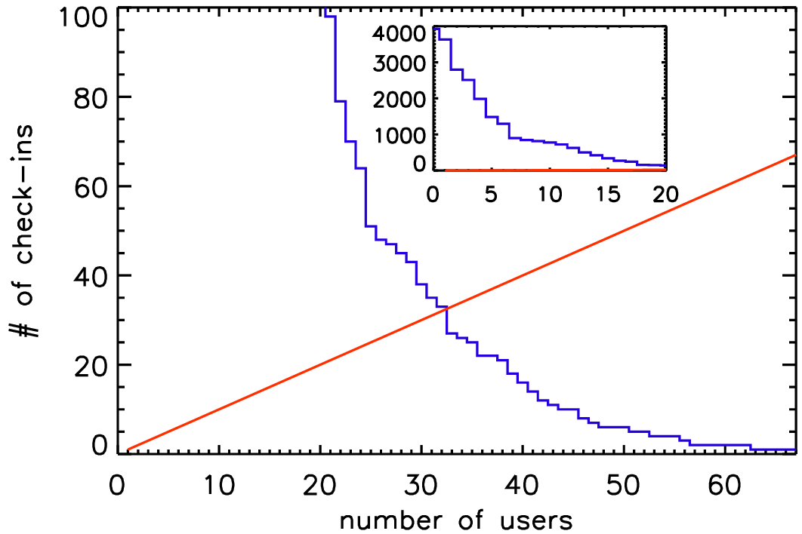
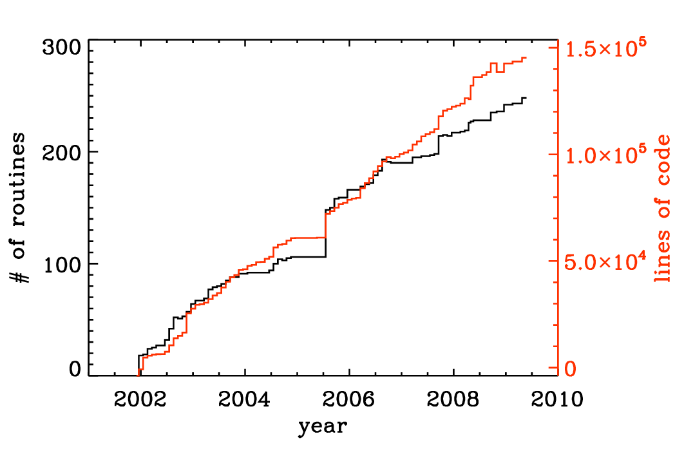
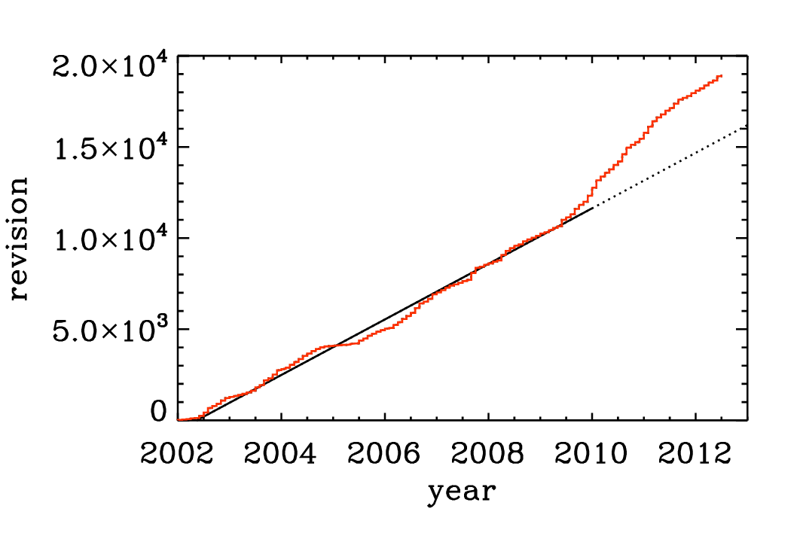
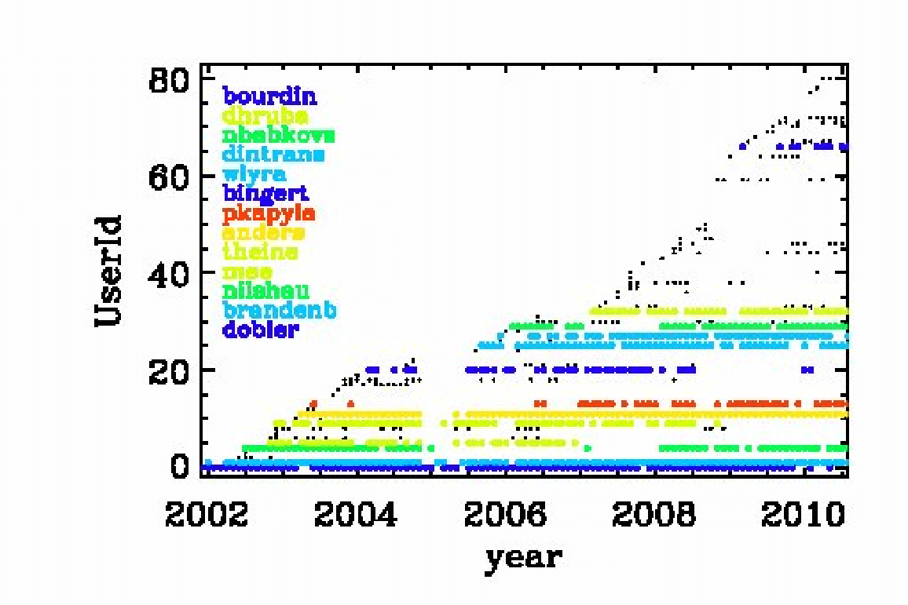

.. _manualpart2:

**********************************************************
Part 2: Programming the PENCIL CODE
**********************************************************

All developers are supposed to have an up-to-date entry in the
:file:`pencil-code/license/developers.txt` so that they can be contacted
in case a code change breaks an auto-test or other code functionality.

Several Pencil Code committers have done several hundred check-ins, but
many of the currently 92 registered people on the repository have hardly
done anything. To put a number to this, one can define an :math:`h` index,
which gives the number of users who have done at least as many as that
number of check-ins. This :math:`h` index is currently 37, i.e., 37 users
have done at least 37 check-ins; see :numref:`pencil-hindex` from 2017,
when the :math:`h` index was only 32.

   The :math:`h` index of Pencil Code check-ins in 2017.

The Pencil Code has expanded approximately linearly in the number of
lines of code and the number of subroutines (:numref:`pfile-size`). The increase
in the functionality of the code is documented by the rise in the number of
sample problems (:numref:`pauto-tests`). It is important to monitor the
performance of the code as well. :numref:`psample-timings` shows that
for most of the runs the run time has not changed much.

   Number of lines of code and the number of subroutines since the end of
   2001. The jump in the Summer of 2005 was the moment when the developments
   on the side branch (eos branch) were merged with the main trunk of the code.
   Note the approximately linear scaling with time.

   Number of tests in the sample directory that are used in the nightly auto tests.
   Note again the approximately linear scaling with time.

Before making changes to the code, it is important that you verify that you
can run the :command:`pc_auto-test` successfully. Don't do this when you
have already modified the code, because then you cannot be sure that any
problems are caused by your changes, or because it wouldn't have worked anyway.
Also, keep in mind that the code is public, so your changes should make sense
from a broader perspective and should not only be intended for yourself.
Regarding more general aspects about coding standards see
:ref:`manApBCodingStandards`.

.. figure:: figs/psample-timings.png
   :align: center
   :name: psample-timings

   Run time of the daily auto-tests since August 17, 2008. For most of the
   runs the run time has not changed much. The occasional spikes are the
   results of additional load on the machine.

In order to keep the development of the code going, it is important that the
users are able to understand and modify (program!) the code. In this section
we explain first how to orient yourself in the code and to understand what
is in it, and then to modify it according to your needs.

   Number of check-ins since 2002. Note again the linear increase with time,
   although in the last part of the time series there is a notable speed-up.

   Check-ins since 2002 per user. Users with more than 100 check-ins are
   color coded.

The Pencil Code check-ins occur regularly all the time. By the Pencil Code
User Meeting 2010 we have arrived at a revision number of 15,000. In February
2017, the number of check-ins has risen to 26,804; see
`<https://github.com/pencil-code/pencil-code>`_.
Major code changes are nowadays being discussed by the Pencil Code Steering
Committee (`PCSC website <https://www.nordita.org/~brandenb/pencil-code/PCSC/>`_).
The increase of the revision number with time is depicted in  :numref:`CheckIns`.
The number of Pencil Code developers increases too (:numref:`UserCheckIns`),
but the really active ones are getting rare. This may indicate that new users
can produce new science with the code as it is, but it may also indicate that
it is getting harder to understand the code. How to understand the code will
be discussed in the next section.

Understanding the code
=======================

Understanding the code means looking through the code.
This is not normally done by just printing out the entire code,
but by searching your way through the code in order to address
your questions.
The general concept will be illustrated here with an example.

Example: how is the continuity equation being solved?
-----------------------------------------------------

All the physics modules are solved in the routine :code:`pde`, which is
located in the file and module :file:`Equ`. Somewhere in the :code:`pde`
subroutine you find the line

.. code:: fortran

        call dlnrho_dt(f,df,p)

This means that here the part belonging to :math:`\partial\ln\rho/\partial t`
is being assembled. Using the :command:`grep` command you will find that this
routine is located in the module :code:`density`, so look in there and try to
understand the pieces in this routine. We quickly arrive at the following
crucial part of code,

.. code:: fortran

        !
        !  Continuity equation.
        !
              if (lcontinuity_gas) then
                if (ldensity_nolog) then
                  df(l1:l2,m,n,irho)   = df(l1:l2,m,n,irho)   - p%ugrho - p%rho*p%divu
                else
                  df(l1:l2,m,n,ilnrho) = df(l1:l2,m,n,ilnrho) - p%uglnrho - p%divu
                endif
              endif

where, depending on some logicals that tell you whether the continuity
equation should indeed be solved and whether we do want to solve for the
logarithmic density and not the actual density, the correct right hand side is
being assembled. Note that all these routines always only *add* to the existing
:code:`df(l1:l2,m,n,ilnrho)` array and never reset it. Resetting :code:`df` is
only done by the timestepping routine. Next, the pieces :code:`p%uglnrho` and
:code:`p%divu` are being subtracted. These are *pencils* that are organized in
the *structure* with the name :code:`p`. The meaning of their names is obvious:
:code:`uglnrho` refers to :math:`\uv\cdot\nabla\ln\rho` and :code:`divu` refers
to :math:`\nabla\cdot\uv`. In the subroutine :code:`pencil_criteria_density`
you find under which conditions these pencils are requested. Using
:command:`grep`, you also find where they are calculated. For example
:code:`p%uglnrho` is calculated in :file:`density.f90`; see

.. code:: fortran

              call u_dot_grad(f,ilnrho,p%glnrho,p%uu,p%uglnrho,UPWIND=lupw_lnrho)

So this is a call to a subroutine that calculates the :math:`\uv\cdot\nabla`
operator, where there is the possibility of :code:`Upwinding`, but this is
*not* the default. The piece :code:`divu` is calculated in :file:`hydro.f90` in
the line

.. code:: fortran

        !
        !  Calculate uij and divu, if requested.
        !
              if (lpencil(i_uij)) call gij(f,iuu,p%uij,1)
              if (lpencil(i_divu)) call div_mn(p%uij,p%divu,p%uu)

Note that the divergence calculation uses the velocity gradient matrix as
input, so no new derivatives are recalculated. Again, using :command:`grep`,
you will find that this calculation and many other ones happen in the module
and file :file:`sub.f90`. The various derivatives that enter here have been
calculated using the :code:`gij` routine, which calls the :code:`der` routine,
e.g., like so

.. code:: fortran

              k1=k-1
              do i=1,3
                do j=1,3
                  if (nder==1) then
                    call der(f,k1+i,tmp,j)

For all further details you just have to follow the trail. So if you want to
know how the derivatives are calculated, you have to look in
:file:`deriv.f90`, and only here is it where the indices of the :code:`f`
array are being addressed.

If you are interested in magnetic fields, you have to look in the file
:file:`magnetic.f90`. The right hand side of the equation is assembled in the
routine

.. code:: fortran

        !***********************************************************************
            subroutine daa_dt(f,df,p)
        !
        !  Magnetic field evolution.
        !
        !  Calculate dA/dt=uxB+3/2 Omega_0 A_y x_dir -eta mu_0 J.
        !  For mean field calculations one can also add dA/dt=...+alpha*bb+delta*WXJ.
        !  Add jxb/rho to momentum equation.
        !  Add eta mu_0 j2/rho to entropy equation.
        !

where the header tells you already a little bit of what comes below. It is
also here where ohmic heating effects and other possible effects on other
equations are included, e.g.,

.. code:: fortran

        !
        !  Add Ohmic heat to entropy or temperature equation.
        !
              if (lentropy .and. lohmic_heat) then
                df(l1:l2,m,n,iss) = df(l1:l2,m,n,iss) &
                                  + etatotal*mu0*p%j2*p%rho1*p%TT1
              endif

We leave it at this and encourage the user to do similar inspection work on a
number of other examples. If you think you find an error, file a ticket at
`<http://code.google.com/p/pencil-code/issues/list>`_. You can of course also
repair it!

Adapting the code
=================

.. _ProgrammingStyle:

The |PC| coding standard
-------------------------------------

As with any code longer than a few lines the appearance and layout of the
source code is of the utmost importance. Well laid out code is more easy to
read and understand and as such is less prone to errors.

A consistent coding style has evolved in the |PC| and we ask that
those contributing try to be consistent for everybody's benefit. In particular,
it would be appreciated if those committing changes of existing code via svn
follow the given coding style.

There are not terribly many rules and using existing code as a template is
usually the easiest way to proceed. In short the most important rules are:

* :command:`tab` characters do not occur anywhere in the code (in fact the use
  of tab character is an extension to the Fortran standard).

* Code in any delimited block, e.g., if statements, do loops, subroutines etc.,
  is indented be precisely 2 spaces. E.g.

  .. code:: fortran

    if (lcylindrical) then
      call fatal_error('del2fjv','del2fjv not implemented')
    endif

* continuation lines (i.e. the continuation part of a logical line that is
  split using the & sign) are indented by 4 spaces. E.g. (note the difference
  from the previous example)

  .. code:: fortran

    if (lcylindrical) &
        call fatal_error('del2fjv','del2fjv not implemented')
    [...]

* There is always one space separation between 'if' and the criterion following
  in parenthesis:

  .. code:: fortran

    if (ldensity_nolog) then
      rho=f(l1:l2,m,n,irho)
    endif

  This is wrong:

  .. code:: fortran

    if(ldensity_nolog) then   ! WRONG
      rho=f(l1:l2,m,n,irho)
    endif

* In general, try to follow common practice used elsewhere in the code. For
  example, in the code fragment above there are no empty spaces within the
  mathematical expressions programmed in the code. A unique convention helps in
  finding certain expressions and patterns in the code. However, empty spaces
  are often used after commas and semicolons, for examples in name lists.

* Relational operators are written with symbols (``==``, ``/=``, ``<``,
  ``<=``, ``>``, ``>=``), *not* with characters (``.eq.``, ``.ne.``,
  ``.lt.``, ``.le.``, ``.gt.``, ``.ge.``).

* In general all comments are placed on their own lines with the ``!`` appearing
  in the first column. It can be omitted in empty lines, but is yet recommended
  to be set in empty lines surrounding comments.

* All subroutine/functions begin with a standard comment block describing what
  they do, when and by whom they were created and when and by whom any
  non-trivial modifications were made.

* Lines longer that ~100 characters should be explicitly wrapped using the ``&``
  character, unless there is a block of longer lines that can only be read
  easily when they are not wrapped. Always add one whitespace before the ``&``
  character.

These and other issues are discussed in more depth and with examples in
Appendix :ref:`manualAppendixB`, and in particular in Sect. :ref:`manApBCodingStandard`.

.. _S-new-output-diagnostics:

Adding new output diagnostics
-----------------------------

With the implementation of new physics and the development of new procedures
it will become necessary to monitor new diagnostic quantities that
have not yet been implemented in the code.
In the following, we describe the steps necessary to set up a new
diagnostic variable.

This is nontrivial as, in order to keep latency effects low on
multi-processor machines, the code minimizes the number of global
reduction operations by assembling all quantities that need the maximum
taken in ``fmax``, and those that need to be summed up over all
processors (mostly for calculating mean quantities) in ``fsum`` (see
subroutine ``diagnostic`` in file ``src/equ.f90``).

As a sample variable, let us consider ``jbm`` (the volume average
``<j · B>``). Only the module ``magnetic`` will be affected, as you can see (the
diagnostic quantity ``jbm`` is already implemented) with:

.. code:: bash

  unix> grep -i jbm src/*.f90

If we pretend for the sake of the exercise that no trace of ``jbm`` was
in the code, and we were only now adding it, we would need to do the following:

1. add the variable ``idiag_jbm`` to the *module variables* of
   ``Magnetic`` in both ``magnetic.f90`` and ``nomagnetic.f90``:

   .. code:: fortran

     integer :: idiag_jbm=0

   The variable ``idiag_jbm`` is needed for matching the position of ``jbm``
   with the list of diagnostic variables specified in ``print.in``.

2. in the subroutine ``daa_dt`` in ``magnetic.f90``, declare and
   calculate the quantity ``jb`` (the average of which will be
   ``jbm``), and call ``sum_mn_name``:

   .. code:: fortran

     real, dimension (nx) :: jb  ! jj·BB
     [...]
     if (ldiagnos) then          ! only calculate if diagnostics is required
       if (idiag_jbm/=0) then    ! anybody asked for jbm?
         call dot_mn(jj,bb,jb)   ! assuming jj and bb are known
         call sum_mn_name(jb,i_jbm)
       endif
     endif

3. in the subroutine ``rprint_magnetic`` in both
   ``magnetic.f90``, add the following:

   .. code:: fortran

     !
     !  reset everything in case of RELOAD
     !  (this needs to be consistent with what is defined above!)
     !
     if (lreset) then  ! need to reset list of diagnostic variables?
       [...]
       idiag_jbm=0
       [...]
     endif
     !
     !  check for those quantities that we want to evaluate online
     !
     do iname=1,nname
       [...]
       call parse_name(iname,cname(iname),cform(iname),'jbm',idiag_jbm)
       [...]
     enddo
     [...]
     !
     !  write column, i_XYZ, where our variable XYZ is stored
     !
     [...]
     write(3,*) 'i_jbm=',idiag_jbm
     [...]

4. in the subroutine ``rprint_magnetic`` in ``nomagnetic.f90``, add
   the following (newer versions of the code may not require this any more):

   .. code:: fortran

     !
     !  write column, i_jbm, where our variable jbm is stored
     !  idl needs this even if everything is zero
     !
     [...]
     write(3,*) 'i_jbm=',idiag_jbm
     [...]

5. and don't forget to add your new variable to ``print.in``:

    .. code:: fortran

        jbm(f10.5)

If, instead of a mean value, you want a new maximum quantity, you need to
replace ``sum_mn_name()`` by ``max_mn_name()``.

Sect. :ref:`S-1d-averages` describes how to output horizontal averages
of the magnetic and velocity fields. New such averages can be added to
the code by using the existing averaging procedures ``calc_bmz()``
or ``calc_jmz()`` as examples.

.. _output-at-one-point-in-space:

Output at one point in space
----------------------------

Various variables at one point can be printed on the command line.
This is often important when you want to check for oscillations where
the sign changes. You would not see it in the rms or max values.
The extensions pt and p2 refer to variables that are taken from
two particular points in space.

Note: this would need to be reworked if one later makes
the output positions processor-dependent. At the moment,
those positions are in that part of the mesh that is on
the root processor.

The file :file:`pt_positions.dat` lists the coordinate positions
where the data is taken from.

.. _f-array:

The f-array
-----------

The `f` array is the largest array in the |Pencil| and its primary role
is to store the current state of the timestepped PDE variables.  The f-array
and its slightly smaller counter part (the df-array; see below)
are the only full size 3D arrays in
the code.  The f-array is of type real but PDEs for a complex variable may
be solved by using two slots in the f-array.  The actual size of the f-array
is :math:`\rm{mx}\times\rm{my}\times\rm{mz}\times\rm{mfarray}`. Here,
:math:`\rm{mfarray}=\rm{mvar}+\rm{maux}+\rm{mglobal}+\rm{mscratch}`
where :math:`\rm{mvar}` refers to the number of real PDE variables.

As an example, we describe here how to put the time-integrated
velocity, :code:`uut`, into the f-array (see :file:`hydro.f90`).
If this is to be invoked, there must be the following call somewhere
in the code:

.. code:: fortran

    call farray_register_auxiliary('uut',iuut,vector=3)

Here, :code:`iuut` is the index of the variable :code:`uut` in the f-array.
Of course, this requires that :code:`maux` is increased by 3, but in order
to do this for a particular run only one must write a corresponding
entry in the :file:`cparam.local` file,

.. code:: fortran

    !                       -*-f90-*-    (for Emacs)
    !  cparam.local
    !
    !** AUTOMATIC CPARAM.INC GENERATION ****************************************
    ! Declare (for generation of cparam.inc) the number of f array
    ! variables and auxiliary variables added by this module
    !
    ! MAUX CONTRIBUTION 3
    !
    !***************************************************************************
    !  Local settings concerning grid size and number of CPUs.
    !  This file is included by cparam.f90
    !
    integer, parameter :: ncpus=1,nprocy=1,nprocz=ncpus/nprocy,nprocx=1
    integer, parameter :: nxgrid=16,nygrid=nxgrid,nzgrid=nxgrid

This way such a change does not affect the memory usage for other
applications where this addition to :file:`cparam.local` is not made.
In order to output this part of the f-array, one must write
:code:`lwrite_aux=T` in the :code:`init_pars` of :file:`start.in`.
(Technically, :code:`lwrite_aux=T` can also be invoked in
:code:`run_pars` of :file:`run.in`, but this does not work at the moment.)

.. _df-array:

The df-array
------------

The ‘df’ array is the second largest chunk of data in the |Pencil|.
By using a 2N storage scheme (see :math:numref:`S-2N-scheme`) after
Williamson [2Nstorage]_ the code only needs one more storage
area for each timestepped variable on top of the current state stored in
the f-array.  As such, and in contrast to the f-array, the df-array is of size
:math:`\rm{mx}\times\rm{my}\times\rm{mz}\times\rm{mvar}`.  Like the df-array it is
of type real.  In fact the ghost zones
of df are not required or calculated but having f- and df-arrays of the same
size make the coding more transparent.  For :math:`\rm{mx}`, :math:`\rm{my}` and
:math:`\rm{mz}` large the wasted storage becomes negligible.

.. _fp-array:

The fp-array
------------

Similar to the ‘f’ array the code also has a ‘fp’ array which contains current
states of all the particles. Like the f-array the fp-array also has a time
derivative part, the dfp-array. The dimension of the fp-array is
:math:`mpar_local\times mpvar` where :math:`mpar_local` is the number of particles in the
local processor (for serial runs this is the total number of particles) and
:math:`mpvar` depends on the problem at hand. For example if we are solving for only
tracer particles then :math:`mpvar=3`, for dust particles :math:`mpvar=6`. The sequence in
which the slots in the fp-array are filled up depends on the sequence in which
different particle modules are called from the :code:`particles_main.f90`. The
following are the relevant lines from :code:`particles_main.f90`.

.. code:: fortran

    !***********************************************************************
        subroutine particles_register_modules()
    !
    !  Register particle modules.
    !
    !  07-jan-05/anders: coded
    !
          call register_particles              ()
          call register_particles_radius       ()
          call register_particles_spin         ()
          call register_particles_number       ()
          call register_particles_mass         ()
          call register_particles_selfgrav     ()
          call register_particles_nbody        ()
          call register_particles_viscosity    ()
          call register_pars_diagnos_state     ()
    !
        endsubroutine particles_register_modules
    !***********************************************************************

The subroutine :code:`register_particles` can mean either the tracer particles
or dust particles. For the former the first three slots of the fp-array are the
three spatial coordinates. For the latter the first six slots of the fp-array
are the three spatial coordinates followed by the three velocity components.
The seventh slot (or the fourth if we are using tracer particles) is the radius
of the particle which can also change as a function of time as particles
collide and fuse together to form bigger particles.

.. ----------------------------------------------------------------------

.. _pencil-case:

The pencil case
---------------

Variables that are derived from the basic physical variables of the code are
stored in one-dimensional :command:`pencils` of length :code:`nx`. All the pencils
that are defined for a given set of physics modules are in turn bundled up in a
Fortran structure called :code:`p` (or, more illustrative, the :command:`pencil case`). Access to individual pencils happens through the variable
:code:`p%name`, where :code:`name` is the name of a pencil, e.g., :code:`rho` that
is a derived variable of the logarithmic density :code:`lnrho`.

The pencils provided by a given physics module are declared in the header of
the file, e.g., in the Density module:

.. code:: fortran

    ! PENCILS PROVIDED lnrho; rho; rho1; glnrho(3); grho(3); uglnrho; ugrho

Notice that the pencil names are separated with a semi-colon and that vector
pencils are declared with “(3)” after the name, and “(3,3)” for a :math:`3\times3` matrix.
Before compiling the code, the script :file:`mkcparam` collects the names of all
pencils that are provided by the chosen physics modules. It then defines the
structure :code:`p` with slots for every single one of these pencils. The definition
of the pencil case :code:`p` is written in the include file
:file:`cparam_pencils.inc`. When the code is run, the actual pencils that are
needed for the run are chosen based on the input parameters. This is done in
the subroutines :code:`pencil_criteria_modulename` that are present in each
physics module. They are all called once before entering the time loop. In the
:code:`pencil_criteria` subroutines the logical arrays :code:`lpenc_requested`,
:code:`lpenc_diagnos`, :code:`lpenc_diagnos2d`, and :code:`lpenc_video` are set
according to the pencils that are needed for the given run. Some pencils depend
on each other, e.g., :code:`uglnrho` depends on :code:`uu` and :code:`glnrho`. Such
interdependencies are sorted out in the subroutines
:code:`pencil_interdep_modulename` that are called after
:code:`pencil_criteria_modulename`.

In each time-step the values of the pencil logicals :code:`lpenc_requested`,
:code:`lpenc_diagnos`, :code:`lpenc_diagnos2d`, and :code:`lpenc_video` are
combined to one single pencil array :code:`lpencil` which is different from
time-step to time-step depending on, e.g., whether diagnostics or video output
are done in that time-step. The pencils are then calculated in the subroutines
:code:`calc_pencils_modulename`. This is done before calculating the time
evolution of the physical variables, as this depends very often on derived
variables in pencils.

The centralized pencil calculation scheme is a guarantee that

- All pencils are only calculated once, and only once.

- Pencils are always calculated by the proper physics module.

Since the |Pencil| is a multipurpose code that has many different physics
modules, it can lead to big problems if a module tries to calculate a derived
variable that actually belongs to another module, because different input
parameters can influence how the derived variables are calculated. One example
is that the Density module can consider both logarithmic and non-logarithmic
density, so if the Magnetic module calculates

.. code:: fortran

  rho = exp(f(l1:l2,m,n,ilnrho)

it is wrong if the Density module works with non-logarithmic density! The
proper way for the Magnetic module to get to know the density is to request the
pencil :code:`rho` in :code:`pencil_criteria_magnetic`.

.. _pencil-check:

Pencil check
^^^^^^^^^^^^^^

To check that the correct pencils have been requested for a given run, one can
run a :command:`pencil consistency check` in the beginning of a run by setting the
logical :code:`lpencil_check` in :code:`&run_pars`. The check is meant to see if

- All needed pencils have been requested

- All requested pencils are needed

The consistency check first calculates the value of :code:`df` with all the
requested pencils. Then the pencil requests are flipped one at a time --
requested to not requested, not requested to requested. The following
combination of events can occur:

- not requested → requested, :code:`df` not changed  
  The pencil is not requested and is not needed.

- not requested → requested, :code:`df` changed  
  The pencil is not requested, but is needed. The code stops.

- requested → not requested, :code:`df` not changed  
  The pencil is requested, but is not needed. The code gives a warning.

- requested → not requested, :code:`df` changed  
  The pencil is requested and is needed.

.. _adding-new-pencils:

Adding new pencils
^^^^^^^^^^^^^^^^^^^^

Adding a new pencil to the pencil case is trivial but requires a few steps.

- Declare the name of the pencil in the header of the proper physics
  module. Pencils names must appear come in a ";" separated list, with
  dimensions in parenthesis after the name [(3) for vector, (3,3) for
  matrix, etc.].
- Set interdependency of the new pencil (i.e. what other pencils does it
  depend on) in the subroutine :code:`pencil_interdep_modulename`
- Make rule for calculating the pencil in :code:`calc_pencils_modulename`
- Request the new pencil based on the input parameters in any relevant
  physics module

Remember that the centralized pencilation scheme is partially there to force
the users of the code to think in general terms when implementing new physics.
Any derived variable can be useful for a number of different physics problems,
and it is important that a pencil is accessible in a transparent way to all
modules.

.. _special-module:

Adding new physics: the Special module
---------------------------------------

If you want to add new physics to the code, you will in many cases want to
add a new Special module. Doing so is relatively straightforward and
there is even a special directory for such additions.

To create your own special module, copy :file:`nospecial.f90` from the src/
directory to a new name in the src/special/ directory.  
In many cases, users may want to put all new bits of physics, needed for the
specific problem at hand, into a single special module. The name chosen for it
should then relate to that problem. It is also possible to employ several
(at present up to five) different special modules at a time in a single setup
which allows to let naming follow the specific physics being implemented
(for technicalities in this case, see the end of this section).

The first thing to do in your new module is to change the :code:`lspecial=.false.`
header to say :code:`lspecial=.true.`

The file is heavily commented though all such comments can be removed as you
go. You may implement any of the subroutines/function that exist in
:file:`nospecial.f90` and those routines must have the names and parameters
as in :file:`nospecial.f90`. You do not however need to implement all
routines, and you may either leave the dummy routines copied from
:file:`nospecial.f90` or delete them all together (provided the "include
'special_dummy.inc'" is kept intact at the end of the file). Beyond that,
data and subroutines can be added to a special module as required,
though only for use within that module.

There are routines in the special interface to allow you to add new
equations, modify the existing equation, add diagnostics, add slices,
and many more things. If you feel there is something missing extra hooks
can easily be added — please contact the |Pencil| team for assistance.

You are encouraged to submit/commit your special modules to the |Pencil|
source. When you have added new stuff to the code, don't forget to mention this
in the :file:`manual.tex` file.

Using more than one special module at a time
^^^^^^^^^^^^^^^^^^^^^^^^^^^^^^^^^^^^^^^^^^^^^

Requires that the environment variables :code:`$MODULE_PREFIX`, :code:`$MODULE_INFIX`
and :code:`$MODULE_SUFFIX` are set properly at runtime. They can be derived
from the qualified names of module functions which have in general the form:

:math:`\langle prefix \rangle \langle module name \rangle \langle infix \rangle \langle function name \rangle \langle suffix \rangle`

with its details depending on the Fortran compiler used. These can be learned by
employing the :code:`nm` command, e.g.:

.. code:: bash

    unix> nm src/general.o | more .

The environment variables are most conveniently set in the user's
:code:`.bashrc`, :code:`.cshrc` or a proper configuration file of the |Pencil| (section :code:`environment`).
In the :file:`Makefile.local` file, the requested special modules are simply specified as a list of names:

.. code:: text

    SPECIAL = special/<module 1> special/<module 2> ...

In contrast to the case with only a single special module, where the namelists' names are
:code:`special_init_pars` and :code:`special_run_pars`,
these are individualized for multiple special modules, viz. :code:`<module name>_init_pars` etc.
As explicit linking at runtime is employed for multiple special modules, code errors, which normally would break the build, show possibly up only at runtime
and are hence hard to debug. Therefore in case of unclear runtime failure, it is useful to perform tests with only one of the special modules at a time, thus
guaranteeing full linking at build time.

For example, when

.. code:: fortran

    SPECIAL  =   special/gravitational_waves_hTXk special/chiral_mhd

is used, the namelist that is usually referenced as

.. code:: fortran

    &special_run_pars
    /

needs to be replaced by:

.. code:: fortran

    &gravitational_waves_hTXk_run_pars
    /
    &chiral_mhd_run_pars
    /

Internally, a number of automatic replacements occur in the code.
Code that is automatically modified in this way is also automatically
unmodified while checking in changes to the repository.
But to facilitate comparison with the original code, one can do the unmodification
also oneself using the :file:`pencil-code/utils/axel/pc_mkspecial.sh` command.

.. _adding-switchable-modules:

Adding switchable modules
-------------------------

In some cases where a piece of physics is thought to be more fundamental,
useful in many situations or simply more flexibility is required it may be
necessary to add a new module :name:`newphysics` together with the
corresponding :name:`nonewphysics` module. The special modules follow
the same structure as the rest of the switchable modules and so using
a special module to prototype new ideas can make writing a new
switchable module much easier.

For an example of a module involving a new
variable (and PDE), the :name:`pscalar` module is a good prototype.
The grep command

.. code:: bash

    unix> grep -i pscalar src/*

gives you a good overview of which files you need to edit or add.

.. _initialcondition-module:

Adding your initial conditions: the InitialCondition module
------------------------------------------------------------

Although the code has many initial conditions implemented, we
now *discourage* such practice. We aim to eventually remove
most of them. The recommended course of action is to make use of
the InitialCondition module.

InitialCondition works pretty much like the Special module. To implement your
own custom initial conditions, copy the file :file:`noinitial_condition.f90` from the
:file:`src/` to :file:`src/initial_condition`, with a new, descriptive name.

The first thing to do in your new module is to change the
:code:`linitialcondition=.false.` header to say :code:`linitialcondition=.true.`  
Also, don't forget to add :file:`../` in front of the file names in :code:`include` statements.

This file has hooks to implement a custom initial condition to
most variables. After implementing your initial condition,
add the line

.. code:: fortran

    INITIAL_CONDITION=initial_condition/myinitialcondition

to your :file:`src/Makefile.local` file. Here, :code:`myinitialcondition` is the
name you gave to your initial condition file.  
Add also :code:`initial_condition_pars` to the :file:`start.in` file, just
below :code:`init_pars`. This is
a namelist, which you can use to add whichever quantity your
initial condition needs defined, or passed. You must also un-comment the
relevant lines in the subroutines for reading and writing the namelists.  
For compiling reasons, these subroutines in :file:`noinitial_condition.f90`
are dummies. The lines are easily identifiable in the code.

Check, e.g., the samples :file:`2d-tests/baroclinic`,
:file:`2d-tests/spherical_viscous_ring`, or :file:`interlocked-fluxrings`,
for examples of how the module is used.

.. _testing-the-code:

Testing the code
================

To maintain reproducibility despite sometimes quite rapid development,
the Pencil Code is tested nightly on various architectures.
The front end for testing are the scripts :command:`pc_auto-test` and
(possibly) :command:`pencil-test`.

To see which samples would be tested, run

.. code:: console

    unix> pc_auto-test -l

to actually run the tests, use

.. code:: console

    unix> pc_auto-test

or

.. code:: console

    unix> pc_auto-test --clean

The latter compiles every test sample from scratch and currently
(September 2009) takes about 2 hours on a mid-end Linux PC.

The :command:`pencil-test` script is useful for cron jobs and allows the actual
test to run on a remote computer. See :ref:`nightly-tests` below.

For a complete list of options, run :command:`pc_auto-test --help` and/or
:command:`pencil-test --help`.

.. _nightly-tests:

How to set up periodic tests (auto-tests)
-----------------------------------------

To set up a nightly test of the Pencil Code, carry out the
following steps.

1. Identify a host for running the actual tests (the *work host*)
   and one to initiate the tests and collect the results (the
   *scheduling host*). On the scheduling host, you should be able to:

   1. run cron jobs,
   2. ssh to the work host without password,
   3. publish HTML files (optional, but recommended),
   4. send e-mail (optional, but recommended).

   Work host and scheduling host can be the same (in this case, use
   :command:`pencil-test`'s :command:`-l` option), but often they will
   be two different computers.

2. [Recommended, but optional:] On the work host, check out a
   separate copy of the Pencil Code to reduce the risk that you
   start coding in the auto-test tree.
   In the following, we will assume that you checked out the code as
   :file:`~/pencil-auto-test`.

3. On the work host, make sure that the code finds the correct
   configuration file for the tests you want to carry out.
   [Elaborate on that: :file:`PENCIL_HOME/local_config` and :command:`-f` option;
   give explicit example]

   Remember that you can set up a custom host ID file for your auto-test
   tree under :file:`${PENCIL_HOME}/config-local/hosts/`.

4. On the scheduling host, use :command:`crontab -e` to set up a :name:`cron`
   job similar to the following:

.. code:: console

    30 02 * * *  $HOME/pencil-auto-test/bin/pencil-test \
        -D $HOME/pencil-auto-test \
        --use-pc_auto-test \
        -N15 -Uc -rs \
        -T $HOME/public_html/pencil-code/tests/timings.txt \
        -t 15m
        -m <email1@inter.net,email2@inter.net,...> \
        <work-host.inter.net> \
        -H > $HOME/public_html/pencil-code/tests/nightly-tests.html

.. note:: 
   This has to be one long line.
   The backslash characters are written only for formatting purposes for
   this manual (*you cannot use them in a crontab file*).

.. note:: 
   You will have to adapt some parameters listed here and may want to
   modify a few more:

   - :command:`-D <dir>`: Sets the directory (on the work host) to run in.
   - :command:`-T <file>`: If this option is given, append a timing statistics line for each test to the given file.
   - :command:`--use-pc`: You want this option (and at some point, it will be the default).
   - :command:`-t 15m`: Limit the time for :file:`start.x` and :file:`run.x` to 15 minutes.
   - :command:`-N 15`: Run the tests at nice level 15 (may not have an effect for MPI tests).
   - :command:`-Uc`: Do :command:`svn update` and :command:`pc_build --cleanall` before compiling.
   - :code:`work-host.inter.net|-l`: Replace this with the remote host that is to run the tests. If you want to run locally, write :code:`-l` instead.
   - :command:`-H`: Output HTML.
   - :code:`> $HOME/public_html/pencil-code/tests/nightly-tests.html`: Write output to the given file.

   If you want to run fewer or more tests, you can use the
   :command:`-Wa,--max-level` option:

.. code:: console

    -Wa,--max-level=3

will run all tests up to (and including) level 3.
The default corresponds to :command:`-Wa,--max-level=2`.

For a complete listing of :command:`pencil-test` options, run

.. code:: console

    unix> pencil-test --help

.. _auto-tests-systemd:

Auto-tests with systemd
-----------------------

On modern Linux systems, you can use systemd (instead of cron) to run periodic auto-tests.
You need to create a couple of files in :file:`~/.config/systemd/user/`:

:file:`pencil_test.service` [#]_ :

.. code:: ini

    [Unit]
    Description=Pencil-code test

    [Service]
    Type=simple
    Environment="PENCIL_HOME=%h/.software/pencil-code-for-tests"
    ExecStart=%h/.software/pencil-code-for-tests/bin/pencil-test \
        -N 15 --update --html --clean --local --use-pc_auto-test \
        --auto-test-options="--max-level=3 --script-tests=python --time-limit=5m"
    StandardOutput=truncate:%h/public_html/pencil_tests/master_full.html

(the backslashes can be left as-is) and :file:`pencil_test.timer`:

.. code:: ini

    [Unit]
    Description=Run pencil test daily at 10pm

    [Timer]
    OnCalendar=*-*-* 22:00:00
    Persistent=True

    [Install]
    WantedBy=timers.target

After creating these files, run

.. code:: console

    systemctl --user enable pencil_test.timer
    systemctl --user start pencil_test.timer

.. [#] Options and filepaths may need to be modified; note that :code:`\%h` is used to denote the user's home directory.

.. _testing-postprocessing:

Testing the postprocessing modules
----------------------------------

Some of the samples contain additional scripts that test the Python and IDL postprocessing modules.
They are not checked by :command:`pc_auto-test` by default; to include these tests, use the :command:`--script-tests` option, e.g.:

.. code:: console

    pc_auto-test --max-level=3 --script-tests=python

The Python postprocessing modules contain an additional set of quick tests that can be invoked as described in :file:`PENCIL_HOME/python/tests/README.md`.

.. _useful-internals:

Useful internals
================

.. _global-variables:

Global variables
----------------

The following variables are defined in :file:`cdata.f90` and are available
in any routine that uses the module :code:`Cdata`.

.. _tabglobalvariables: 

+------------------+----------------------------------------------------------------------------------+
| Variable         | Meaning                                                                          |
+==================+==================================================================================+
| Real                                                                                                |
+------------------+----------------------------------------------------------------------------------+
| t                | simulated time t.                                                                |
+------------------+----------------------------------------------------------------------------------+
| integer                                                                                             |
+------------------+----------------------------------------------------------------------------------+
| n[xyz]grid       | global number of grid points (excluding ghost cells) in x, y and z direction.    |
+------------------+----------------------------------------------------------------------------------+
| nx, ny, nz       | number of grid points (excluding ghost cells) as seen by the current processor,  |
|                  | i.e., ny=nygrid/nprocy, etc.                                                     |
+------------------+----------------------------------------------------------------------------------+
| mx, my, mz       | number of grid points seen by the current processor, but *including ghost cells*.|
|                  | Thus, the total box for the ivar-th variable (on the given processor) is given   |
|                  | by f(1:mx,1:my,1:mz,ivar).                                                       |
+------------------+----------------------------------------------------------------------------------+
| l1, l2           | smallest and largest x-index for the physical domain (i.e., excluding ghost      |
|                  | cells) on the given processor.                                                   |
+------------------+----------------------------------------------------------------------------------+
| m1, m2           | smallest and largest y-index for physical domain.                                |
+------------------+----------------------------------------------------------------------------------+
| n1, n2           | smallest and largest z-index for physical domain, i.e., the physical part of     |
|                  | the ivar-th variable is given by f(l1:l2,m1:m2,n1:n2,ivar)                       |
+------------------+----------------------------------------------------------------------------------+
| m, n             | pencil indexing variables: During each time-substep the box is traversed in      |
|                  | x-pencils of length mx such that the current pencil of the ivar-th variable is   |
|                  | f(l1:l2,m,n,ivar).                                                               |
+------------------+----------------------------------------------------------------------------------+
| logical                                                                                             |
+------------------+----------------------------------------------------------------------------------+
| lroot            | true only for MPI root processor.                                                |
+------------------+----------------------------------------------------------------------------------+
| lfirst           | true only during first time-substep of each time step.                           |
+------------------+----------------------------------------------------------------------------------+
| headt            | true only for very first full time step (comprising 3 substeps for the           |
|                  | 3rd-order Runge–Kutta scheme) on root processor.                                 |
+------------------+----------------------------------------------------------------------------------+
| headtt           | = (lfirst .and. lroot): true only during very first time-substep on root         |
|                  | processor.                                                                       |
+------------------+----------------------------------------------------------------------------------+
| lfirstpoint      | true only when the very first pencil for a given time-substep is processed,      |
|                  | i.e., for the first set of (m,n), which is probably (3,3).                       |
+------------------+----------------------------------------------------------------------------------+
| lout             | true when diagnostic output is about to be written.                              |
+------------------+----------------------------------------------------------------------------------+

.. _subroutines-functions:

Subroutines and functions
-------------------------

.. list-table::
   :widths: 20 80
   :header-rows: 0

   * - :code:`output(file,a,nv)`
     - (module Cdata): Write (in each procN/ directory) the content of the
       global array a to a file called file, where a has dimensions :command:`mx` :math:`\times` :command:`my` :math:`\times` :command:`mz` :math:`\times` :command:`nv`
       or :command:`mx` :math:`\times` :command:`my` :math:`\times` :command:`mz` if :command:`nv=1`.
   * - :code:`output_pencil(file,a,nv)`
     - (module IO): Same as :code:`output()`, but for a pencil variable, i.e. an auxiliary
       variable that only ever exists on a pencil (e.g., the magnetic field
       strength bb in magnetic.f90, or the squared sound speed cs2 in entropy.f90).
       The file has the same structure as those written by :code:`output()`,
       because the values of a on the different pencils are accumulated
       in the file.
       This involves a quite nontrivial access pattern to the file and has thus
       been coded in C (src/debug_c.c).
   * - :code:`cross(a,b,c)`
     - (module Sub): Calculate the cross product of two vectors a and b and
       store in c.
       The vectors must either all be of size :command:`mx` :math:`\times` :command:`my` :math:`\times` :command:`mz` :math:`\times` 3 (global arrays), or of
       size nx×3 (pencil arrays).
   * - :code:`dot(a,b,c)`
     - (module Sub): Calculate the dot product of two vectors a and b and
       store in c.
       The vectors must either be of size :command:`mx` :math:`\times` :command:`my` :math:`\times` :command:`mz` :math:`\times` 3 (a and b) and :command:`mx` :math:`\times` :command:`my` :math:`\times` :command:`mz` :math:`\times` (c),
       or of size :command:`nx` :math:`\times`3 (a and b) and nx (c).
   * - :code:`dot2(a,c)`
     - (module Sub): Same as :code:`dot(a,a,c)`.

References
=============

.. Citations:

.. [Abramowitz-Stegun] Abramowitz, A., & Stegun, I. A. (1984). *Pocketbook of Mathematical Functions*. Harri Deutsch, Frankfurt.

.. [BHB11] Babkovskaia, N., Haugen, N. E. L., & Brandenburg, A. (2011). *J. Comp. Phys.*, 230(1), 12. *A high-order public domain code for direct numerical simulations of turbulent combustion*. (arXiv:1005.5301)

.. [BB14] Barekat, A., & Brandenburg, A. (2014). *Astron. Astrophys.*, 571, A68. “Near-polytropic stellar simulations with a radiative surface.”

.. [Ref-2] Brandenburg, A. (2001). *Astrophys. J.*, 550, 824–840. “The inverse cascade and nonlinear alpha-effect in simulations of isotropic helical hydromagnetic turbulence.”

.. [Ref-1] Brandenburg, A. (2003). In *Advances in non-linear dynamos* (A. Ferriz-Mas & M. Núñez Jiménez, Eds.), *The Fluid Mechanics of Astrophysics and Geophysics*, Vol. 9, pp. 269–344. Taylor & Francis, London and New York. Available at http://arXiv.org/abs/astro-ph/0109497

.. [Ref-4] Brandenburg, A., & Dobler, W. (2001). *Astron. Astrophys.*, 369, 329–338. “Large scale dynamos with helicity loss through boundaries.”

.. [BH01] Brandenburg, A., & Hazlehurst, J. (2001). *Astron. Astrophys.*, 370, 1092–1102. “Evolution of highly buoyant thermals in a stratified layer.”

.. [BK17] Brandenburg, A., & Kahniashvili, T. (2017). *Phys. Rev. Lett.*, 118, 055102. “Classes of hydrodynamic and magnetohydrodynamic turbulent decay.”

.. [BHKRS21] Brandenburg, A., He, Y., Kahniashvili, T., Rheinhardt, M., & Schober, J. (2021). *Astrophys. J.*, 911, 110. “Gravitational waves from the chiral magnetic effect.”

.. [BS02] Brandenburg, A., & Sarson, G. R. (2002). *Phys. Rev. Lett.*, 88, 055003. “The effect of hyperdiffusivity on turbulent dynamos with helicity.”

.. [BDS02] Brandenburg, A., Dobler, W., & Subramanian, K. (2002). *Astron. Nachr.*, 323, 99–122. “Magnetic helicity in stellar dynamos: new numerical experiments.”

.. [BEO96] Brandenburg, A., Enqvist, K., & Olesen, P. (1996). *Phys. Rev. D*, 54, 1291–1300. “Large-scale magnetic fields from hydromagnetic turbulence in the very early universe.”

.. [BJNRST96] Brandenburg, A., Jennings, R. L., Nordlund, Å., Rieutord, M., Stein, R. F., & Tuominen, I. (1996). *J. Fluid Mech.*, 306, 325–352. “Magnetic structures in a dynamo simulation.”

.. [BKMRPTV17] Brandenburg, A., Kahniashvili, T., Mandal, S., Roper Pol, A., Tevzadze, A. G., & Vachaspati, T. (2017). *Phys. Rev. D*, 96, 123528. “Evolution of hydromagnetic turbulence from the electroweak phase transition.”

.. [BMS95] Brandenburg, A., Moss, D., & Shukurov, A. (1995). *MNRAS*, 276, 651–662. “Galactic fountains as magnetic pumps.”

.. [BNST95] Brandenburg, A., Nordlund, Å., Stein, R. F., & Torkelsson, U. (1995). *Astrophys. J.*, 446, 741–754. “Dynamo-generated turbulence and large scale magnetic fields in a Keplerian shear flow.”

.. [Collatz66] Collatz, L. (1966). *The numerical treatment of differential equations*. Springer-Verlag, New York, p. 164.

.. [Dobler06] Dobler, W., Stix, M., & Brandenburg, A. (2006). *Astrophys. J.*, 638, 336–347. “Convection and magnetic field generation in fully convective spheres.”

.. [Dur08] Durrer, R. (2008). *The Cosmic Microwave Background*. Cambridge University Press.

.. [Gammie2001] Gammie, C. F. (2001). *Astrophys. J.*, 553, 174–183. “Nonlinear outcome of gravitational instability in cooling, gaseous disks.”

.. [GNG87] Goodman, J., Narayan, R., & Goldreich, P. (1987). *Month. Not. Roy. Soc.*, 225, 695–711. “The stability of accretion tori — II. Nonlinear evolution to discrete planets.”

.. [HB04a] Haugen, N. E. L., & Brandenburg, A. (2004). *Phys. Rev. E*, 70, 026405. “Inertial range scaling in numerical turbulence with hyperviscosity.”

.. [HockneyEastwood1981] Hockney, R. W., & Eastwood, J. W. (1981). *Computer Simulation Using Particles*. McGraw-Hill, New York.

.. [HTM84] Hurlburt, N. E., Toomre, J., & Massaguer, J. M. (1984). *Astrophys. J.*, 282, 557–573. “Two-dimensional compressible convection extending over multiple scale heights.”

.. [kim87] Kim, J., Moin, P., & Moser, R. (1987). *J. Fluid Mech.*, 177, 133. “Turbulence statistics in fully developed channel flow at low Reynolds number.”

.. [KW90] Kippenhahn, R., & Weigert, A. (1990). *Stellar structure and evolution*. Springer, Berlin.

.. [KR80] Krause, F., & Rädler, K.-H. (1980). *Mean-Field Magnetohydrodynamics and Dynamo Theory*. Akademie-Verlag, Berlin; also Pergamon Press, Oxford.

.. [Lele92] Lele, S. K. (1992). *J. Comp. Phys.*, 103, 16–42. “Compact finite difference schemes with spectral-like resolution.”

.. [MTW] Misner, C. W., Thorne, K. S., & Wheeler, J. A. (1973). *Gravitation*. San Francisco: W. H. Freeman and Co., p. 213.

.. [MTBM09] Mitra, D., Tavakol, R., Brandenburg, A., & Moss, D. (2009). *Astrophys. J.*, 697, 923–933. “Turbulent dynamos in spherical shell segments of varying geometrical extent.” (arXiv:0812.3106)

.. [NG95] Nordlund, Å., & Galsgaard, K. (1995). *A 3D MHD code for Parallel Computers*. Available at http://www.astro.ku.dk/~aake/NumericalAstro/papers/kg/mhd.ps.gz

.. [NS90] Nordlund, Å., & Stein, R. F. (1990). *Comput. Phys. Commun.*, 59, 119. “3-D simulations of solar and stellar convection and magnetoconvection.”

.. [Ole97] Olesen, P. (1997). *Phys. Lett. B*, 398, 321. “Inverse cascades and primordial magnetic fields.”

.. [NR] Press, W., Teukolsky, S., Vetterling, W., & Flannery, B. (1996). *Numerical Recipes in Fortran 90* (2nd ed.). Cambridge.

.. [SH88] Stanescu, D., & Habashi, W. G. (1988). *J. Comp. Phys.*, 143, 674. “2N-storage low dissipation and dispersion Runge–Kutta schemes for computational acoustics.”

.. [2Nstorage] Williamson, J. H. (1980). *J. Comp. Phys.*, 35, 48. “Low-storage Runge–Kutta schemes.”

.. [JOSS] Pencil Code Collaboration. (2021). *J. Open Source Software*, 6, 2807. “The Pencil Code, a modular MPI code for partial differential equations and particles: multipurpose and multiuser-maintained.”

.. [Porter22] Porter, T. A., Jóhannesson, G., & Moskalenko, I. V. (2022). *Astrophys. J. Supp.*, 262, 30. “The GALPROP Cosmic-ray Propagation and Nonthermal Emissions Framework: Release v57.”

.. [mcmodel] Intel. *Fortran Compiler Developer Guide and Reference – mcmodel*. https://software.intel.com/en-us/fortran-compiler-developer-guide-and-reference-mcmodel
