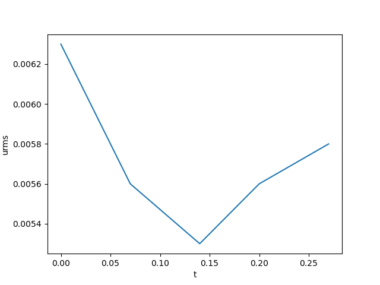
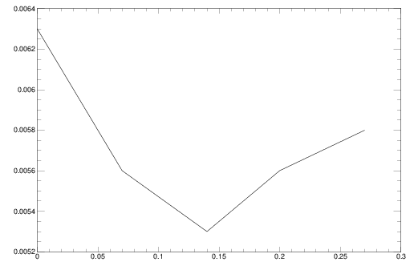

.. _ultra_quick_guide:

**************************
Ultra quick start guide
**************************

Welcome to the **Ultra Quick Start Guide** — the fastest way to run your first
|PC| simulation *without even getting your hands dirty*. If the Quick Start
Guide was a coffee, this one is an espresso shot. The Full User Manual? That’s your
five-course meal with footnotes.

This document is for the impatient, the curious, or anyone who just wants to
see |PC| come to life before lunch.

Required software
=================

All you need is `Docker <https://docs.docker.com/get-started/get-docker/>`_ —
the container platform that lets you borrow someone else’s perfectly prepared
environment so you can skip the compiler setup and get straight to science.

Download the Pencil Code
========================

For the long story, see :ref:`download`. The short version: use Git.

.. code:: bash

     git clone https://github.com/pencil-code/pencil-code.git

That will create a directory named ``pencil-code`` containing everything you
need to run the examples below. You now have the full source at your fingertips
— ready to simulate, experiment, or just admire from a safe distance.

.. _docker-container:

Running with Docker
====================

If you want to skip all compilation steps and jump straight into running a
simulation, you can use the Docker setup described below. It automatically
downloads all necessary packages and configures the latest Pencil Code environment,
so you can start experimenting in minutes — no compiler installation required.

This method is perfect if you want to test-drive |PC| or run a self-contained
example without installing a single library on your machine.

It can compile both MPI and non-MPI simulations.

.. admonition:: Limitation

     Cannot yet be used on supercomputers.

Getting the Docker files
------------------------

The Docker setup lives in a few simple text files that tell Docker how to build
and start the environment.

They are included in the Pencil Code repository under
:file:`~/pencil-code/doc/readthedocs/pencil-docker`.

If you ever wanted to see how an entire computational environment fits inside
a few lines of YAML — this is your chance.

Starting up
-----------

Move to the Docker directory and start the container:

.. code:: bash

     cd ~/pencil-code/doc/readthedocs/pencil-docker
     run_docker

.. tip::

     The first time you build the container, it may take several minutes as it
     downloads compilers and all necessary libraries. Once the container is
     built, subsequent starts will be much faster. (Think of it as caching your
     future patience.)

You are now inside the container — ready to run, compile, or explore the code
as if it were installed locally.

This container mounts the :file:`pencil-code` directory as a volume and works
inside that directory, so any data created within the container will also be
available outside it.

Now you can execute any Pencil :command:`pc_` command without worrying about
compilers and packages.

Stopping the container
--------------------------

- If you are in the terminal running the ``docker compose up --build`` command (see the note above),
  just press :kbd:`Ctrl-C`. The container will stop and you will regain control of the terminal.

- If you are in the directory containing the ``docker-compose.yml`` file
  (``pencil-code/doc/readthedocs/pencil-docker``), execute

  .. code:: bash

     docker compose stop

- From any other location, run the ``docker stop`` command and specify the name of the container:

  .. code:: bash

     docker stop pencil

Running GUI applications
------------------------

The container is configured to display GUI applications on the host. For a
quick test, try:

.. code:: bash

   xclock

If the window does not appear, you may need to grant X11 access on your host
before you run the container:

.. code:: bash

   xhost +

After that, you can use visualization tools such as ``matplotlib`` and call
``plt.show()`` from inside the container — and the plot windows will appear on
your desktop as usual. (No magic, just Docker sorcery.)

Running a test simulation
==========================

To verify that everything works correctly, execute the included test script.
It compiles and runs the **same sample problem** used in the standard quick
start example (`samples/conv-slab`), so the output should match what you saw
earlier.

.. code:: bash

   /app/pencil-code/docker-test/conv-slab$ execute-test 

This script creates a :file:`docker-test` directory inside :file:`pencil-code`, copies the example sample, moves there, compiles, and runs the sample problem - producing output similar
to the following:

.. code:: text

    --it-----t-------dt------urms----umax----rhom----ssm----dtc---dtu---dtnu-dtchi-
       0    0.00 6.793E-03  0.0063  0.0956 14.4708 -0.4460 0.978 0.025 0.207 0.345
      10    0.07 6.793E-03  0.0056  0.0723 14.4708 -0.4464 0.978 0.019 0.207 0.345
      20    0.14 6.793E-03  0.0053  0.0471 14.4709 -0.4467 0.978 0.019 0.207 0.345
      30    0.20 6.793E-03  0.0056  0.0413 14.4708 -0.4471 0.978 0.017 0.207 0.346
      40    0.27 6.793E-03  0.0058  0.0449 14.4708 -0.4475 0.978 0.013 0.207 0.346

    Simulation finished after           41  time-steps

If you see similar output, your Docker setup is fully operational.

.. important::

     Running the script again will overwrite
     :file:`pencil-code/docker-test/conv-slab`. Consider it a clean slate for
     your next experiment.

Post-processing and visualizing data
=======================================

Once your simulation has finished, you can post-process the results either from
within the container or outside it. Since the container shares the
:file:`pencil-code` directory with your host system, all your data are right
where you expect them — no hunting through mysterious Docker volumes.

You can use Python, IDL (via GDL), or any other familiar tools. The container
already includes everything you need for both.

Testing the Python module
-------------------------

The container also includes the Python interface to the Pencil Code. To verify
that it works, start Python inside the container and try importing the module:

.. code:: bash

   /app/pencil-code/python# python3
   Python 3.10.12 (main, Aug 15 2025, 14:32:43) [GCC 11.4.0] on linux
   >>> import pencil
   >>>

If that runs without errors, the Python tools are ready for use — no extra
setup, no environment juggling.

In the following, we'll use the same test simulation (the one you just ran in
``docker-test/conv-slab``) to demonstrate how to explore results using the
``pencil`` module.

Using the ``pencil`` module
^^^^^^^^^^^^^^^^^^^^^^^^^^^^^

Let’s open the time series data created by the test run. (Yes, you’re about to
plot something that was born inside a container.)

.. code:: python

   import pencil as pc
   import matplotlib.pyplot as plt

Read the time series generated by the simulation :file:`data/time_series.dat`

.. code:: python

     >>> ts = pc.read.ts()
     Read 5 lines.

If write :command:`ts.` and your press :kbd:`tab` you will see all the options:

.. code:: python

     >>> ts.
     ts.dt     ts.dtchi  ts.dtu    ts.keys   ts.rhom   ts.t      ts.urms   
     ts.dtc    ts.dtnu   ts.it     ts.read(  ts.ssm    ts.umax   
     >>> ts.

To plot the RMS velocity ``urms``, simply do:

.. code:: python

     plt.plot(ts.t,ts.urms)
     plt.xlabel("Time")
     plt.ylabel("u_rms")
     plt.title("Time evolution of u_rms")
     plt.show()

You should get something like:

  Evolution of the urms in the conv-slab simulation. Python post-processing inside the container. 

Some examples of postprocessing with Python can be found in the
:ref:` python documentation <modpython>` and in the :ref:` python tutorials <tutpython>`.

Using IDL
---------

Prefer IDL? The container includes :abbr:`GDL (GNU Data Language)`, `a free an open-source IDL compiler <https://gnudatalanguage.github.io/>`_,  so you can also run IDL scripts inside the container.

.. code:: idl

     # idl
     GDL> pc_read_ts, obj=ts
     GDL> help, ts, /structure
     GDL> plot, ts.t, ts.urms,/ynozero

Which produces:

  Evolution of the urms in the conv-slab simulation.. IDL post-processing inside the container.

.. tip::

   Feeling energized? Now that you’ve had your digital espresso, you’re ready
   to dive deeper — from tweaking parameters to exploring the Full Manual,
   the world of Pencil Code awaits.
