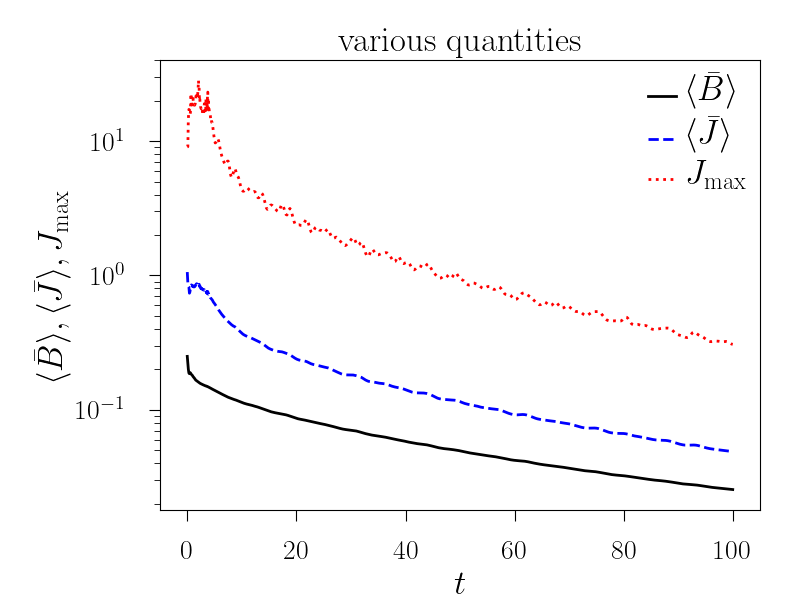
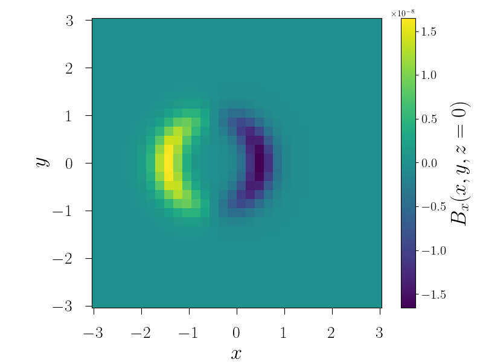

.. _tutpython:

***********************
Pencil Python Tutorials
***********************

Installation
==============

For modern operating systems, Python is generally installed together
with the system. If not, it can be installed via your preferred package
manager or downloaded from the website https://www.python.org/. For
convenience, I strongly recommend to also install
`IPython <http://ipython.org/>`__, which is a more convenient console
for python. You will also need the `NumPy <http://www.numpy.org/>`__,
`matplotlib <http://matplotlib.org/>`__,
`h5py <https://www.h5py.org/>`__ and `Tk <http://www.tcl.tk/>`__
library.

Perhaps the easiest way to obtain all the required software mentioned
above is install either Continuum’s
`Anaconda <https://store.continuum.io/cshop/anaconda/>`__ or Enthought’s
`Canopy <https://www.enthought.com/products/canopy/>`__. These Python
distributions also provide (or indeed are) integrated graphical
development environments.

Another way of installing libraries, particularly on a cluster without
root privileges you can use pip or pip3:

.. code:: sh

   pip install h5py
   pip3 install h5py

In order for python to find the Pencil Code commands you will have to
add to your .bashrc:

.. code:: sh

   export PYTHONPATH=$PENCIL_HOME/python

Setting Up a Local Python Environment (Recommended)
----------------------------------------------------

For development and to avoid conflicts with system packages, it is strongly
recommended to use a virtual environment. This allows you to install packages
locally without requiring root privileges and keeps your Pencil Code environment
isolated from other Python projects.

Using venv (Python 3.3+)
~~~~~~~~~~~~~~~~~~~~~~~~

Python 3 includes the ``venv`` module by default. To create and activate a
virtual environment:

.. code:: sh

   # Create a virtual environment in a directory called 'venv'
   python3 -m venv ~/pencil-venv

   # Activate the virtual environment
   source ~/pencil-venv/bin/activate

   # Your prompt should now show (pencil-venv) indicating the environment is active

Once activated, you can install required packages using pip:

.. code:: sh

   pip install numpy matplotlib h5py ipython

To deactivate the virtual environment when you're done:

.. code:: sh

   deactivate

To use this environment in the future, simply activate it again with:

.. code:: sh

   source ~/pencil-venv/bin/activate

Using conda (Anaconda/Miniconda)
~~~~~~~~~~~~~~~~~~~~~~~~~~~~~~~~

If you're using Anaconda or Miniconda, you can create a conda environment:

.. code:: sh

   # Create a new conda environment named 'pencil'
   conda create -n pencil python=3.10 numpy matplotlib h5py ipython

   # Activate the environment
   conda activate pencil

   # Deactivate when done
   conda deactivate

Installing Additional Libraries
~~~~~~~~~~~~~~~~~~~~~~~~~~~~~~~~

Once your virtual environment is activated, you can install additional Python
packages as needed:

.. code:: sh

   # Install individual packages
   pip install scipy pandas

   # Install from a requirements file (if provided)
   pip install -r requirements.txt

   # Upgrade a package
   pip install --upgrade numpy

For clusters without internet access, you can download packages on a machine
with internet and transfer them:

.. code:: sh

   # On a machine with internet, download packages
   pip download numpy matplotlib h5py -d ~/packages/

   # Transfer the ~/packages/ directory to the cluster, then install
   pip install --no-index --find-links ~/packages/ numpy matplotlib h5py

Making the Virtual Environment Persistent
~~~~~~~~~~~~~~~~~~~~~~~~~~~~~~~~~~~~~~~~~~

To automatically activate your virtual environment when you start a new terminal
session, you can add the activation command to your ``.bashrc`` or ``.bash_profile``:

.. code:: sh

   # Add to ~/.bashrc
   source ~/pencil-venv/bin/activate
   export PYTHONPATH=$PENCIL_HOME/python

.. note::

   If using a virtual environment, make sure to activate it **before** setting
   the ``PYTHONPATH`` variable. This ensures that the Pencil Code Python modules
   are found alongside your installed packages.

`ipythonrc`
-----------

If you use IPython, for convenience, you should modify your
``~/.ipython/ipythonrc`` (create it if it doesn’t exist) and add:

.. code:: python

   import_all pencil

Additional, add to your ``~/.ipython/profile_default/startup/init.py``
the following lines:

.. code:: python

   import numpy as np
   import pylab as plt
   import pencil as pc

   import matplotlib
   from matplotlib import rc

   plt.ion()

   matplotlib.rcParams['savefig.directory'] = ''

`.pythonrc`
------------

In case you are on a cluster and don’t have access to IPython you can
edit you ``~/.pythonrc``:

.. code:: python

   #!/usr/bin/python
   import numpy as np
   import pylab as plt
   import pencil as pc

   import atexit
   #import readline
   import rlcompleter

   # Enable search with CTR+r in the history.
   try:
       import readline
   except ImportError:
       print "Module readline not available."
   else:
       import rlcompleter
       readline.parse_and_bind("tab: complete")

   # Enables command history.
   historyPath = os.path.expanduser("~/.pyhistory")

   def save_history(historyPath=historyPath):
       import readline
       readline.write_history_file(historyPath)

   if os.path.exists(historyPath):
       readline.read_history_file(historyPath)

   atexit.register(save_history)
   del os, atexit, readline, rlcompleter, save_history, historyPath

   plt.ion()

create the file ``~/.pythonhistory`` and add to your ``~/.bashrc``:

.. code:: sh

   export PYTHONSTARTUP=~/.pythonrc

.. _pythongeneral: 

Pencil Code Commands in General
===============================

For a list of all Pencil Code commands start IPython and type ``pc. <TAB>`` (as with auto completion).
To access the help of any command just type the command followed by a '?' (no spaces), e.g.:

.. code:: 

        pc.math.dot?
        Type:       function
        String Form:<function dot at 0x7f9d96cb0cf8>
        File:       ~/pencil-code/python/pencil/math/vector_multiplication.py
        Definition: pc.math.dot(a, b)
        Docstring:
        take dot product of two pencil-code vectors a & b with shape

        a.shape = (3, mz, my, mx)
        
You can also use ``help(pc.math.dot)`` for a more complete documentation of the command.

There are various reading routines for the Pencil Code data. All of them return an object with the data. To store the data into a user defined variable type e.g.

.. code:: python

        ts = pc.read.ts()

Most commands take some arguments. For most of them there is a default value, e.g.

.. code:: python

        pc.read.ts(file_name='time_series.dat', datadir='data')

You can change the values by simply typing e.g.

.. code:: python

        pc.read.ts(datadir='other_run/data')

Reading and Plotting Time Series
================================

Reading the time series file is very easy. Simply type

.. code:: python

        ts = pc.read.ts()

and python stores the data in the variable ``ts``. 
The physical quantities are members of the object ``ts`` and can be accessed accordingly, e.g. ``ts.t, ts.emag``. 
To check which other variables are stored simply do the tab auto completion ``ts. <TAB>``.

Plot the data with the matplotlib commands:

.. code:: python

        plt.plot(ts.t, ts.emag)

The standard plots are not perfect and need a little polishing. See further down about making pretty plots.
You can save the plot into a file using the GUI or with

.. code:: python

        plt.savefig('plot.eps')

Reading and Plotting VAR files and slice files
==============================================

* Read var files:

.. code:: python

        var = pc.read.var()

* Read slices: before reading slices, you need to assemle gloabl slice files from the different processors with:

.. code:: bash

     $ make read_videofiles

     $ ./src/read_videofiles.x 
     enter variable (lnrho, uu1, ..., bb3) and stride (e.g. 10): uu1

Now you can read assembled slice files:

.. code:: python

        slices = pc.read.slices(field='bb1', extension='xy')

This returns an object ``slices`` with members ``t`` and ``xy``. 
The last contains the additional member ``xy``.

If you want to plot e.g. the x-component of the magnetic field at the central plane simply type:

.. code:: python
        
        plt.imshow(var.bb[0, 128, :, :].T, origin='lower', extent=[-4, 4, -4, 4], interpolation='nearest', cmap='hot')

For a complete list of arguments of ``plt.imshow`` refer to its documentation.

For a more interactive function plot use:

.. code:: python

        pc.visu.animate_interactive(slices.xy.bb, slices.t)

.. warning::

        arrays from the reading routines are ordered ``f[nvar, mz, my, mx]``, i.e. reversed to IDL. 
        This affects reading var files and slice files.

Create a custom VAR0 or var.dat
===============================

With the functionality of writing snapshots directly into ``VAR*`` or ``var.dat`` the user can now generate an initial condition directly from a numpy array or modify the last snapshot and continue running. The function to be used is in ``python/pencil/io/snapshot.py`` and is called ``write_snapshot``. Here we outline how to generate an initial condition. For modifying the ``var.dat`` only the last steps are necessary.

First we need an empty run. For this let us use ``samples/kin-dynamo``

.. code:: python

        cd pencil-code/samples/kin-dynamo
        pc_setupsrc

In principle we can use any initial condition, as we are going to over write it. But it is cleaner to use

.. code::

        INITIAL_CONDITION = noinitial_condition

in ``src/Makefile.local``. Compile and start:

.. code:: bash

        make
        pc_start

This generates a ``VAR0`` and ``var.dat`` in every proc directory.

Our snapshot writing routine needs to know the cpu structure. Furthermore, we need to know the indices of the primary variables. The first can be obtained from ``src/cparam.local``, while the latter can be read from the newly generated ``data/index.pro``. The numpy arrays that are written need to have the shape [nvar, nz, ny, nz] with the correct order of variables and no ghost zones. Optionally, the number of ghost zones, which is usually 3, can be specified.

Putting it all together our python routine would look something like this:

.. code:: python

        import numpy as np
        import pencil as pc

        # Read the data to obtain the shape of the arrays, rather than the actual data.
        var = pc.read.var(trimall=True)

        # Modify the data.
        var.aa += np.random.random(var.aa.shape)

        # Write the new VAR0 and var.dat files.
        pc.io.write_snapshot(var.aa, file_name='VAR0', nprocx=1, nprocy=1, nprocz=1)
        pc.io.write_snapshot(var.aa, file_name='var.dat', nprocx=1, nprocy=1, nprocz=1)

Examples
========

Standard plots with any plotting library are not the prettiest ones. The same is true for matplotlib. Here are a few pretty examples of plots where the default style is changed. You can add your commands into a script e.g. ``plot_results.py`` and execute it from your terminal with ``python plot_results.py`` or in IPython with ``exec(open('plot_results.py').read())``.

The sample we use here is ``samples/interlocked-fluxrings``.

Simple plot:

.. code:: python

        import pencil as pc
        import numpy as np
        import pylab as plt

        # Read the time_series.dat.
        ts = pc.read.ts()

        # Prepare the plot.
        # Set the size and margins.
        width = 8
        height = 6
        plt.rc('text', usetex=True)
        plt.rc('font', family='arial')
        plt.rc("figure.subplot", left=0.2)
        plt.rc("figure.subplot", right=0.95)
        plt.rc("figure.subplot", bottom=0.15)
        plt.rc("figure.subplot", top=0.90)
        figure = plt.figure(figsize=(width, height))
        axes = plt.subplot(111)

        # Make the actual plot.
        plt.semilogy(ts.t, ts.brms, linestyle='-', linewidth=2, color='black', label=r'$\langle\bar{B}\rangle$')
        plt.semilogy(ts.t, ts.jrms, linestyle='--', linewidth=2, color='blue', label=r'$\langle\bar{J}\rangle$')
        plt.semilogy(ts.t, ts.jmax, linestyle=':', linewidth=2, color='red', label=r'$J_{\rm max}$')

        plt.xlabel(r'$t$', fontsize=25)
        plt.ylabel(r'$\langle\bar{B}\rangle, \langle\bar{J}\rangle, J_{\rm max}$', fontsize=25)
        plt.title('various quantities', fontsize=25, family='serif')

        # Prepare the legend.
        plt.legend(loc=1, shadow=False, fancybox=False, numpoints=1)
        leg = plt.gca().get_legend()
        # Change the font size of the legend.
        ltext = leg.get_texts() # all the text.Text instance in the legend
        for k in range(len(ltext)):
                legLine = ltext[k]
                legLine.set_fontsize(25)
        frame = leg.get_frame()
        frame.set_facecolor('1.0')
        leg.draw_frame(False)

        # Make plot pretty.
        plt.xticks(fontsize=20, family='serif')
        plt.yticks(fontsize=20, family='serif')
        axes.tick_params(axis='both', which='major', length=8)
        axes.tick_params(axis='both', which='minor', length=4)

        # Create an offset between the xylabels and the axes.
        for label in axes.xaxis.get_ticklabels():
                label.set_position((0, -0.03))
        for label in axes.yaxis.get_ticklabels():
                label.set_position((-0.03, 0))

The result is this plot:

Simple 2d plot:

.. code:: python

        import pencil as pc
        import numpy as np
        import pylab as plt

        # Read the slices.
        slices = pc.read.slices()

        # Read the grid size.
        grid = pc.read.grid()
        x0 = grid.x[3]
        x1 = grid.x[-4]
        y0 = grid.y[3]
        y1 = grid.y[-4]

        # Prepare the plot.
        # Set the size and margins.
        width = 8
        height = 6
        plt.rc('text', usetex=True)
        plt.rc('font', family='arial')
        plt.rc("figure.subplot", left=0.15)
        plt.rc("figure.subplot", right=0.95)
        plt.rc("figure.subplot", bottom=0.15)
        plt.rc("figure.subplot", top=0.95)
        figure = plt.figure(figsize=(width, height))
        axes = plt.subplot(111)

        # Make the actual plot.
        plt.imshow(slices.xy.bb1[0, :, :].T, origin='lower', interpolation='nearest',
                   extent=[x0, x1, y0, y1])
        plt.xlabel(r'$x$', fontsize=25)
        plt.ylabel(r'$y$', fontsize=25)

        # Set the colorbar.
        cb = plt.colorbar()
        cb.set_label(r'$B_{x}(x,y,z=0)$', fontsize=25)
        cbytick_obj = plt.getp(cb.ax.axes, 'yticklabels')
        plt.setp(cbytick_obj, fontsize=15, family='serif')

        # Make plot pretty.
        plt.xticks(fontsize=20, family='serif')
        plt.yticks(fontsize=20, family='serif')
        axes.tick_params(axis='both', which='major', length=8)
        axes.tick_params(axis='both', which='minor', length=4)

        # Create an offset between the xylabels and the axes.
        for label in axes.xaxis.get_ticklabels():
                label.set_position((0, -0.03))
        for label in axes.yaxis.get_ticklabels():
                label.set_position((-0.03, 0))

The result is this plot:

IDL to Python guide
===================

A large array of idl scripts have been developed over the years, and many of them served their purpose at the time, but there are many others
of general purpose. Below is a small selection of examples of idl call sequences along with their python counterparts.

Here are the links to a few potentially useful sites:

1. `IDL to Python bridge <https://www.l3harrisgeospatial.com/docs/IDLToPython.html>`_

2. `IDL commands in numerical Python <http://mathesaurus.sourceforge.net/idl-python-xref.pdf>`_

===============================   ======
IDL                               Python
===============================   ======
pc_read_var,obj=var,/trimall      var = pc.read.var(var_file = 'var.dat', trimall = True, sim = SIM)    
help,var                          help(var)       
pc_read_param,obj=param           pc.read.param()
===============================   ======

Troubleshooting
================

I’m an a cluster and the library LIBNAME could not be loaded.
--------------------------------------------------------------

Typically system administrators don’t install all the software you need.
Just contact the person in charge and ask for installing it.

I’m getting complaints about a ‘tk’ library.
---------------------------------------------

Try launchin python with

.. code:: sh

   ipython --pylab='qt'

If this doesn’t work or you have only access to the python console try
in Python:

.. code:: python

   plt.switch_backend('qt')

or any other backend like ``qtk``. If you are still out of luck you can
still save the plot into a file with

.. code:: python

   plt.savefig('plot.eps')

There is nothing displayed when I try plotting.
------------------------------------------------

Try:

.. code:: python

   plt.show()
   plt.draw()

Further Reading (strongly recommended)
=======================================

* Boris’ short introduction about post-processing of Pencil Code runs: https://old.nordita.org/~brandenb/teach/PencilCode/python.html

* Python tutorial: https://docs.python.org/3/tutorial/index.html

* IPython reference: https://ipython.org/ipython-doc/stable/interactive/reference.html

* NumPy tutorial: https://numpy.org/learn/

* SciPy tutorial: https://docs.scipy.org/doc/scipy/tutorial/index.html

* Matplotlib gallery: https://matplotlib.org/stable/gallery/

* MayaVi: https://docs.enthought.com/mayavi/mayavi/examples.html